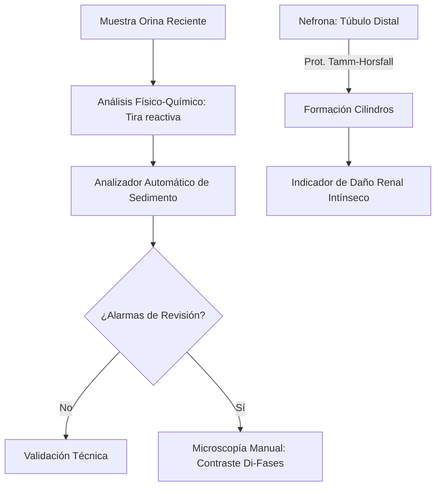
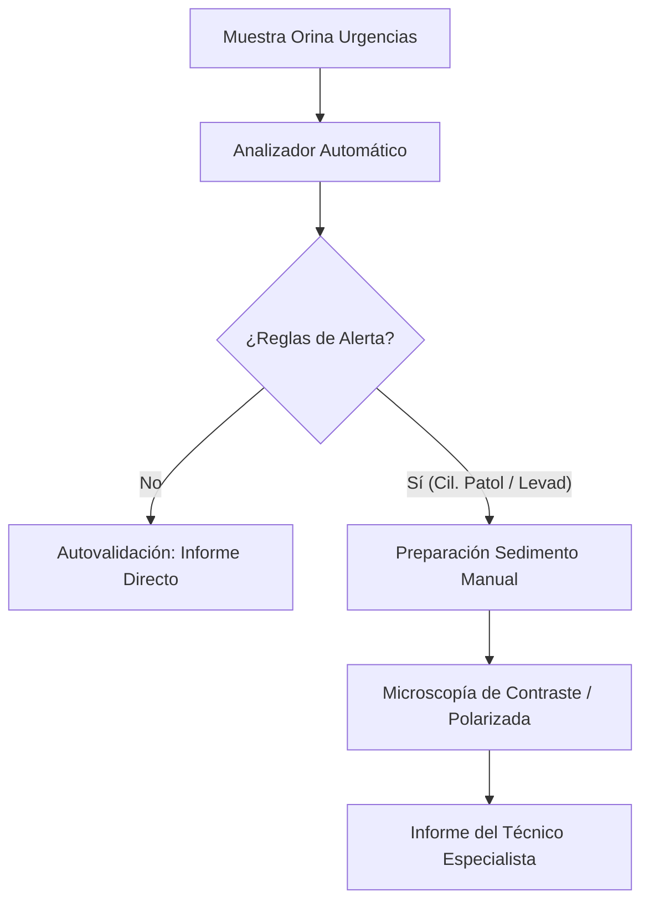
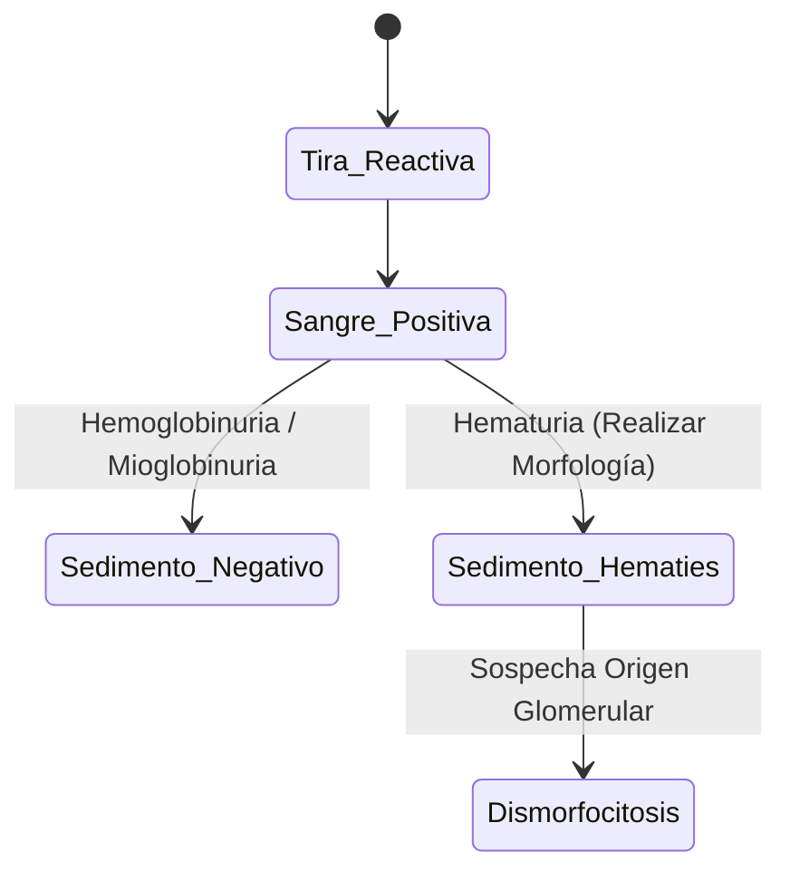

# Semana 5: Más allá de la Sangre
## Lección 21: El Sedimento Urinario: De la Microscopía a la Automatización

### 1. Título y Resumen (Abstract)
**Título:** Implementación de la Citometría de Flujo por Imágenes en el Análisis Sistemático de Orina: Optimización de la Autovalidación y Cribado del Sedimento Patológico.
**Resumen:** Este artículo analiza la evolución tecnológica del análisis de sedimentos urinarios. Se fundamenta el proceso de formación de elementos formes (cilindros, células, cristales) bajo las leyes de la fisiología renal y se evalúa la eficacia de la automatización en la reducción de la subjetividad técnica. Se destaca el papel del TSLCB en la gestión de las reglas de autovalidación y la identificación de elementos críticos mediante microscopía de contraste de fases.

### 2. Introducción (Fundamentos y Objetivos)
#### 2.1. Anatomía y Fisiología Renal (Módulo 1370)
El currículo de **Fisiopatología General** (Módulo 1370) describe el aparato urinario. La orina es el producto de la filtración glomerular, reabsorción tubular y secreción.
- **Formación de Elementos Formes:** Las células epiteliales (túbulos, uréteres, vejiga) descaman de forma natural. Los hematíes y leucocitos aparecen en procesos inflamatorios o de daño glomerular.
- **Cilindros (Módulo 1371):** Estructuras cilíndricas formadas exclusivamente en los túbulos distales por la precipitación de la mucoproteína de **Tamm-Horsfall**. Su presencia indica siempre patología renal parenquimatosa.

#### 2.2. Fundamentos de la Automatización del Sedimento (Módulo 1371/1368)
El **Módulo de Análisis Bioquímico** incluye la automatización de la orina:
1.  **Citometría de Flujo Fluorescente (Láser):** Analiza partículas basándose en señales de dispersión de luz y fluorescencia tras tinción con colorantes de ácidos nucleicos.
2.  **Imágenes Digitales Automáticas:** Capturan miles de fotos de alta resolución en un flujo laminar. Un software de inteligencia artificial (redes neuronales) realiza la clasificación preeliminar por tamaño y forma.
3.  **Técnicas de Concentración (Centrifugación):** Tradicionalmente, se centrifugan 10 mL de orina (Módulo 1371) para concentrar el sedimento antes de la observación microscópica manual.

#### 2.3. Gestión Crítica Preanalítica (Módulo 1367/1368)
- **Estabilidad de la Muestra:** La orina debe procesarse en < 2h. El pH alcalino (producido por bacterias ureolíticas) disuelve los cilindros hialinos y lisa los hematíes (Módulo 1367).
- **Control de Calidad (Módulo 1368):** Uso de materiales de control comerciales que contienen partículas que simulan células y cristales.

**Objetivo:** Establecer algoritmos de autovalidación técnica para optimizar el flujo de trabajo en el laboratorio de alta carga.

### 3. Material y Métodos
- **Diseño:** Estudio técnico sobre eficiencia analítica.
- **Entorno:** Unidad de Sedimentos, Hospital Universitario de Getafe.
- **Intervenciones:** Análisis pareado de 500 muestras mediante tira reactiva (Reflectometría), analizador de imágenes Sysmex UN-Series y microscopía manual (cámara de Fuchs-Rosenthal).

### 4. Resultados (Hallazgos Experimentales)
Workflow de revisión y criterios de sospecha:

### 5. Discusión y Conclusiones
La automatización permite procesar > 50 muestras/hora. Sin embargo, el TSLCB sigue siendo vital para identificar **Hematíes Dismórficos** (acantocitos) que sugieren sangrado renal. Se concluye que las reglas de autovalidación deben ser estrictas: cualquier concordancia de nitritos positivos con ausencia de bacterias en imagen requiere revisión obligatoria. El control del pH preanalítico es el mayor reto para la estabilidad de los cilindros.

### 6. Agradecimientos
Iniciativa apoyada por el Servicio de Nefrología para el cribado precoz de nefropatía diabética mediante la detección de microalbuminuria y cilindros grasos.

### 7. Bibliografía (Literatura Citada)
- **European Urinalysis Guidelines - EFLM.** [Ver en eflm.eu](https://www.eflm.eu/site/page/guidelines)
- **Recomendaciones para el examen sistemático de orina - SEQCML.** [Ver en seqc.es](https://www.seqc.es/es/bioquimica-en-el-laboratorio-clinico/manuales-y-monografias/)
- **Urinalysis StatPearls - NCBI.** [Ver en ncbi.nlm.nih.gov](https://www.ncbi.nlm.nih.gov/books/NBK470501/)
- **Atlas de Sedimento Urinario - Asociación Española de Biopatología Médica.** [Ver en aebm.org](https://www.aebm.org/)

---
### Sobre la Ponente
**Luz del Mar Rivas** es Facultativa Especialista de Área (FEA) de Bioquímica Clínica en el **Hospital Universitario de Getafe**.

### 8. Charla y Transcripción (Contenido Multimedia)

**Enlace al vídeo:** [Ver en YouTube](https://www.youtube.com/watch?v=zYczkeKiVZA)

#### Transcripción de la Sesión
Hola a todos. Eh, como un año más vuelvo a daros otra sesión. Soy Lud del Mar Rivas, para aquellos que no me conocéis, facultativo de bioquímica clínica, responsable de calidad y preanalítica en el laboratorio de análisis clínico del Hospital E Getafe. Os voy a hablar este año del sedimiento urinario enfocándome en la estandarización del informe del sedimento, su demanda y la autovalidación.

Esta sesión la he estructurado en dos grandes objetivos. Uno, el proceso de laboratorio, definiéndose así la estandarización de la fase preanalítica, fase analítica y fase postanalítica y otro objetivo que es la gestión de los resultados. Con respecto a la fase preanalítica y fase analítica, es importante reducir la variabilidad interlaboratorios mediante protocolos homogéneos. Con respecto a la estandarización de la fase postanalítica, debemos establecer la estandarización del informe del sedimiento urinario. Es decir, todos los laboratorios debemos expresar los resultados de la misma manera, usando las mismas recomendaciones y la misma interpretación del informe de resultados. El otro objetivo, la gestión de los resultados, apunta a conocer las estrategias de adecuación de la demanda del urrianálisis en relación al civado de la luminuria mediante la tirar activativa, conocer estrategias de autovalidación en el URIanálisis, así como asegurar una correlación clínico laboratorio adecuada antes del reporte final. El objetivo principal para mí, que quiero que yo veáis para casa es que e tenemos que darle valor a lo que hacemos. No somos una fábrica de resultados. Vamos a ayudar al clínico a que interprete los resultados que emitimos.

Es el tercer análisis más solicitado en los laboratorios asistenciales, ya que proporciona información valiosa a partir de una muestra cuya obtención es sencilla y no invasiva. Engloba el estudio de la tiradorina, un examen microscópico y un urino cultivo. Para ello necesario personal especializado, personal que le va a dedicar muchísimo tiempo. Es por ello que el estudio de la orina se hace de manera secuencial mediante pruebas semicuantitativas de escrin basadas en la tira reactiva. a partir de un determinado valor de la tirar reactiva, haremos o no el sedimiento urinario. Los avances fenológicos en el campo de la análisis de la orina no han seguido una evolución continua como en el campo de la bioquímica o de la motología, pero las últimas décadas podemos decir que sí ha experimentado un avance significativo, de tal manera que en el estudio de la orina tenemos automatizados los procesos mediante los equipos automáticos con un lector de tiras más un analizador del sedimento urinario que va a ampliar imágenes digitales o bien un citómetro de flujo. El estudio de la orina puede ser la primera aproximación a la detección de patología nefrologógica y urológica. Cada laboratorio establecerá las pruebas a realizar de acuerdo con las guías existentes y siempre habiendo consenso con los clínicos. Aunque no está justificado un escromo como todos sabéis, de todas las solicitudes de análisis de orina que nos llegan eh que recibimos en laboratorio, especialmente la de orina reciente, una gran parte no tiene una indicación médica que lo justifique. Las indicaciones del urianálisis para poder hacerse estudio de la orina englobarían pacientes con valores elevados de creatinina en suero. Sospecha o seguimiento de una infección urinaria, sospecha o seguimiento de patología no infeciosas del tracto urinario, sospecha o seguimiento de enfermedad renal primaria. enfermedad renal secundaria, patologías sistémicas como por ejemplo puede ser una diabetes mellitus, una hipertensión, enfermedad cardiovascular, enfermedades autoinmunes, etcétera, pacientes con edema progresivo nuevo o no explicado y pacientes con síntomas yovidencia clínica de nefrolitiasis.

de la muestra de orina es responsabilidad del laboratorio. Por lo tanto, el laboratorio tiene que controlar todas las etapas del proceso, sobre todo la fase preanalítica. En la recogida de la muestra orina tiene un papel fundamental el paciente, por lo tanto, a este hay que transmitirle la importancia de la correcta recogida para poder obtener resultados correctos. Hay que informarlo del método de recogida de la muestra, tanto de manera oral como escrita, mediante las hojas de información de los pacientes. Con respecto a la fase preanalítica, los recipientes que se pueden usar pues pueden ser recipientes estériles para orinas de una emisión, orinas puntuales de 50 a 100 ml o bien recipientes más grandes que son de dos o 3 eh litros para orinas de 24 horas, también estériles. Al paciente también se le facilitará un tubo secundario de 10 12 mm que mediante un sistema de vacío podrá extraer la orina de los recipientes estériles del punto anterior. Estos tubos secundarios son los que utilizaremos en el laboratorio para poder hacer el estudio de la tira y el estudio del sedimento, si procede.

Con respecto a la recogida de de la de la orina, deciros que la primera orina de la mañana está muy concentrada y nos va a valer para hacer el urrianálisis y también un urocultivo. La segunda orina de la mañana, esta se puede arte efectuar un poco más por la ingesta de los líquidos, pero sigue siendo válida para hacer el estudio del sedimento urinario. Con respecto a la recogida de la muestra, hay que tener en cuenta que en aquellos pacientes que están sondados, como pueden ser los niños que están sin control urinario, va a existir una alta tasa de contaminación. En el caso de que el médico quiera realizar un estudio microbiológico, la sonda no le va a valer. Deberá hacer una punción suprapúbica, una aspiración estéril de la orina para poder hacer este estudio. Se puede llevar también a cabo en diferentes pacientes adultos la urostomía, que es la cirugía de la végiga, para poder extraer la orina. Y en niños chiquititos, como sabéis, se puede usar eh la bolsa de recogida de la orina, que tiene el inconveniente de tener una alta tasa de contaminación. Por lo tanto, si en 30 minutos el pequeñín no ha orinado, debemos retirarle, bueno, enfermería debe retirarle esa bolsa y poner una nueva. Esto es importante que lo sepamos todos.

Y con respecto a la conservación de la muestra, es importante decir que la guía, la FLM del 23, la última del 2023, nos dice que el procesamiento ideal debe ser inferior a 2 horas postre recolección. ¿Qué pasa? que debido a que los puntos periféricos de extracción suelen estar alejados del laboratorio, que son los centros de atención primaria, es muy importante conocer el tiempo que tardan en llegar al laboratorio. Se acepta que después de 2 horas a temperatura ambienta, la composición de la orina puede cambiar y por tanto también pueden cambiar los elementos formes porque empiecen a deteriorarse. Se recomienda que posterior a 2 horas la orina a temperatura ambiente lo que vamos a hacer es refrigerarlo. Bueno, lo que se debe hacer es refrigerar esa muestra. si se va a demorar el análisis, aunque realmente no hay un acuerdo del tiempo que puede ser útil la refrigeración, ya que va a depender del constituyente del que se trate. Deciros que para el análisis químico eh se recomienda analizar antes de 4 horas y si está refrigerado, bueno, pues antes de las 24 horas. Con respecto a la refrigeración, refrigeraremos entre 2 y 8 gr, ¿vale? Hasta 6 o 8 horas. En el caso de las urinas de una ambición que queramos hacer estudio de sedimento urinario, está totalmente prohibido congelar las muestras de la orina para examen microscópico. Sí, podremos hacerlo para el estudio bioquímico. Y hay que tener en cuenta que eh hay ciertas cosas que pueden influir en los resultados, como puede ser evitar la luz directa, va a afectar el resultado de bilirubina y urovilinógeno. Si nos demoramos en el análisis, podemos tener mayor proliferación bacteriana. El número de bacterias va a crecer. Si nos demoramos puede producirse la degradación de cilindros y también de elemento formes como van a ser las células. La contaminación vaginal es un punto también a destacar. Si no se ha hecho bien la recogida de la orina, encontraremos una orina con muchísimas células escamosas porque no han, bueno, porque han recogido desde la primera orina de la misión, no retirando lo que es la primera parte y nos puede dar también falsos positivos de lucocitos esta contaminación vaginal. Y tener en cuenta también que cuando nos encontramos con orinas con un pH mayor de de 8 se puede producir la lisis de los hematies por envejecimiento de la muestra.

Respecto a la fase analítica la guía europea de euroanálisis, ¿qué nos va a decir? Bueno, lo primero, como os estamos diciendo, hay que estandarizar esta fase analítica. Por lo tanto, generalmente la anelsis de la orina se va a realizar de manera secuencial, comenzando con pruebas semicuantitativas de screening, lo que decimos que son las tiras reactivas. Cuando lo el resultado de la tira reactiva es totalmente negativo, no continuamos con el estudio, pero si tiene eh algún indicio positivo, habría que ampliar pruebas cuantitativas que pueden ser de imagen y o microbiológicas. El examen químico, ¿de qué va a costar? Bueno, pues vamos a ver que va a costar. de proteínas, glucosa, cetonas, bilirubina, sangre, hemoglobina y nitritos. Como mínimo. Tenemos tiras en el mercado que van a llevar además la albúmina y la creatinina y otras que además llevan el citrato. Es muy importante decir que siempre hay que pasar un control de calidad interno diario para este examen químico. Con respecto al examen microscópico del sedimento, ¿cómo lo vamos a estandarizar? Pues todos los laboratorios deberíamos centrifugar a 100 revoluciones o 400 g durante 5 minutos. Hay que descantar el sobrenadante de tal manera que nos queden 05 ml y de ahí vamos a estudiarlo. Lo vamos a evaluar con microscopía, a 40 aumentos. Lo vamos a hacer principalmente con contraste de fases. Es verdad que aquí nosotros en el laboratorio contamos con un equipo que presenta la microscopía de campo claro y además también tiene la microscopía de contraste de fases. ¿Por qué la guía nos dice que es mejor la de contraste de fasos o preferiblemente esta? Bien, porque esta nos va a permitir distinguir estructuras que poseen un índice de refracción parecido al del agua. Podremos diferenciar con esta microscopía células epiteliales, hematíes fantasmas, hematías dismórficos, ciertos cilindros, gránulos lipídicos, gotitas de grasa, cuerpos fale grasos, bacterias, etcétera. Por eso se recomienda más la de contraste de fases. Y por último, la guía también hace eh un repunte en cuanto al examen físico. Hay que hacer especial mención al color, ya que este puede correlacionar con la hidratación del paciente, la densidad y presencia de pigmentos. Y también el aspecto la turbidez es puede ser indicio de lucocituria, cristaluria o bacteriuria.

Estandarización de la fase postanalítica según la guía europea de euroanálisis, la FLM, como hemos dicho, se centra en la liberación de los resultados y en un informe de resultados integrado. Con respecto a la liberación de resultados, nos dice que debe existir una correlación físicoquímica microscópica, un análisis crítico de las discordancias. Hay que analizar por qué existe esa discordancia entre la tira y el sedimento y debe haber una liberación de resultados integrada con los datos clínicos del paciente. Por lo tanto, el informe integrado que debe incluir hallaos críticos destacados, interpretación respaldada por la evidencia científica, recomendación de cultivo cuando corresponda y comentarios objetivos y estandarizados. Estos comentarios objetivos y estandarizados pueden aportar mucha información al clínico y ayudar en el diagnóstico de los pacientes. Por ejemplo, leucoitoria significativa acompañada de bacturria. Se recomienda cultivo urinario. Informe del sedimento urinario debe ser un objetivo de todos los laboratorios, dado que la información que el especialista puede aportar va a contribuir a la a la mejora de la calidad y validez del estudio del sedimiento urinario. Podemos decir que esta estandarización tiene cuatro grandes objetivos. Por un lado, e mostrar o dar a conoceros críticos destacados. Por otro lado, la interpretación respaldada siempre por la evidencia. Se pueden aportar con esta estandarización comentarios objetivos y estandarizados, así como recomendaciones de urocultivo cuando corresponda. Por lo tanto, el informe del sedimiento urinario debe incluir de manera esquematizada el método de visualización y procesamiento de la muestra cuando lo estamos haciendo de manera manual automatizado. La guía lo que nos recomienda es hacer este método de visualización de manera automatizada frente a la manual por los errores que se puede cometer debido a la subjetividad del observador. En cuanto a la tira reactiva, debemos mostrar eh resultados de todos los componentes que la componen. En cuanto al sedimento urinario, hay que informar de los segmentos formes observados y en qué cantidad los observamos. En cuanto a la cantidad de las partículas urinarias, ¿cómo las vamos a informar? En microlitros o campo. La guía eh de ureanálisis europea nos dice que se prefiere el microlitro frente al campo. Y por último, esta estandarización va a tener como punto clave la interpretación final del sedimento urinario por el facultativo responsable. Cuando el sedimento resulte patológico, se debe realizar una interpretación final del informe y no limitarse exclusivamente a su mera desescripción. Volvemos a decir que vamos a dar valor a lo que hacemos.

Dos formes a identificar y cómo informarlos. debemos realizar una correcta interpretación, es decir, debemos tener en cuenta el resto de los parámetros y valorar su coexistencia con otros elementos formes, alteración en la bioquímica urinaria y la información clínica aportada en la historia clínica del paciente. Y además debemos tener en cuenta que en caso de que existan discrepancias entre la tira reactiva y el sedim urinario, siempre prevalece la observación al microscopio, ya que la tira reactiva puede sufrir interferencias, como bien sabéis. Pues teniendo en cuenta la estandarización de los criterios que definen cada uno de los elementos formes y su importancia clínica descrita en las diapositivas anteriores, vamos a establecer las recomendaciones en base a la guía europeaanálisis de cómo informarlos. Comencemos primero con los hematíes o eritrocitos. El interés clínico radica principalmente en que va a haber un sangrado que puede ser o bien de origen renal o bien de las rías urinarias o bien puede ser también una contaminación vaginal. Se debe tener en cuenta tanto el número de matíes como su morfología. Cantidad. ¿Qué te dice la guía? Que no se va a considerar patológica la existencia de menos de 12 matíes por microlitro en el hombre o de 30 ematías microlitros mujeres y niños. Con en cuanto a la morfología, es muy importante hacer una diferenciación entre hematíes isomórficos o hematíes dismórficos. ¿Por qué? porque nos van a aportar información del origen del sangrado. Es importante o se recomienda el empleo de microscopía de contraste de fases por las ventajas que hemos visto anteriormente. ¿Qué recomienda la guía? Informar siempre número de matías microlitro por encima del valor de referencia y en el caso de que observemos una dismorfia eritrocitaria expresarla siempre en porcentaje. ¿Y qué rango nos dan a pesar de que la literatura existe un poquito de discrepancia? Bueno, pues el rango más estandarizado es por encima del 80% mates dimórficos hablaremos de una hematuria glomerular y así hay que informárselo al clínico por debajo del 20% diremos que la hemuria no es glomer y si estamos en esa zona gris entre el 80 y el 20 pues diremos que el paciente presenta una maturia que es de origen incierto. Ojo, existen unos tipos de hematíes que los acantocitos, que es el multilobulado más anular, que en el caso de que el paciente presente más de un 5% sí hablaremos de una maturidad glomerular. Aquí a la derecha tenéis una imagen de lo que son los hematíes isomórficos totalmente normales, que puede ser el normal, el estrellado, el fantasma, el sectado o el monodiverticular, y a la derecha aquellos que presentan dimorfia que sí indican una patología que está el anular, forma de anillo, el vacío, el polidiular, el espiculado o los mixtos, que son esos acantocitos que son en un más multilobulado. Por lo tanto, en cuanto a los eritrocitos, es decir, que la interpretación del sedimento urinario es vital. ¿Cómo podemos informarlo? Por ejemplo, presencia de 35 hematí microlitro de aspecto isomórfico, hematuria compatible con un origen extrarenal de las vías urinas.

En cuanto a los lococitos, su presencia va a estar relacionada generalmente con infecciones o con un proceso inflamatorio o con una contaminación vaginal. En cuanto a la cantidad, le pasa igual que los amatíes, ¿no se considera patológica la presencia de menos de 12 lucocitos por microlitro en el hombre o menos de 30 lucocitos microlitro en mujeres y niños? ¿Qué recomienda la guía? Informar el número de lucocitos por microlitro por encima del valor de referencia comentado. Con respecto a las células del epitelio escamoso, estas no suelen observarse si la orina se recoge de forma adecuada. Recordemos que cuando vamos a recoger la orina, la primera porción de orina hay que desecharla, ¿vale? Muchas veces vemos que hay muchas células epetiliales y es porque se está recogiendo la primera fracción de la orina. Su presencia puede indicar contaminación vaginal o perianal, sobre todo si está asociado a lococitos, bacterias y o levaduras. Las consideraciones. ¿Qué nos dice la guía? Informarlo por encima de 30 células epiteliales por microlitro como posible contaminación y recomendar la necesidad de una nueva muestra extremando las precaciones de la abstención y recogida de la orina. Recomendaciones ante el halago reiterado de estas células. Tener en cuenta posibles patologías. Esto es lo que debemos informarle al clínico. La transición, su interés es cuando están por encima de seis células por microlitro en el sedimento. Por debajo no tendrá ningún significado clínico. Se puede observar de manera más frecuente en niños y ancianos debido a una mayor tasa de recambio eurotelial. Muchas veces en cuando estamos viendo las orinas de los niños vemos que tienen muchas células de transición. Ojo, se debe al recambio urotelial. Recomendaciones. Vamos a ver la guía que nos aporta. Si el número está por encima de seis células de transición por microlitro, se debe valorar en conjunto con el contexto del sedimento, es decir, con otros elementos formes. Si estas células aparecen asociadas a leucocitos y o hematíes isomórficos de manera aislada, pondremos un comentario que es presencia compatible con proceso inflamatorio o irritativo leve. Si están asociadas a bacterias iitritos, leucocitos, proceso compatible con una infección del tracto urinarios. Si está asociada a fragmentos de tejidos, pondremos descartar que el paciente se encuentra sondado o la presencia de cálculos y reserva también cristales. Y si esta célula de transición aparecen junto con células atípicas con o sinematuria isomórfica y o fragmentos de tejido, recomendaremos el estudio por anatomía patológica. un estudio citopatológico, de tal manera que podramos descartar la presencia de células neoplásicas.

Con respecto a las células del tejido túbula renal, las células renales, nos dice la guía que la presencia de a partir seis células por microlitro siempre es significativa e indica una patología tubular. Además, suelen acompañarse de otros elementos formes que no se orienten de un posible diagnóstico, como son cilindros, granulosos, epiteliales, también hematíes, también lípidos, etcétera, que recomiendan que siempre que os observen se tienen que informar valorándose en conjunto con el contexto del sedimiento urinario. O atípicas, su interés radica e que es importante identificarlas para lograr un diagnóstico eh preco por la importancia que tienen. Siempre que se observen se tienen que informar recomendando su derivación para estudio citopatológico al servicio de anatomía patológica. Es verdad que se trata de células que es difícil muchas veces de pues de saberlas discernir de una neoplásica, una típica u otro tipo de de células. Siempre que sospechemos hay que derivarlas, como digo, a este servicio de anatomía patológica. Fijaros en la imagen que os pongo como célula neoplásica cómo se caracteriza porque van a tener contornos totalmente irregulares, granulación interior, más de un núcleo y además se van a caracterizar porque dentro de una misma muestra son pleomórficas, es decir, vais a ver que existen diferentes tamaños. Debajo de esta imagen de la célula neoplásica os pongo eh cuatro imágenes de macrófagos. Ojo, no confundir la célula neoplásica con un macrófago. El macrófago mucho más grande, totalmente eh con una estructura totalmente regular. y está muy vapulado. ¿Vale? Bien. Por otro lado, eh las células infectadas por virus. ¿Qué podemos decir? Que cuando las células tubulares renales o bien del urotelio se encuentran infectadas por algún tipo de virus, se denomina decois cel. Siempre que observemos este tipo eh de células se tienen que informar. Además, fijaros en la imagen, observa que tienen núcleos grandes, son homogéneos y tienen como un aspecto así como vidrioso en su interior. Como importancia, deciros que son un marcador temprano de la infección apareciendo antes de una disfunción clínica del riñón.

En cuanto a los espermatoces, en la mayoría de los casos, su presencia sugiere una contaminación tras una actividad sexual. En el caso de los varones, puede ser patológico por una eyaculación retrógrada, caso de esterilidad o por medicamentos o bien también drogas de abuso. En cuanto a las recomendaciones, existen discrepancias y la literatura sobre si deben ser informados o no, por lo que se recomienda valorar de forma individual cada caso según el significado clínico que puede aportar, así como las implicaciones legales en el caso de encontrar espermatozoides en una mujer. ¿Vale? y las consideraciones, ojo, los espermatozoides van a dar o pueden dar falsos positivos en la tira en proteínas. Entonces, en caso de resultado positivo en proteínas mediante tira reactiva, la presencia de espermatozoides en el sedimento puede justificar esa protinuria y se puede recomendar repetir el análisis recogiendo la muestra de orina con una abstinencia sexual de al menos 72 horas para descartar así la presencia de proteínas en orina. Ese comentario debe incluirse en el informe de resultados. Y en cuanto a las levaduras, pues también su presencia en mujeres suele indicar una contaminación vaginal debido a una vaginitis por hongos, pero también se puede observar en pacientes con inmunosopresión, en el embarazo, en la obesidad y en los pacientes diabéticos. Es muy casual y muy frecuente encontrar levaduras en pacientes diabéticos. Para que se considere infección por levaduras debe existir la muestra lucocitos. Fijaros, lucocitos más levaduras sí va a haber infección. En caso contrario, puede ser debido a una mala recogida o a una contaminación. Podremos hacer una recomendación de eh que emitan una segunda muestra para eh discernir o para eh ver que no existe esa contaminación. En cuanto a las recomendaciones, te dice la guía, informar solo si existe también lucocituria o en caso de pacientes de riesgo como el inmunosupresión, embarazo, obesidad, diabético, lo que acabamos de decir y que no informemos la presencia de levaduras aisladas y en baja cantidad sin lococitura asociada.

Las bacterias, su presencia puede indicar infección del tracto urinario, pero no siempre que sean bacterias el diagnóstico de ITU. Se debe valorar junto con la presencia de nitritos positivos en la tirar reactiva, de lucocito y otros factores como puede ser la edad, el sexo, la procedencia que recomiendan que deben informarse como escasa, moderados, abundante en orinas visualizadas eh a 40 aumentos informar si se observan bacterias con la morfología L. Las bacterias con morfología L significa que el tratamiento antibiótico que le están dando al paciente no funcionan. Por eso es muy importante informarlas en el informe de resultados. Nos dice la guía en el caso de las bacterias que no es necesario informarlas por microlitro, que será eh suficiente con hacerlo como escaso, moderado o abundante. Existe una serie de adecuaciones también de la demanda eh para hacer o no urocultivo que se aplican en microbiología.

Los cilindros, todos sabemos que en condiciones normales no deben aparecer cilindros en la orina. Se deben informar la cantidad siempre el número de cilindros por microlitro si el equipo no lo da en microlitro, sino lo que nos dice la guía que en su defecto lo digamos por campo, ¿vale? En unidad, pero en campo de 40x. En el caso de observar cilindros patológicos en pacientes que no tienen historia de enfermedad renal, lo que recomiendan es ampliar el estudio bioquímico de la función renal con una creatinina, una estimación del filtro glomerular, un cociente de albumina creatinina y cociente protinuria creatinina en función del resultante de la tira reactiva. Existen diferentes tipos de cilindros, como todos sabéis. Por ejemplo, en el caso de los yalinos y los cilindros yalinos y cilindros granulosos, el interés es que para valorar su significado clínico es importante conocer si el paciente presenta o no protinuria. Si el paciente no presenta proteinuria, es probable que tenga un proceso de deshidratación, o bien que tenga fiebre, o bien que tenga vómitos, o bien que haya realizado un ejercicio intenso. Si estos cilindros aparecen con una proteinuria, con proteínas marcadas en la tira reactiva, puede estar asociado con posible daño renal y debe valorarse en conjunto con los datos clínicos disponibles del paciente. Estas recomendaciones deben figurar en el informe del sedimento urinario para que lo vea el clínico. Con respecto a otro tipo de cilindros como son los cereos, esto siempre que vemos los cereos clarísimamente indican daño renal grave y crónico con atrofia tubular. En el sedimento se observan acompañado de otros cilindros como pueden ser yalinos, granulosos, epiteliales. E igual que los y que los granulosos, nos dice la guía que debemos informarlos por microlitro. tipo de cilindros que podemos encontrar son los semáticos, lucocitarios y epiteliales. Los semáticos, su presencia siempre patológica, indicando hemorragia dentro de la nefrona, que puede ser resultado de una lesión glomer en casos de glomeronefritis, eh enfermedades autoinmunes como es la nefritis lúpica, endocarritis bacteriana, etcétera. ¿Qué nos recomienda la guía? que se deben informar siempre el número de cilindros eritrocitarios por microlitro, indicando su potencial asociación con patologías que pueden cursar con una afectación glomerular y o tubular. En el caso de los lucocitarios, su presencia es característica de infección del parénquima renal, aunque también podemos observarlos en glomeron nefritis y nefritis estticial aguda o bien lúpica. ¿Qué nos recomienda la guía? que hay que indicarlos siempre el número de cilindros lucocitarios por microlitro y añadir como comentario posible patología infecciosa si se observa vividura significativa, pH alcalino, nitritos positivos, esteras lucocitaria o posible afectación glomerular en caso de protinuría intensa, cilindros hemáticos, cilindros grasos o hematíes ismórficos. Ojo, a veces se confunde el cilindro leucocitario con el epitelial. En caso de duda siempre informaros como cilindros celulares, pero en caso de duda de cualquier tipo de cilindro que estemos viendo, ¿vale? Si no lo tenemos claro, se informará cilindro celular. Y en el caso de los cilindros epiteliales, estos indicarán un daño renal agudo y se asocian también con una necrosis tubular aguda o algunas glomeronopatías. La clasificación de las células que componen el cilindro es un dato secundario. Recomendaciones. Lo indicaremos la el cilindro los epiteliales por microlitro y pondremos que eh puede indicar una probable lesión de origen tubular sin excluir otras localizaciones como una afectación glomerular. Ojo, no confundir con los cilindros lucocitarios.

Otro tipo de elemento forme que podemos encontrar en el sedimento urinario son los cristales. Existen diferentes tipos de cristales, como todos sabéis, que podemos encontrar. El interés clínico, bueno, pues radica que su presencia puede ser patológica por una nefrolitiasis, un daño renal agudo, etcétera, o bien puede ser no patológico por una precipitación, por refrigeración, demuera en su análisis, ojo, sea problemas en la fase preanalítica. Se recomienda visualizar con luz polarizada y la orina sin centrifugar antes de 2 horas con condiciones planíticas controladas. En caso de no tener estas condiciones, se puede informar el halago de cristaluria junto con un comentario. ¿Qué nos recomienda la guía? Que se deben identificar el tipo de cristal y la cantidad. En caso de paciente litiásico y algunas cristalurias, se recomienda informar el tamaño, el espesor, tasa de macción y tasa de agregación. ¿Por qué? porque el tamaño del cristal importa bastante. A mayor tamaño del cristal pueden aparecer lo que se denomina eh litiasis, lo que se denominan piedras, cálculos renales. Si se observan cristales o maclas gigantes, informa como presencia de cristales de gran tamaño con poder litogénico. En caso de microagregación de cristales, informar que también existe muy alto poder litogénico. Es decir, tanto si el tamaño es grande como si se agrupan, hay que informar ese poder litogénico. consideraciones de la guía que los informemos por encima de cinco cristales por campo a 40 aumentos, considerándolos como abundantes.

Otro tema del que vamos a tratar en esta sesión es la estrategia de adecuación de la demanda en función del civado de la luminuria. Según las guías caligo del 2012, la enfermedad renal crónica se define como la presencia de alteraciones en la estructura o en la función renal durante más de 3 meses. La enfermedad renal crónica se clasifica según la causa, la categoría de tasa de filtrado glomerular y la categoría de la luminuria. Como podéis ver en la tabla uno, la luminuria se debe evaluar inicialmente en una muestra aislada de orina de primera hora de la mañana preferiblemente mediante la determinación del cociente albumina creatinina. Se considera albuminuria normal cuando este cociente es inferior a 30 mg por gramo de creatinina. Bien, eh los programas de detección de enfermedad renal crónica permiten identificar la enfermedad en sus etapas iniciales, lo que posibilita el tratamiento en individuos que al principio se encuentran asintomáticos. La Asociación Americana de Diabetes, la Sociedad Europea de Hipertensión y la Sociedad Europea de Cardiología recomienda realizar la detención temprana de la enfermedad renalcónica en pacientes con diabetes e hipertensos, tanto en el momento de diagnóstico como en el seguimiento de los mismos. ¿Qué ocurre? Que la incidencia de diabetes y de hipertensión, como bien sabéis, en la población es bastante alta. Por lo tanto, el despistaje de enfermedad renal crónica, este cribado puede llegar a ser muy costoso. El precio de una tira reactiva es mucho menor al precio de la determinación cuantitativa del albuminio de la creatinina. Por esta razón se han llevado a cabo eh diversos estudios para evaluar el rendimiento diagnóstico de la tira reactiva, que consiste la cuantificación de ese cociente albúmina creatinina en esa tira. Bien, en el algoritmo diagnóstico, un resultado negativo en la tira se considera concluyente y no requiere confirmación adicional, es decir, cuantificar albumina cretinina, mientras que un resultado positivo deberá ser confirmado mediante una segunda evaluación cuantitativa, evidentemente. Por lo tanto, ¿cual va a ser nuestro objetivo? Queremos identificar al mayor número posible de individuos que no tiene presencia de albuminuria, minimizando así la posibilidad de falsos negativos y asegurar un alto valor predictivo negativo. ¿Vale? Pues en función de lo que os acabo de decir y como podéis ver en la imagen de la derecha donde pone figura uno, podemos ver que en el caso de que eh la tira reactiva nos dé una albúmina igual a 10 mg de cilitro y una creatina superior a 50 mg de cilro, podemos asegurar, como aseguran diferentes estudios, que el cociente albúmina creatinina va a ser inferior a 30 mg por gramo con una probabilidad del 99% de que ese paciente presente una enfermedad renal crónica. Vale, pues este comentario es el que saldrá en el sistema automático en el sí, ¿vale? En nuestro caso es herbola. En el caso de que no se cumpla este cociente alumina creatinina, lo que vamos a hacer es cuantificarlas en el equipo, ¿vale? De tal manera que sí estaremos dando ese cociente aluminio creatinina ya medido y no calculado mediante la tira reactiva. ¿Veis?

Y como hemos dicho, el urianálisis es una de las pruebas más solicitadas en el laboratorio. La gran mayoría de los laboratorios disponen de equipos automatizados. La implementación de reglas de autovalidación pueden favorecer que nos centremos en la revisión de aquellas que realmente eh lo requieren, porque hay una discordancia entre la tira y el sedimiento urinario o porque debamos observar elementos formes que debamos comprobar microscópicamente, ¿vale? Para ello se van a aplicar una serie de algoritmos y estas reglas de autovalidación debe estar adaptadas por cada laboratorio en función de la población, del analizador que tengamos, así como del flujo de trabajo. ¿Qué ventajas tienen estas reglas? Reducen el tiempo de revisión manual, mejoran la selección de muestras y resultados de pruebas potencialmente clínicamente significativas. reducen la fatiga mental del observador, así como reducen el potencial error asociados a la validación de grandes volúmenes de resultados. Como todos sabéis, en el flujo de trabajo habitual en el uraanálisis se realiza primero el análisis de la tira reactiva y en un segundo nivel el análisis mediante el sedimiento urinario. Normalmente la realización del sedimiento urinario viene condicionada por la aplicación de una regla experta, es decir, solo se realizará el sedimento en caso de presencias de determinadas concentraciones de glucocitos, nitritos, proteínas o bienematías. Esto nos va a permitir ser eficientes en el flujo de trabajo y no perder ni tiempo ni recursos en la realización de sedimentos de muestras no patológicas, de tal manera que estamos optimizando los recursos. Es conocido que la aplicación de la regla experta va a suponer una pérdida de una parte de orinas patológicas, pero la relación coste beneficio va en favor de aplicarla.

¿Podríamos permitir la autovalidación de los resultados sin revisión por el técnico facultativo sin perder la seguridad y calidad de los resultados? ¿Podemos optimizar el número de orinas que requerirán revisión por microscopía? Todo ello lo podemos conseguir implementando reglas de autovalidación. Reglas de autovalidación permitirán validar los resultados de la tira reactiva del sedimento urinario de manera automática sin la necesidad de que el técnico que ocupa la sección revise esas imágenes de microscopía. Lógicamente, estas reglas deben ser establecidas por cada laboratorio y deben ser adaptadas a su población analizador, así como flujo de trabajo. Podemos decir que podremos aplicarlas siempre y cuando exista una concordancia entre la tira reactiva y el sedimento urinario. ¿Cuándo no podremos aplicarlo? Cuando estemos ante un equipo eh que use la metodología citometría de flujo, si este nos da que detecta levaduras, células renales, cristales, cilindros patológicos y discrepancia entre los glucocitos y hematíes, entre la tira y el sedimetruinario, será necesario que el técnico revise esas imágenes por microscopía que ha hecho el equipo. En el caso de que estemos ante una microscopía digital, contraste de fases, veremos que también será necesario que el técnico revise las imágenes cuando nos den nitritos positivos y bacterias prácticamente indetectables, cuando haya discordan entre la tira reactiva y el sedimiento urinario para leucocitos y hematíes. Cuando el equipo eh bueno, la imagen haya detectado levaduras o cilindros patológicos, así como niveles altos de albúinas. De esta manera lo que estamos haciendo es permitir aumentar la eficiencia del proceso centrando nuestros esfuerzos en muestras que sí requieren una auténtica revisión.

Por dicho todo esto, ¿qué nos vamos a llevar para casa? ¿Qué conclusiones? Pues en el informe final de resultados se debe reflejar el método de visualización del sedimento y el tratamiento de la muestra expresando los resultados siempre con un número, no como un rango y siempre que se pueda en unidades por microlitro. La emisión del informe debe contener toda la información de manera concisa ajustando el contenido al contexto clínico del paciente y orientando el diagnóstico con la interpretación final por parte del facultativo responsable. El cribado de la luminuria mediante tira reactiva es una estrategia costefectiva para la detención de la enfermedad renal crónica. Como hemos visto, también existe el cribado duro cultivo mediante diferentes tecnologías, dando un buen rendimiento para descartar cultivos negativos, evitando tratamientos innecesarios, mejorando rendimientos, disminuyendo costes y cartas de trabajo. Y por último, las reglas de autovalidación permiten aumentar la eficiencia del proceso, centrando nuestros esfuerzos en muestras que requieren revisión. Estas reglas deben ser establecidas por cada laboratorio y adaptadas a su población, analizador y flujo de trabajo.

#### Explicación de la Ponencia
La sesión profundiza en la estandarización del urianálisis, destacando la importancia de protocolos homogéneos en las fases preanalítica, analítica y postanalítica. Se centra en la interpretación clínica del sedimento urinario (hematíes, leucocitos, células epiteliales, cilindros, cristales), la adecuación de la demanda mediante el cribado de albuminuria con tira reactiva y la implementación de reglas de autovalidación para optimizar la eficiencia del laboratorio sin comprometer la seguridad del paciente.

*Contenido técnico integral para la excelencia profesional del TSLCB.*
