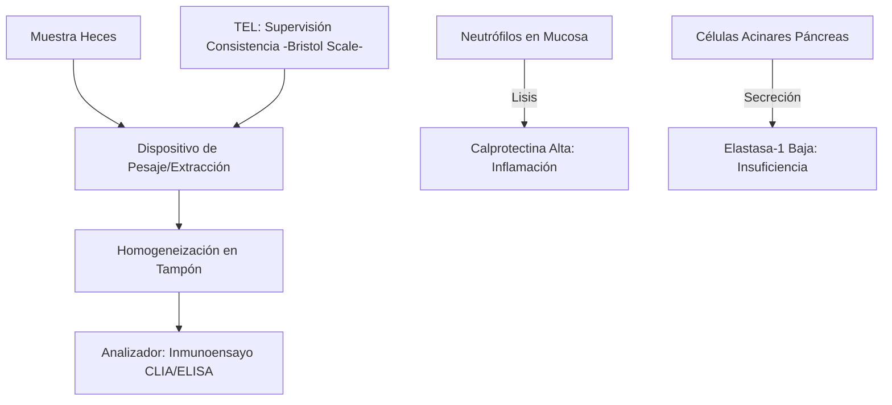
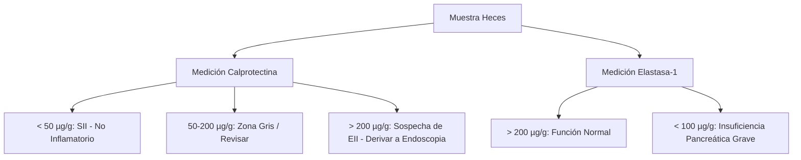
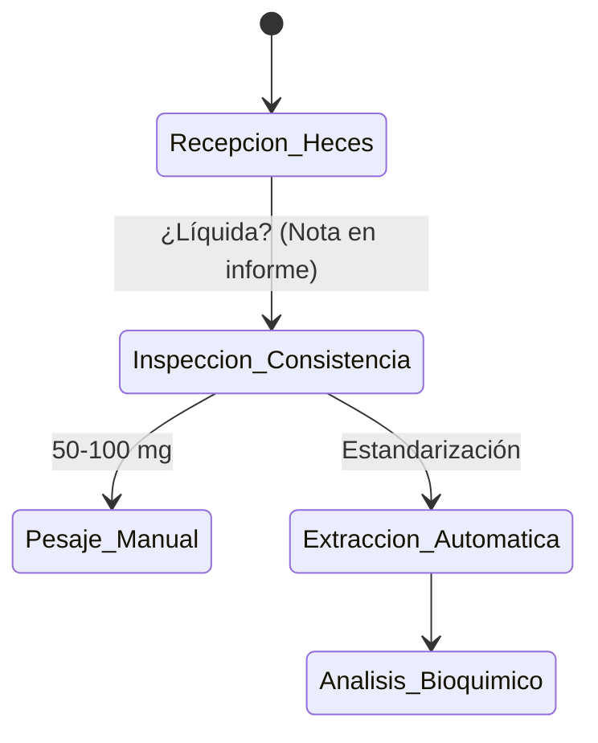

# Semana 5: Más allá de la Sangre
## Lección 22: Información oculta en las Heces: Calprotectina y Elastasa Fecal

### 1. Título y Resumen (Abstract)
**Título:** Utilidad de los Biomarcadores Fecales en el Diagnóstico Diferencial de la Patología Intestinal: De la Inflamación Crónica a la Insuficiencia Pancreática Exocrina.
**Resumen:** Este artículo analiza los fundamentos bioquímicos de la Calprotectina y la Elastasa Fecal como herramientas no invasivas en gastroenterología. Se evalúa el valor de la calprotectina para distinguir entre Enfermedad Inflamatoria Intestinal (EII) y Síndrome de Intestino Irritable (SII), así como la estabilidad de la elastasa como marcador de función pancreática primario. Se destaca el papel del TSLCB en la gestión de muestras fecales y la optimización de los procesos de extracción analítica.

### 2. Introducción (Fundamentos y Objetivos)
#### 2.1. Fisiopatología del Aparato Digestivo (Módulo 1370)
El currículo de **Fisiopatología General** (Módulo 1370) describe las patologías del tubo digestivo y glándulas anexas. 
- **Inflamación Intestinal:** Caracterizada por la migración de leucocitos (neutrófilos) a la mucosa. 
- **Función Pancreática:** Síntesis y secreción de enzimas hidrolíticas (lipasa, amilasa, elastasa) para la digestión de macromoléculas.
- **Patologías Relacionadas:** Enfermedad Inflamatoria Intestinal (Crohn, Colitis Ulcerosa) e Insuficiencia Pancreática Exocrina (FPI).

#### 2.2. Biomarcadores Fecales y su Bioquímica (Módulo 1371)
El **Módulo de Análisis Bioquímico** incluye el estudio de componentes en heces:
1.  **Calprotectina Fecal:** Proteína de unión al calcio (60% de las proteínas citosólicas del neutrófilo). Su presencia en heces indica migración leucocitaria por inflamación mucosa activa.
2.  **Elastasa-1 Pancreática:** Enzima altamente estable que no se degrada en el tránsito intestinal. Su cuantificación indica la capacidad de síntesis del páncreas exocrino.
3.  **Sangre Oculta en Heces (SOH):** Detección de hemoglobina humana (métodos inmunológicos) para el cribado de cáncer colorrectal.

#### 2.3. Fase Preanalítica y Preparación (Módulo 1367/1368)
El TSLCB debe dominar el procesamiento de muestras fecales:
- **Homogeneización y Extracción (Módulo 1367):** Uso de dispositivos colectores con volumen de extracción fijo para estandarizar la dilución de la muestra.
- **Consistencia de las Heces:** Influencia en la concentración del biomarcador (efecto dilución en heces líquidas).
- **Estabilidad (Módulo 1368):** La calprotectina es estable ~7 días a temperatura ambiente.

**Objetivo:** Establecer el algoritmo de validación técnica de biomarcadores fecales conforme a las guías de la Comunidad de Madrid.

### 3. Material y Métodos
- **Diseño:** Estudio descriptivo y procedimental.
- **Entorno:** Laboratorio de Bioquímica y Gastroenterología, Hospital Universitario de Getafe.
- **Intervenciones:** Determinación de Calprotectina mediante inmunocromatografía de alta sensibilidad o inmunoensayo quimioluminiscente (CLIA). Determinación de Elastasa-1 por ELISA monoclonal (específico humano).
- **Procesamiento:** Uso de dispositivos de extracción automatizada de heces (CALEX / Faecal Sample Prep).

### 4. Resultados (Hallazgos Experimentales)
Interpretación clínica según puntos de corte estandarizados:

### 5. Discusión y Conclusiones
La calprotectina tiene un valor predictivo negativo excelente: un resultado < 50 µg/g descarta prácticamente la EII activa, ahorrando colonoscopias innecesarias. Se concluye que el TSLCB debe supervisar meticulosamente la fase de extracción, ya que el moco de la superficie de la hez puede contener concentraciones de calprotectina muy superiores al centro de la muestra. La elastasa fecal sigue siendo el *Gold Standard* no invasivo para descartar malabsorción de origen pancreático.

### 6. Agradecimientos
Al equipo de Enfermería de Digestivo por la formación a los pacientes en la técnica de recogida domiciliaria.

### 7. Bibliografía (Literatura Citada)
- **GETECCU: Guía para el uso de biomarcadores en la enfermedad inflamatoria intestinal.** [Ver en geteccu.org](https://geteccu.org/guias-y-recomendaciones)
- **Consenso SEQCML para la utilización de la calprotectina fecal.** [Ver en seqc.es](https://www.seqc.es/es/bioquimica-en-el-laboratorio-clinico/manuales-y-monografias/)
- **BSG Guidelines for the Management of Exocrine Pancreatic Insufficiency.** [Ver en bsg.org.uk](https://www.bsg.org.uk/clinical-resource/management-of-exocrine-pancreatic-insufficiency/)
- **Diagnostic Value of Fecal Elastase-1 in Chronically Stooling Patients.** [Ver en ncbi.nlm.nih.gov](https://www.ncbi.nlm.nih.gov/pmc/articles/PMC4212502/)

---
### Sobre la Ponente
**Marta García Corbalán** es Facultativa Especialista de Área (FEA) de Bioquímica Clínica en el **Hospital Universitario Arnau de Vilanova** (Lleida).

### 8. Charla y Transcripción (Contenido Multimedia)

**Enlace al vídeo:** [Ver en YouTube](https://www.youtube.com/watch?v=jlOCJwlKoto)

#### Transcripción de la Sesión
Hola, soy Marta García Corbalán, facultativo especialista en bioquímica clínica en el Hospital Universitario Arnaudo de Vilanova en Yida y voy a hablaros hoy de la información oculta en Eces. El título está así a posta eh haciendo referencia a la sangre ocultaneces, pero vamos a hablar de e muchas más eh pruebas que se van a realizar en esta muestra que nos van a dar información muy útil para el diagnóstico de ciertas patologías.

Este es el índice que seguiremos a lo largo de la presentación y eh pasaremos ahora a ver la la introducción con las indicaciones del estudio. El estudio de ECEs eh tiene su interés para eh distintas situaciones, entre las que van a destacar las siguientes. En cuanto al coprocultivo, para los procesos infecciosos, que va a identificar patógenos específicos como salmonela, sigela, campilobácter o parásitos, eh, no vamos a entrar en ellos porque si no se quedaría una sesión muy amplia. Entonces, sobre todo, vamos a a centrarnos en las pruebas para la para los diagnósticos de alteraciones de la digestión como mal absorción y maldigestión en las pruebas para las los procesos cancerígenos y el sangrado gastrointestinal y los procesos inflamatorios intestinales destacando la enfermedad inflamatoria intestinal.

Para conocer el por qué se van a solicitar ciertas pruebas y el por qué nos da cierta información los resultados que nos ofrezcan, e mejor es comenzar por por comprender cómo funciona la normalidad del proceso de del proceso digestivo de de cómo se forman las eces. Entonces, las eces van a ser el producto final de este procesamiento digestivo de los alimentos que va a seguir ciertas etapas eh consecutivas. Entonces tendremos la ingestión, que va a ser la entrada de alimentos y líquidos en el aparato digestivo. Luego tendremos una digestión que ya va a comenzar en la boca con la e masticación, sería una digestión mecánica y con la secreción de saliva, una digestión química. Entonces, con la digestión mecánica de la masticación, conseguiremos el desmenuzamiento de los alimentos y además eh realizaremos una una digestión química, por ejemplo, con la milasa salivar, que va a participar en la digestión de los carbohidratos. Luego, por ejemplo, los movimientos peristálticos del esófago, también sería una digestión mecánica. Y luego tendríamos eh ácidos gástricos y enzimas eh tanto en boca, estómago, intestino delgado, que van a descomponer el bolo alimenticio en moléculas simples. Entonces, se va a transformar en quo, va a ser el bolo alimenticio junto con el jugo gástrico y eh posteriormente en kilo, que será ese kimo, con la mezclado con la bilis, el jugo pancreático o jugo y jugos intestinales. A continuación tendremos la absorción que sería el paso de los nutrientes a las células intestinales, que va a ser los enterocitos, y su transporte a sangre o linfa. Eh, luego en el intestino grueso tendremos la absorción de agua y ya por último el proceso de defecación que será la expulsión de las sustancias no digeridas o desechos o residuos en forma de eces a través del recto y el ano.

Aquí veremos de una forma más gráfica todo este proceso del que hemos hablado. Entonces, comenzando por la boca, tendremos e ya una digestión de carbohidratos y lípidos gracias a la milasa y la lipasa y eh veremos el transporte del polo alimenticio por el esófago con esos movimientos peristálticos que hemos comentado antes. En el estómago se se producirá el almencenamiento y triturado y vaciado de los nutrientes con ya un comienzo de digestión gracias a los jugocástricos, al ácido clorídrico, la pesina y la lipasa, se realiza la digestión de lípidos y proteínas. Luego las sales biliares nos van a ayudar a la digestión de las grasas mediante su emulsión, la formación de micelas, eh, que lo veremos más adelante, el estudio de grasa eces. Eh, gracias a las enzimas pancreáticas tendremos la digestión de carbohidratos, lípidos y proteínas, que también veremos adelante cómo nos va a influir tener una insuficiencia pancreática. En el intestino delgado, en la primera porción, el duodeno, vamos a tener la absorción de la mayoría de los nutrientes, sobre todo en calcio. Eh, y ya eh a lo largo del resto del del intestino, en el Y1 vamos a tener la digestión de carbohidrato, lípidos y proteínas, de otras vitaminas, agua, hierro. Ya llegando a la última porción del intestino delgado, tendremos absorción de vitamina B12, sales biliares. Y llegando al final, al colon, tendremos la absorción de agua, como hemos comentado antes, electrolitos, ácidos grasos de cadena corta, que para eso han tenido que pasar por toda esta digestión de la con las sales biliares. Y tendremos también la fermentación de bacterian de de carbohidratos como la fibra y la formación de vitamina AK y biotina.

En cuanto a la composición de las eces, vamos a ver esta tabla y en cuanto a la frecuencia de las deposiciones, seguiremos la regla del tres para orientarnos, que sugiere que la normalidad sería realizar un mínimo de tres deposiciones a la semana y un máximo de tres eh veces al día, de manera que menos de tres veces a la semana podría sugerir estreñimiento y más de tres veces al día diarrea. cantidad eh varía mucho según la ingesta de fibra, pero con unas dietas estándar el peso promedio diario es de unos 128 g al día en adultos. Eh, ¿por qué es importante la fibra en este contexto? Porque al aumentar el peso de y el volumen de las eces, eh, acelera el tránsito intestinal. Entonces, va a reducir el tiempo que las sustancias e cancerígenas van a estar en contacto con la pared del colon, eh, siendo importante para la prevención del cáncer de colon. Y además esa fibra, como hemos visto en la diapocitiva anterior, también va a ser digerida por las bacterias del colon, que van a producir ácido grasos de cadena corta que tienen propiedades antiinflamatorias y todo esto va a a ser importante para eso, para la prevención del cáncer de colon. Luego, en cuanto a los componentes normales en en las eces, tendremos un porcentaje de un 70 75% de agua que va a determinar la consistencia de las eces. En cuanto a la materia sólida, va a ser solo un 25% y eh se va a dividir en bacterias, que va a ser más o menos un 25 o 50% de este 25 de materia sólida. Y es la flor intestinal. va a realizar la va a ser importante para la fermentación, el metabolismo y la formación de las eces. Eh, en cuanto a restos alimentarios va a ser variable, pero está en torno a un 30% de la fracción sólida. Sobre todo van a ser fibras y residuos no digeridos. Luego nos va a dar información sobre digestiones incompletas. Las células epiteliales se encuentran en baja cantidad y van a ser por la descamación de la mucosa intestinal, que es la renovación normal del epitelio. Las grasas o lípidos, lo normal, ya lo veremos también en adelante, es e encontrar menor de menos de 7 g por día, que supone un 10% más o menos, 10 a 20 de la fracción sólida. Entonces, van a ser los líquidos no absorbidos y eh nos va a dar una información sobre la digestión y absorción normal. Eh, las sales minerales suponen un 3 a un 10% de la fracción sólida y van a ser eh tanto electrolitos, calcio y fósforo, que nos va a dar información sobre el equilibrio hidroelectrolítico. Y en cuanto a los pimientos vilares como la estercovilina, eh normalmente nos encontraremos trazas y es por la degradación bacteriana de la bilirubina que va a dar, además es de color marrón a las eces.

En cuanto al análisis macroscópico de las eces, eh nos guiaremos de la escala de eces de Bristol, que nos va a clasificar en siete tipos, las eces según su consistencia e su entonces tendremos del tipo uno los trozos duros separados que va a ser estreñimiento importante, tipo dos también el ligero estreñimiento, siendo los tipo tres y cuatro los rangos normales y en cuanto a tipo 5 se y si tirando más hacia hacia diarrea. Entonces, vamos a ver qué nos puede indicar cada una de estas alteraciones. Pues unas eces líquidas nos van a poder indicar mala absorción, infección o hiperscrireción intestinal. unas eces duras, pues por ejemplo un exceso de absorción en el colon, un tránsito lento, unas eces blandas o pastosas, puede ser un tránsito acelerado, puede ser como lo que hemos dicho con la fibra o e un posible déficit de bilis o de digestión digestión incompleta. Las eces grasas, que se va a conocer como este atorrea, nos puede dar información sobre una maldigestión, que veremos el déficit de enzimas pancráticas o malas absorción del en el intestino. En cuanto al color, el color negro o melenas, va a indicarnos un sangrado digestivo alto e y puede ser también por suplementos de hierro o bismuto, no por ninguna patología. En cuanto al color rojo, puede ser un sangrado digestivo bajo de color recto. El color pálido nos va a indicar falta de bilis o una exción biliar, puede indicar grasa ences. El color verdoso puede ser por un trasito intestinal rápido por eh dietas ricas en vegetales. En cuanto al olor también va a ser importante pudiendo por mala asorción o fermentación excesiva. El moco nos puede indicar irritación o inflamación intestinal y la presencia de sangre oculta que como veremos puede ser de eh lesiones intestinales o para el cribado de cáncer de color rectal.

Ya empezando con la patología, eh realizaremos estudios de mal absorción y maldigestión que van a ser eh trastornos digestivos que impiden la correcta asimilación de los nutrientes. Entonces, la maldigestión va a ser el fallo en la descomposición de los alimentos, es decir, por hidrólis eh dentro del intestino. Y la mala absorción es la incapacidad de la mucosa intestinal para absorber esos nutrientes ya descompuestos. Entonces, eh una de las funciones del páncreas eh va a ser la la producción de enzimas digestivas que van a degradar los alimentos luego en el intestino delgado. Entonces, si el páncreas eh no produce o no libera esas suficientes enzimas, la digestión de de carbohidratos, proteínas y lípidos y ciertos micronutrientes, eh se va a ver incompleta. Entonces, ¿qué patologías tenemos asociadas a esta insuficiencia pancreática? Pues principalmente la pancreatitis crónica y seguido de la pancreatitis crónica tendremos la fibraisquística. Luego ya con menor frecuencia el cáncer de páncreas, eh, por recepción pancreática, por obstrucción del conducto pancreático o e ya como causa genética rara sería el síndrome de Swanschman Diamond, que es un tractor no autosómico recesivo que cursa con neutropenia y esta insuficiencia pancrática eh eso destacando un poco la fibrosis quística que cursa con esta insuficiencia pancreática, Eh, se produce por una mutación, un gen que va a hacer va a codificar una proteína eh CFTR anómala. Eh, esta esta proteína va a funcionar como un canal de cloro. Entonces, si está defectuoso va a haber un una defectuosa excreción de cloro y una excesiva resorción de sodio. Por eso hay deshidratación y formación de unas secreciones más espesas. Esas secreciones espesas van a bloquear los conductos pancreáticos y nos va a causar esa insuficiencia pancreática. Como resultado, tendremos unas voluminosas, grasientas y y fétidas.

Como pruebas para el estudio de la insuficiencia pancrática tendremos, por ejemplo, la lastasa uno fecal, que es una enzima con función proteítica que está producida exclusivamente por el páncreas, lo cual nos es muy útil para por su especificidad. eh se va a excretar en las eces y su disminución en eces nos va a indicar insuficiencia pancrática, como vemos en los en los resultados. Em una cosa importante es que es resistente a la degradación eh durante el trasito intestinal, con lo cual eh se disminuirá el número de falsos negativos porque se hayan degradado antes de llegar a las eces y además los resultados no están afectados por el tratamiento oral que reciben los pacientes con enzimas pancráticas sustitutivas. Esto, ¿por qué es? Porque el inmunoensayo, el ir utiliza anticuerpos monoclonales que se van a unir a la de elastasa humana. Entonces, no va a interferir, no va a medir eso esa ese tratamiento sustitutivo. Lo que sí es importante tener en cuenta es que se pueden ver alterados los resultados pacientes con diarrea acuosa porque pueden tener valores bajos por la porque el contenido fecal directamente es que está diluido. Entonces, se recomendaría pues repetir la determinación tras la resolución de de la diarrea. Eh, luego como resultados, una una de las tasas mayor 200 microg por gramos de eces nos va a indicar una función pancrática normal entre 100 y 200, una insuficiencia pancrática pancrática leve o moderada y una e en las tasas menor a 100 micr por gramo de eces eh va a ser una insuficiencia pancrática grave. Otra prueba que nos va a dar información sobre la suficiencia pancrática va a ser la quimiotrisina fecal, que es una enzima proteítica que viene de que la trisina activa el quimiotrisinógeno pancreático y este lo transforma en quimiotrisina el intestino delgado. Entonces, se va a excretar en eces, se puede hacer tanto en muestra aislada como en eces de 24 o 72 horas y lo que nos va a indicar una insuficiencia pancrética es su disminución. Esta es menos sensible que la prueba anterior que la tasa unofcal y sí que requiere suspender el tratamiento con enzimas pancráticas 5 días antes de la recogida de la muestra. Entonces, los resultados eh positivos, es decir, presencia de quemotina, va a ser una función pancrática normal y un resultado negativo que no se detecte o se detecte en valores muy bajos, va a ser insuficiencia pancrática leve o moderada.

En cuanto a la el estudio de grasa ences nos va a dar información sobre la digestión y la absorción de lípidos. Y la normalidad es que el 95% de los lípidos de la dieta se van a absorber en intestino, es decir, que ences va a haber una cantidad mínima de grasa. Entonces, eh cuando tengamos hablemos de este atorrea es la la presencia excesiva de grasa en ECS. Esto va a hacer que esas Eces eh sean voluminosas, fétidas, pálidas. y además por ese contenido en grasa suelen flotar. ¿Qué patologías tenemos asociadas a esta grasa en eces? pues es insuficiencia pancrática socrina, la enfermedad inflamatoria intestinal, la enfermedad celíaca, infecciones y enfermedades de las vías biliares. Por lo que hemos dicho en las primeras diapocitivas que la bilis emulsiona las grasas formándose micelas para que pueda digerirse completamente. Para el estudio de las grasaneces tendremos los métodos cualitativos que nos van a permitir detectar la presencia de grasa de ences de forma rápida, pero no la van a cuantificar con precisión. Eh, aún así son las técnicas más usadas por su simplicidad. Por ejemplo, tendremos entonces la atención con sudán tres o cuatro. Em, este colorante es lipofílico, es soluble en grasa. Entonces vamos a conseguir que se tiñan las grasas de color rojo anaranjado, que es lo que veremos en el microscopio. Para ello, pues primero vamos a tomar una pequeña muestra de eces que vamos a a emulsionar una solución y le vamos a echar el colorante. Entonces, vamos a observar una gran cantidad de gotas lipídicas de este color naranjo naranja rojizo e que nos va a indicar esta torrea.

Otros métodos para estudiar las grasas ences eran los métodos cuantitativos clásicos como el método de Van de Camer, que va a ser más preciso, pero se usan con menos frecuencia porque es más engorroso. Requiere una recogida de de 72 horas para reducir la variabilidad de la muestra, siguiendo una dieta especial que va a ser de unos 100 g de grasa al día para evitar fasos negativos por un bajo consumo de grasas. Entonces, se homogeneizará la muestra total recogida en esas 72 horas. Y el fundamento es que el este método va a hidrolizar las grasas por sa bonificación con hidróxido potásico y se van a cuantificar los ácidos grasos liberados. En cuanto a los métodos cuantitativos nuevos, tendríamos el análisis por espectrometría infrarroja, que requiere una muestra de 24 horas. es una técnica rápida y se basa en el absorción de radiación infrarroja por los enlaces químicos de las de las grasas. En cuanto a los resultados, lo normal será obtener un unos valores de grasa de 24 horas menores a 7 g y tendremos ya por mayor de 14 g por 24 horas una esta torrea moderada o grave.

Otra pruebaneces eh que podemos realizar van a ser los cuerpos reductores o azúcares reductores que sirven para la estudio de la mala ababs absorción de carbohidratos. Entonces, ¿qué qué síntomas nos van a dar e esta mala absorción de carbohidratos? Pues diarrea, eh de posiciones numerosas, acuosas, explosivas y ácidas. Lo de ácidas luego veremos que es importante porque habrá más pruebas como el pH. Entonces, los azúcares reductores son eh se llaman así porque tienen una capacidad de reducir el sulfato de cobre a óxido de cobre que nos va a dar un color rojo naranja, que por eso se va a realizar esta prueba. Y estos azúcares reductores son la glucosa, la fructosa, la galactosa, la lactosa y la maltosa. Es importante acordarse que la sacarosa no lo es. Entonces, en procedimiento, pues se va a mezclar la muestra con un reactivo que va a tener ese sulfato de cobre, el son los test de Benedito de Feling y se va a aplicar eh calor mediante baño maría para acelerar esa reacción. Entonces, luego veremos el color. Entonces, cuando veamos que ha reducido de sulfato a a óxido de cobre con este color rojo o naranja, pues es que tendremos esos cuerpos reductores en en eces, que esto que nos va a sugerir, pues que parte de los carbohidratos digeridos no ha sido digerida o absorbida correctamente.

Como decía antes, vamos a ver ahora también el estudio de PHnes. Entonces, este también nos va a dar información sobre la malsorción de carbohidratos, que nos va a dar unas eces ácidas y se va a realizar pues mediante tirph. Entonces, eh, ¿qué tendremos en cuanto a a la normalidad? un pH entre 6, 7 y5 que que ligeramente alcalino, pero hay que tener en cuenta que los niños pueden tener unos valores más ácido porque su alimentación se basa en el leche materna que ya eh causa ese pH más ácido. menor a 5,56 tendremos una posible malabsorción de carbohidratos o grasas, también infecciones bacterianas o dietas ricas en hidratos de carbono. Y un pH alcalino mayor a 7,5, pues nos puede indicar procesos de putrefacción, de inflamación intestinal o dietas muy ricas en proteínas. Eh, con pHs muy altos se relaciona con un mayor riesgo de cáncer de colon. Esto tiene que ver también con lo que hemos dicho al principio, con la fibra que conseguíamos como un pH más e ácido, ¿no? Más alcalino. Entonces, ¿qué factores van a influir en el resultado? Pues eh una dieta rica en proteínas nos va a dar más compuestos amoniacales, lo que va a hacer una alcalinización. Como visto aquí, una dieta rica en fibra, hidratos de carbono, nos va a dar un crecimiento de las bacterias de la microbiota normal intestinal que va a fermentar estos hidratos y la fibra y nos va a dar un hacia acidificación. acidificación de las eces. Los antibióticos al final nos van a alterar esa microbiota. Eh, si nos eliminan estas bacterias de la microbiota que que la acidifican, pues tendremos lo contrario, una alcalinización. Y el tiempo de tránsito intestinal, si tenemos un tránsito más rápido, por ejemplo, con diarrea, hay menos tiempo para estas bacterias para que hagan esa fermentación, con lo cual pues igual tendremos una alcalinización.

Ya pasando a a otra prueba muy importante va a ser la carprotectina, que sobre todo nos va a indicar inflamación intestinal porque los neutrófilos van a migrar eh en casos de inflamación a la mucosa intestinal y ahí van a liberar sus proteínas inflamatorias. La calprotestina eh forma parte de estas proteínas inflamatorias y es y es un 60% de las proteínas del citosol de estos neutrófilos. Entonces va a ser el mejor marcador no invasivo de enfermedad inflamatoria intestinal que tendremos para diferenciar la colitis ulcerosa o la enfermedad de cron. también la podemos solicitar con con la sospecha de brote de enfermedad porque son enfermedades autoinmunes que van a a cursar en brotes. Entonces también las indicaciones van a ser otras como la diarrea acusa sanguinolenta, dolor abdominal, fiebre, pérdida de peso, sangrado rectal y eh como técnicas eh la técnica Elisa va a ser la más extendida, aunque también se pueden usar test rápidos, – turbidimetría, quimolinmunescencia y bueno, en cuanto a los resultados, por ejemplo, eh nos sirve también para diferenciar entre una enfermedad inflamatoria intestinal o un síndrome de intestino irritable que no va a cursar con esa inflamación, con lo cual tendremos valores normales menores a 50 eh micr por gr de eces. En cuanto a una inflamación ya leve o inespecífica, que puede ser por infecciones, por toma de antiinflamatorios no esteroideos o por enfermedad celíaca, pues eran unos resultados más e entre 50 y 200 micrg. Si ya mayores de 200 microgr eces, tendremos más información sobre una inflamación activa, que aunque también pueden ser infecciones, aines y demás, pues nos orientará más a enfermedad inflamatoria intestinal. Importante considerar que los menores de 4 años eh fisiológicamente van a tener valores más elevados.

Como prueba importantísima en Eces tendremos también la sangre oculta en Eces, es decir, sangre no visible. Detectaremos la hemoglobina que que no llegamos a a verla e ni al microscopio. Y eh estas causas de sangrado digestivo serán la inflamación de la mucosa intestinal, que puede ser tanto por inflamación, enfermedad inflamatoria intestinal como por otras causas de inflamación como infecciones y demás. Em, tendremos el sangrado por pólipos, por úlceras y importantísimo por el cáncer de colon, que es lo que ha condicionado que se desarrollen crivados de cáncer colorrectal como el programa Prebecolon que va a incluir a toda la población entre 50 a 69 años. En algunas comunidades han ampliado esta edad 74 años y van a darles estos kits de estudio de sangre ocultaneces. Entonces, ante un resultado negativo, se va a repetir el test cada 2 años hasta estas edades y ante un resultado positivo se citará al paciente para una colonoscopia para confirmación. Con todo esto se ha conseguido reducir la mortalidad por cáncer de colon hasta en un 16 a 33% al eh detectarlo mucho antes de que llegue de que empiecen la eh los síntomas graves y metástasis.

Para su estudio tendremos distintos métodos, aunque el más usado por sus ventajas que veremos ahora va a ser el método inmunoquímico. Eh, ambos van a detectar la hemoglobina, que es grupo hemomaglobina e que va a estar presente ences en el caso del sangrado ocultóis. En el caso del método inmunoquímico va a detectar la globina humana, que no tiene interferencias con las globinas animales, con lo cual eh ante una alimentación con e proteína de origen animal y demás y no va a interferir y las globinas del sangrado de la de la parte superior del tracto digestivo se van a degradar antes de llegar al colon, con lo cual tampoco se van a detectar. Entonces es eh una prueba eh mucho más ventajosa que el método del guayaco, que eh detecta eh también la hemoglobina, pero eh detecta el grupo emo. Entonces, bueno, eh además para aumentar la sensibilidad pues también suele requerir una muestra de tres días consecutivos. Entonces también además es más engorroso. ¿Qué pasa con este grupo EMO? pues que es idéntico en la hemoglobina al resto de animales. Entonces con una dieta rica en carne roja puede dar falsos positivos. Y además resiste la degradación en el intestino. Entonces, esto que estábamos diciendo como ventaja del inmunoquímico, de los sangrados de la parte superior de trato digestivo, aquí sí se va a detectar. Entonces, por ejemplo, ante un sangrado de encías puede detectarse e en esta prueba sin tener ningún pólipo ni nada de cáncer color rectal. Entonces, falsos positivos, además, como es un una prueba colorimétrica, pues nos van a dar los alimentos que dan un cambio de color en la ausencia de sangre, pues los rábanos, coliflor, manzana y brócoli, que hay que evitarlos en la dieta antes de esta prueba. Y como falsos negativos, la vitamina C l va a interferir con la reacción evitando el cambio de color, incluso en situaciones en las que sí que haya presencia de sangre. Entonces, aquí vemos cómo eh se deposita en esas almohadillas la muestra veces y con el e se pone el reactivo y se verá el cambio de color.

#### Explicación de la Ponencia
La sesión aborda el análisis clínico de las heces como herramienta diagnóstica fundamental. Se detallan las fases del proceso digestivo y la composición normal de las heces, así como el análisis macroscópico (Escala de Bristol). Se profundiza en el estudio de la malabsorción y maldigestión (elastasa, quimiotripsina, grasas, azúcares reductores, pH), marcadores de inflamación (calprotectina) y el cribado de cáncer colorrectal mediante la detección de sangre oculta, comparando métodos inmunoquímicos y químicos.

*Contenido técnico integral para la excelencia profesional del TSLCB.*
