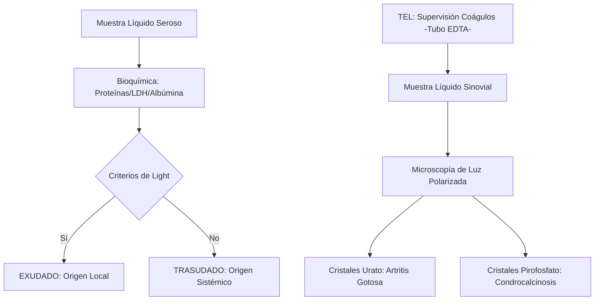
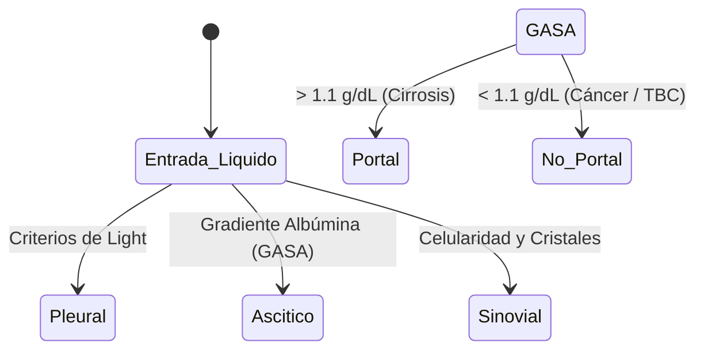

# Semana 5: Más allá de la Sangre
## Lección 23: Casos Clínicos: Mis líquidos favoritos

### 1. Título y Resumen (Abstract)
**Título:** Diagnóstico Diferencial de los Derrames Serosos mediante el Análisis Bioquímico y Citológico: Aplicación de los Criterios de Light y Caracterización de Cristales.
**Resumen:** Este artículo integra el conocimiento sobre líquidos extra-sanguíneos (pleural, ascítico y sinovial) a través de casos prácticos. Se fundamenta la distinción entre trasudados y exudados basándose en la permeabilidad capilar y se evalúa la técnica de microscopía de luz polarizada para la identificación de artritis microcristalina. Se destaca el papel del TSLCB en la validación de ratios suero-líquido y la gestión de la seguridad biológica en muestras de cavidad.

### 2. Introducción (Fundamentos y Objetivos)
#### 2.1. Fisiopatología de las Cavidades Serosas (Módulo 1370)
El currículo de **Fisiopatología General** (Módulo 1370) describe las membranas serosas (pleura, peritoneo, pericardio). El líquido seroso es un ultrafiltrado plasmático que lubrica el espacio entre las hojas parietal y visceral.
- **Formación de Derrames:** Acumulación patológica de líquido por desequilibrio entre formación y reabsorción.
    - **Trasudado:** Resultado de cambios sistémicos (insuficiencia cardíaca, cirrosis) con BHE intacta.
    - **Exudado:** Resultado de inflamación local (infección, cáncer) con aumento de permeabilidad capilar.

#### 2.2. Valoración Bioquímica de Líquidos de Cavidad (Módulo 1371)
El **Módulo de Análisis Bioquímico** incluye la medición de solutos en fluidos:
- **Criterios de Light (Líquido Pleural):** Uso de ratios proteínas y LDH (Líquido/Suero) para clasificar el derrame (Módulo 1371).
- **Gradiente de Albúmina (GASA):** Diferencia entre albúmina en suero y líquido ascítico para detectar hipertensión portal.
- **Detección de Amilasa:** Sugiere pancreatitis o perforación esofágica (Módulo 1371).

#### 2.3. Líquido Articular y Microscopía de Luz Polarizada (Módulo 1368/1371)
- **Cristales (Módulo 1368):** El TSLCB debe identificar cristales de Urato Monosódico (Gota) y Pirofosfato Cálcico (Seudogota) mediante microscopio óptico con filtros polarizadores y placa compensadora (birrefringencia).
- **Recuento Celular:** Diferenciación entre líquido inflamatorio, séptico o mecánico (Módulo 1374).



**Objetivo:** Integrar la valoración analítica de fluidos biológicos en el proceso de validación técnica compleja.

### 3. Material y Métodos
- **Diseño:** Estudio clínico retrospectivo multivariante.
- **Entorno:** Laboratorio de Líquidos y Citología, Hospital Universitario de Getafe.
- **Intervenciones:** Determinación de glucosa, proteínas, albúmina, LDH y colesterol en líquidos y sueros pareados. Recuento celular en cámara de Neubauer. Estudio de cristales mediante microscopio de luz polarizada con placa compensadora de cuarto de onda.

### 4. Resultados (Hallazgos Experimentales)
Diferenciación de perfiles según el origen del fluido:

```mermaid
grid-layout
  - title: Gota (Urato Monosódico)
    content: Agujas finas, birrefringencia negativa intensa.
  - title: Seudogota (Pirofosfato)
    content: Romboedros/Paralelepípedos, birrefringencia positiva.
```

### 5. Discusión y Conclusiones
La interpretación del líquido sinovial debe ser inmediata, ya que los cristales pueden disolverse o cambiar de morfología según la temperatura. Se concluye que el TSLCB debe asegurar que la muestra para recuento celular esté en un tubo con EDTA para evitar microcuágulos que falseen la cifra. El uso del gradiente albúmina (GASA) ha desplazado al ratio proteico en el líquido ascítico por su mayor precisión fisiopatológica.

### 6. Agradecimientos
A los servicios de Neumología y Reumatología del HUGF por la integración de los datos clínicos en los informes de laboratorio.

### 7. Bibliografía (Literatura Citada)
- **Clinical Practice Guidelines for the Management of Pleural Effusion.** [Ver en thorax.bmj.com](https://thorax.bmj.com/content/78/Suppl_3/s1)
- **Estudio analítico de los líquidos serosos - SEQCML.** [Ver en seqc.es](https://www.seqc.es/es/bioquimica-en-el-laboratorio-clinico/manuales-y-monografias/)
- **ACR Guideline for the Management of Gout.** [Ver en rheumatology.org](https://www.rheumatology.org/quality-care/clinical-practice-guidelines/gout)
- **Light's Criteria in the Differentiation of Pleural Effusion.** [Ver en emra.org](https://www.emra.org/emresource-org/percept/lights-criteria/)

---
### Sobre la Ponente
**Verónica Cámara Hernández** es Facultativa Especialista de Área (FEA) de Bioquímica Clínica. Aunque ejerce habitualmente en el **Hospital Universitario de Getafe**, actualmente se encuentra en comisión de servicios desempeñando labores de gestión.

### 8. Charla y Transcripción (Contenido Multimedia)

**Enlace al vídeo:** [Ver en YouTube](https://www.youtube.com/watch?v=bF8mmqdLh90)

#### Transcripción de la Sesión
Hola a todos, bienvenidos a esta séptima edición del curso de actualización en el laboratorio clínico. Para los que no me conocéis, mi nombre es Verónica Cámara. Soy facultativo, especialista en bioquímica clínica y aunque bueno, de normal ejerzo en el Hospital Universitario de Getafe, pues ahora mismo estoy en una comisión de servicio ejerciendo otras labores más de gestión.

Este año eh os voy a presentar, bueno, pues un una sesión de casos clínicos de matimetría y de líquidos biológicos, aunque eh bueno, para los que hacéis el curso de forma regular anualmente, eh el año pasado el bueno, pues mi sesión estuvo más centrada en cómo los equipos de matrimetría nos podían ayudar y en y expliqué eh bueno, pues introduje algunos casos clínicos y este año me voy a centrar más en la parte de líquidos biológicos, aunque sí que veremos un bueno pues un caso clínico más específico de los equipos de matimetría. Como os decía, el bueno, la sesión va a estar dividida en dos bloques, casos clínicos de matimetría y de líquidos biológicos, aunque como os acabo de decir, pues sobre todo voy a estar muy centrada en casos clínicos de líquidos biológicos. A partir de ahora eh voy a a apagar la cámara para que no os moleste ningún momento durante la presentación en ninguna imagen y ya me volveré a conectar con ella una vez eh bueno, estemos finalizando.

Bueno, el primer caso clínico que os presento pues se trata de una mujer de 50 años, pues que acude al servicio de urgencias, presenta malestar desde el día de ayer, está asociado pues a un dolor abdominal, náuseas sin vómitos, una diarrea con moco, eh niega que tenga disuria niematuria, refiere una sensación bestérmica sin fiebre. Eh, y además cuenta que eh bueno, pues que la semana anterior había sido tratada por una insuficiencia del tracto urinario. Cuando uno lee eh o cuando le llega un paciente con con esta sintomatología, bueno, pues lo primero que hay que decir es, ¿vale?, el síntoma principal de la paciente es el dolor abdominal. Por tanto, ¿qué tenemos que descartar a priori con el dolor abdominal? Lo más común pues una gastroenteritis, algún síndrome del intestino irritable, una apendicitis aguda, pero eso también nos va a dar alguna clave de la analítica, una colitiasis que también podríamos ver alguna cosa en la analítica o un colicorreno. E la insuficiencia del tracto urinario en principio no tiene disuria ni hematuria y además ha estado tratada. Por tanto, bueno, pues también podría en ocasiones dar un dolor abdominal, aunque eh más que dolor abdominal, las eh lo que nos van a dar es el típico, ¿no?, cuando alguien dice, "Me duelen los riñones". Ese es el bueno, pues lo más eh donde más se irradiaría el dolor más que a la zona abdominal. Pero bueno, esa la descartamos porque, como os digo, no tiene ni disuria ni hematuria. Los médicos, ¿qué hacen? pues analítica completa con una gasometría venosa y además le solicitan un copocrultivo. En cuanto a los resultados, estamos en un laboratorio de urgencias. El el coprocultivo, por tanto, eh no va a salir en el día. eh le darán los resultados a posterior, pero de la analítica que destaca pues básicamente la PCR que la tiene en 8,6 mg decilitro, el valor estándar es menor de cinco. Entonces, bueno, pues tiene ahí una PCR un poco anodina, pero bueno, pues un poquito elevada. La gasometría venosa está sin alteraciones, la coagulación sin alteraciones y en el hemograma tiene eh bueno, pues presenta 56,000 plaquetas. Esto en sí a priori sería una eh trombocitopenia y habría o por lo menos nosotros en el laboratorio es un criterio tanto en el laboratorio como en las guías clínicas. Es un criterio por debajo de 100,000 de revisión del frotis de sangre periférica. Eh, las trombocitopenias, hm, sobre todo, pues se presentan en ocasiones, pues por ejemplo, en patologías como una leucemia o como una anemia aplásica. Es verdad que en este caso también luego hay que pensar, ¿no? Cuando uno ve una analítica tiene que que analizar el contexto, no se puede fijar solo en un valor. Es decir, aquí no nos podemos quedar únicamente con el valor de las plaquetas. Hm. En todo caso tendríamos, bueno, pues una PCR que está nodina y de repente 56,000 plaquetas. Si si esta paciente no tiene ninguna alteración más en el hemograma, pues hombre, nos debemos eh mosquear un poco y ver qué ocurre. Como os decía, esto es un criterio para la revisión del frotis de sangre periférica, que por tanto deberíamos eh pues realizar ese frotis y verlo al microscopio para descartar una eh pseudo eh trombocitopenia, ya sea una aglutinación por electa o por eh un – satelitismo plaquetar o unas crioglutininas, pero tenemos otras opciones a día de hoy, mucho más automatizadas.

Como os digo, hay opciones automatizadas que nos permiten hacer una comprobación o una medida un poco más exacta e de eh las plaquetas. Hm. Bueno, los que eh trabajéis con bueno, con equipos de hematimetría porque estéis en las secciones de hematología o de las urgencias, sabéis que a día de hoy prácticamente casi todos los equipos o una gran parte de los equipos de matimetría se basan en la citrometría de flujo con fluorescencia. En este caso que son eh las – las plaquetas, pues lo que se hace es que se utiliza un colorante que se va a unir a la ADN y a la RN y luego pues van a pasar a través de ese eh rayo láser y luego pues la dispersión con el tamaño pues se van a medir esas plaquetas. El proceso es un poco más complejo que ahora os voy a explicar y esto nos permite eh bueno, pues hacer una medida más exacta, es decir, vamos a utilizar lo que se denomina las eh la medida de plaquetas óptimas, que está basada en una citometría de flujo, pero que además de ese de hacer pasar las plaquetas por ese rayo láser y dependiendo de las dispersiones en los distintos ejes, pues nos va a decir que efectivamente es una plaqueta o en el caso que sea es un hematí o un leucocito, o qué tipo de leucocito es. Aquí vamos a utilizar pues un eh reactivo – específico para las plaquetas. Como os decía, este método eh es hay que señalar que es e que está disponible en los analizadores de Mindrive en las series en los BC. En este caso, nosotros, por ejemplo, Getafet, que tenemos los veces 6,200, es es donde, bueno, pues son los que utilizamos y donde tenemos disponible este método que si alguno también trabajáis con estos equipos es lo que llamamos el canal de retis. Como os decía, ¿qué qué hacemos? Aparte de utilizar la citometría de flujo tal y como la conocemos, utilizamos un reactivo específico. Entonces, lo que se hace es que se precalienta este reactivo, ¿vale? Eh, acorde a esa temperatura de reacción que necesitamos, en este caso 42 gr. ¿Qué hacemos? la muestra con el reactivo que ya está precalentado se mezclan a altas revoluciones, de forma que lo que eh hace es que – ese reactivo específico se une a las plaquetas y lo que e se encarga es de romper, ¿no?, ese ese polímero que se ha formado, ese ese grumo, por así decirlo, de plaquetas y lo divide, o sea, lo va despolimeralizando y eh un y luego una vez que se ha roto ese polímero, pues al pasar por el el láser es capaz de detectar pues plaqueta a plaqueta, ¿vale? O sea, que ese reactivo lo que nos hace es romper esos polímeros que se forman con los agregados plaquetarios. Y como os digo, esto pues a día de hoy está disponible en los equipos de Mindra y es lo que se conoce como el canal Terretis.

Siguiendo con el caso que tenemos, mirad, si veis tenemos a la izquierda, ¿vale? Voy a poneros el puntero ase. Tenemos eh a la izquierda la primera medida, ¿vale? Como veis teníamos aunque aquí pone 56 es por las unidades, ¿vale? Esto serían 56,000 plaquetas. Cuando lo pasamos por e el canal de Retis nos apareció 238,000 plaquetas. es e nosotros los equipos se pueden, bueno, se pueden eh configurar para que el cada digamos unos valores determinados pues te haga esa medida ampliada con las plaquetas ópticas. En este caso fue muy curioso porque el no dio alarma de agregados plaquetarios, ¿vale? O sea, por eso es muy importante analizar todo el conjunto de datos. Yo veo esto es un hemograma normal y evidentemente con este valor de plaquetas tengo que revisar el frotis. Si además tengo la opción de que tengo un canal de Retis, pues de maravilla, porque lo que hago es que lo paso por el canal de Retis para confirmar si ese valor es real o no mientras voy haciendo el frutis. Pero en este caso sí que corregido, ¿vale? Si veis eh los diferentes escategramas, ¿vale? Pues bueno, de normal lo que nos aparece es el de la serie roja, ¿vale? tendríamos las plaquetas, el diferencial leucocitario y luego pues el el escategrama donde están los eh se ve de forma general glóbulos blancos, pero en este caso también nos aparece pues el diagrama de o el escatagrama mejor dicho, de la parte de los reticulocitos, ¿vale? Porque una vez que – mides por este canal, pues lo que también te va a medir son reticulocitos. Como digo, este caso es muy específico para los equipos eh de Mindraay. Volviendo entonces a nuestra eh a nuestro caso clínico, tenemos una señora de 50 años con dolor abdominal, donde lo único que destaca, por tanto, es una PCR bastante anodina. de todos los eh síntomas o los diagnósticos, mejor dicho, perdón, de todos los diagnósticos posibles que os ponía yo al principio, la litiasis, el cólico renal, incluso la pendicitis aguda, nos hubiesen dado seguramente, bueno, sobre todo estas tres – PCRs muchísimo más elevadas y en alguna de ellas incluso la parte hepática pues ya bastante alterada. El síndrome del intestino irritable. Bueno, pues la verdad es que es más difícil de identificar, pero bueno, suele ser algo también que se va va a repetir, no es algo puntual. Esta señora finalmente era una gastroenteritis y bueno, el copocultivo salió negativo, así que bueno, pues esta señora vino a urgencias, pero pues por algo bastante leve.

El segundo caso eh que os presento es – bueno, pues es un varón de 47 años, estaba trabajando y bueno, pues presenta una cefalea intensa, una visión – doble. Eh, bueno, pues llama, le da tiempo a llamar al 112 y de todas estas posteriormente pues se desvanece, se desvanece, llega la móvil, eh, lo valora, eh objetivan que está en coma, no tiene movimiento al bueno, eh las pupilas mióticas escasamente reactivas, lo entuban, le ponen la medicación y, bueno, el paciente – presenta en ese momento tensiones e muy tensiones arteriales muy elevadas, lo traslaban de urgencia y de ahí a la U. En este caso, bueno, pues qué hacen le solicitan un tag craneal que muestra una hemorragia cerebelosa derecha y una analítica completa sin alteraciones. ¿Vale? En este sentido, bueno, pues quizá el diagnóstico del paciente, bueno, pues ya va un poco más dirigido porque ya de a priori ya en el TAG nos sale que hay una hemorragia cerebral. Por tanto, bueno, pues con eso comienzan a tratar al paciente y al quinto día le solicitan un eh líquido céfalorraquídeo. Del líquido céfalorraquídeo, en este caso va a estar analizado por los equipos de Sigmes. Pues veis que tiene eh en este caso tiene de Leucos, ¿vale? Esto serían 423 eh células por microlitro y células totales pues prácticamente las mismas, 456. ¿Por qué traigo este este caso clínico que bueno, pues es bastante anodino? Y ya veréis para remarcaros la importancia de que conozcáis la tecnología que se está usando en los laboratorios y en vuestro día a día. y que sepáis interpretar qué qué sale qué sale en los equipos, qué resultado me está dando un equipo y si tengo que hacer algo o si me tiene que llamar algo la atención. En este caso, – los equipos de Sigmes – los XN, pues también trabajan la filosofía para la detección también de líquidos biológicos es – la citometría de flujo. Y aquí también tenemos pues un escategrama con la parte de leucocitos, ¿vale? Que es este de la izquierda y este que es la parte extendida, que básicamente simplemente son los ejes, por así decirlo, más – más amplios, ¿vale? En el equipo aquí sí que me salía una alarma. En este caso me decía que el escategrama de los leucocitos, pues que a priori era normal. Sin embargo, a mí me tiene que llamar mucho la atención este – este escategramo. ¿Qué ocurre? O sea, está todo en la parte horizontal, no hay las típicas nubes donde se ven las poblaciones y en cambio me dicen que son que tengo 423 leucos. Si nos vamos en qué están distribuidos, pues nos aparece, por ejemplo, que hay un 24% de macrófagos, un 18% de linfocitos y un 52% prácticamente de neutrófilos. ¿Dónde están las nubes? Y está todo prácticamente en la parte horizontal. Yo cuando veo esto me tengo que mosquear y decir, "Uy, aquí pasa algo. – ¿cómo era el líquido?" Que es lo primero que nos tenemos que preguntar. ¿Era un líquido normal? no era un líquido normal. – pues si nos vamos a como se informó en el laboratorio, nos ponía que precisamente el aspecto macroscópico del líquido ya era un líquido turbio, ligeramente hemático y con presencia de partículas sólidas en suspensión. Esto ya nos tiene que llamar la atención porque pasar un líquido así por por un equipo – automatizado, pues de a priori h podemos decir que el resultado que nos dé desde luego va a ser a revisar, ¿vale? Porque – si ya tenemos partículas sólidas en suspensión, no sabemos que qué vamos a medir. En la descripción microscópica, cuando se hizo – bueno, pues una extensión para verlo al microscopio, pues vamos expuso que se observa escasa celularidad leucocitaria y y presencia de matíes. Y en cuanto al recuento de cos que se hizo por cámara de New Power, salían 25 por microlitro. O sea, que fijaros la diferencia del equipo que me estaba dando, 423 leucos por microlitro a 25. ¿Vale? Entonces, de ahí este caso clínico que os quería traer, que no tiene nada, pero que considero que es muy importante para que seáis conscientes de la importancia de revisar los escategramas de los equipos.

Siguiente caso clínico. Pues aquí tenemos una mujer de 93 años acude a la urgencia por una disnea de varias semanas de evolución. se ha incrementado en los últimos dos días, está asociada también a ortopneas, no tiene – síntomas claros de edemas. – durante la noche parece que algo más de tospectación, no tiene fiebre, bueno, – no hay un dolor abdominal, naceas, vómitos, etcétera. A todo esto, urgencias, servicio de urgencias, ¿qué le solicitamos? Bueno, pues se solicita una analítica completa donde destaca una PCR de 5,4, le hacen una radiografía de tórax donde ahí sí que ven – líquido y por tanto hacen – bueno, pues una toracoesis y un estudio del líquido pleural. El líquido pleural llega al laboratorio. ¿Y qué destacamos de él? Bueno, pues sobre todo lo que vamos a destacar son por un lado el los leucos, ¿vale? Que tenemos 1863 leucos por microlitros. Pero es que si nos fijamos en las células totales estamos en 3,578, o sea, – prácticamente el doble de células tenemos que están identificadas como leucocitos. Este líquido biológico sigue estando analizado por un equipos de Sigmes, un XN. Y en este caso, bueno, pues os cuento un poco las cosas que se ven en el escategrama. Para los que no estéis – familiarizados, tenemos en esta parte de aquí tendríamos los linfocitos, en esta parte de aquí tendríamos los neutrófilos, más abajo tenemos los eosinófilos y luego en esta zona de aquí tendríamos las células, los monoconcitos macrófagos, ¿vale? Pero luego tenemos toda esta zona, ¿vale? que es donde estarían las células que los equipos XN se llaman de alta fluorescencia. Las células de alta fluorescencia, ¿qué células son? Bueno, pues ahí están incluidas macrófagos de tamaños – considerablemente mayores que escapan de la bueno, pues de los estándares que hay para que la citometría de flujo los clasifique como e como células mononucleadas, como monocitos, perdón. – luego tenemos las células mesoteliales y luego las células – atípicas, generalmente las tumorales, ¿vale? Hacemos – bueno, pues las extensiones de este líquido biológico y al hacer las extensiones, pues bueno, tenemos – estas estas imágenes, ¿vale? Este de aquí es el escatagrama e extendido. ¿Por qué lo os lo pongo? Porque como veis, esta nube, que para mí sería una población uniforme y homogénea, el equipo la ha dividido en dos. Esta parte que está más arriba, – pues la pone de azul oscuro y por tanto las va a clasificar como células de alta fluorescencia. En cambio esta que aparece en verde, esta zona en verde, las va a clasificar como células mononucleadas que no – y por la zona en la que está correspondientes a macrófagos, pero es una nube simplemente que es una nube muy grande, o sea, que corresponde a las mismas células. En esta – bueno, en esta extensión, además, aquí se puede ver que hay acúmulos de células, ¿vale? Y luego pues aparte de que haya células mesoteliales o que haya – macrófagos como puede ser este, pues también tenemos otras células hm pues con una elevada relación nucleo citoplasma, pero sobre todo bueno pues lo que tenemos es en muchos casos agrupaciones celulares. ¿Cómo se informó? Estamos, o sea, os – os recuerdo estamos en un laboratorio de urgencias y las información que podemos dar en el momento, en un tiempo corto, es bastante limitada. En este caso, pues tenemos que – se observaban abundantes células mesateliales, algunas de ellas con carácter reactivo. Además se observan células de elevado tamaño con alta relación nucleocitoplasma con citoplasma basófilo y en la mayoría de las ocasiones formando nidos y sin citios celulares y se recomienda el estudio por anatomía patológica. Evidentemente anatomía patológica pues no os no da el resultado en el momento, pero bueno, en este caso ya estamos informando de que ese líquido, desde luego – no es un líquido inflamatorio que tengas una infección o una neumonía y hayas hecho líquido. Este líquido va más allá. Desde el laboratorio, ¿qué hacemos también? pues se amplían, al día siguiente se amplían marcadores tumorales y en este caso pues – salen elevados todos de ellos, el CA, el el CA153 y el Progr, que están además todos – relacionados con e bueno, pues con el cáncer de pulmón. Bueno, a los días pues anatomía patológica – da su resultado con un estudio del inmunofenotipo y – además un inmunofenotipo compatible con origen pulmonar donde salen positivo marcadores como el TTG1, el C7 y el BR EP4 positivos y salen negativos el ER, el C20 y el WP1. El diagnóstico al final de anatomía patológica fue un adenocarcinoma.

Vamos a otro caso de líquidos biológicos. En este caso tenemos pues un varón de 73 años que acude a la urgencia por también pues en este caso por sensación de una distensión abdominal y disnea, ¿vale? refiere que en los últimos 3 cu días ha ido aumentando ese perímetro abdominal y además es lo que le produce esa sensación de disnea. El el señor en este caso sí que está en tratamiento con inmunoterapia por una recidiva metastásica de melanoma con – implantes peritoneales. no ha tenido fiebre ni ninguna clínica infecciosa en ningún nivel y bueno, pues – refiere haber tenido episodios previos de astitis. Se le solicita un analítica, una radiografía de toras y un electrocardiograma. En este caso, bioquímica, hemograma y coagulación normales, pero normales es que ni la PCR, o sea, normales. Se realiza pues la parcíntesis evacuadora. y se manda muestras, pues para que analicemos tanto la bioquímica como microbiología. El líquido llega al laboratorio de urgencias y ¿qué nos encontramos? pues nos encontramos este maravilloso líquido. Tenemos que en este caso – los leucocitos van a ser 11,363, pero nos vamos y vemos que las células totales son 49,000 y que de alta fluorescencia tenemos 37,800 células. Y con esto decimos, hm, desde luego, algo hay, porque no es normal que tengamos prácticamente tres veces más de células clasificadas como alta fluorescencia en este líquido. Vamos, nos vamos al escategrama, que el escategrama ya nos dice mucho, ¿vale? De hecho, en este caso tenemos un 6% – 7% prácticamente de linfocitos, un 88% de macrófagos, monocitos macrófagos y un 4% de neutrófilos. Si nos vamos al escatagrama, vuelvo a vamos a insistir un poquito para los que no estáéis familiarizados, en esta parte estarían los los linfocitos, en esta parte estarían los neutrófilos eófilos vendrían por aquí y un poco en el centro y un poquito más arriba, los – macrófagos o monocitos. Como podéis ver, aquí no hay nada. O sea, lo único que tenemos es una nube que sí que corresponderían a los linfocitos, pero es que luego tenemos en una zona muchísimo más arriba una nube muy concentrada de células que no sabemos lo que son. Nos vamos a hacer la extensión y vamos a ver el escategrama extendido. El escategrama extendido nos da a la derecha, ¿vale?, una nube enorme. Una nube enorme, es decir, que todas esas células de alta fluorescencia prácticamente van a ser – las mismas pélulas, es decir, van a tener la misma – morfología, ¿vale? – y esta era la extensión que veis que es preciosa con, bueno, pues muchísimas células, una gran cantidad de células. Ya vemos cosas que no nos van a gustar, ¿vale? de tamaño bastante grande y aunque quizá aquí pues no se aprecia lo suficiente, tenemos – células mesateliales, por ejemplo, binucleadas, como pueden ser estas, pero luego también vamos a tener unas – células, por ejemplo, en este caso, que tiene muchísimo núcleo y poco citoplasma, ¿vale? – y de este tipo de células, pues tenemos – bastantes, ¿vale? tenemos una gran cantidad. ¿Cómo describimos por tanto nosotros – este líquido? Bueno, pues la urgencia que al final es, ¿qué información me puedes dar en el momento? Pues tenemos un líquido donde decimos que es un líquido de aspecto turboático que se observa células de estirpenoleucocitarias de tamaño heterogéneo con alta relación nucleocitoplasma y prolongaciones citoplasmáticas, ¿vale?, que son estas extensiones, aunque en este caso muchas veces no tiene por qué ser un síntoma negativo. Presencia de abundantes vacuas, núcleo redondeado, ocasionalmente citoplasma basófilo y – bueno, no hay – sintios, es verdad, no hay sintios, hay ocupaciones, pero no hay sintios. Algunas células, sobre todo, bueno, pues como os he dicho, las células mesateliales tienen – más de un núcleo y bueno, se le vuelve a decir que – bueno, pues que – envíen el líquido anatomía patológica para que hagan evidentemente el estudio del inmunofenotipo. melatonía patológica, pues que informa que efectivamente hay una gran cantidad de células malignas con heterogeneidad moderada y y bueno, pues con una expresión intensa de – melan a y el T1 y el y bueno y que le falta e falta atención para la el retin en el bloque celular. Conclusión que tenemos un líquido que es compatible con una metástasis de melanoma. El señor ya tenía venía de una recidiva de – bueno, pues de un melanoma y en este caso pues bueno, tiene de nuevo una recaída.

Siguiente caso y ya vamos terminando. – en este caso, todos los casos que hemos visto son casos de los equipos de XNS de Sismes. Y en este caso vamos a empezar a ver casos que han sido analizados por los equipos de MINRA y los BC – 6200. Entonces, e bueno, pues aquí tenemos un paciente de 87 años con – bueno, pues antecedentes de cáncer de colo, con metástasis, con nefostomía, bueno, que se viene a la urgencia porque – bueno, pues tiene una hematuria que se visualiza, es decir, una hematuria macroscópica y además con una fiebre de 38 gr. Y con esos antecedentes pues nadie piensa bien. De hecho, el juicio inicial que hacen en la urgencia es que impresionan a titis atención por una progresión del proceso oncológico. Se le solicita analítica completa, el estudio del líquido ascítico, el radiografía de toras que muestra que no hay infiltración y la radiografía de abdomen que hay una superposición del extremo del catéter de nefrostomía sobre la celueta ranal izquierda. Pero a priori, bueno, pues – no parece que haya ah relacionado con la parte más oncológica de la bioquímica. Bueno, pues es un señor que es verdad que tiene un poquito más elevada, bueno, pues la creatinina, pero venimos de una nefropomía y destaca una PCR de 168,5 muy elevada, los neutrófilos ya empieza a tener un poquito de neutrofilia con que va acompañada o o tiene sentido con esa leve leucocitosis y sobre todo el sistemático de orinas. tiene 500 leucos en la tira química con tres cruces de matíz. En el sedimento urinario, pues se e se informa una gran cantidad de matías con muchísimos leucos, cilindros, bacterias, etcétera. Es decir, que a priori este señor, aunque su juicio inicial parecía que era algo relacionado, una citis relacionada con el proceso oncológico, pues por lo que sale la analítica – tanto en la bioquímica como en el sistemático de orinas, tiende más a que sea una infección del tracto urinario. Pero nos falta otro análisis y es el del líquido ascítico. Como os decía, en este caso, – el análisis del líquido asítico nos dio un total de e 4200 leucos con 5000 células – totales, nucleadas totales, lo que suponía 852 células de alta fluorescencia. Esto ya es un criterio para que revisemos – los líquidos biológicos, ¿vale? Es decir, cuando hay muchísima diferencia entre las células totales y las y las y los leucocitos, – por lógica debemos ver que son esas – células de alta fluorescencia. En este caso, Mindrive también utiliza citometría de flujo para los líquidos biológicos, pero los escaterramos, bueno, pues como podéis ver, son un poquito diferentes. En este caso tenemos a la izquierda la población de linfocitos. Luego aquí tenemos los neutrófilos. En esta parte tenemos los macrófagos monocitos. Y ahora descubriremos que son – bueno, pues esta nube que tenemos un poquito más a la derecha de los macrófagos. Si nos vamos a a la extensión, esto es lo que podíamos ver. Y bueno, aunque lo veáis en pequeñito, pues las hay muchísimo linfo, ¿vale? que son todos estos puntitos ahí que veis más oscuritos. Pero es que luego tenemos estas células más grandes. ¿Y qué son estas células? Estas células son, bueno, pues en su mayoría – aunque hay algún macrófago, como puede ser este o este, lo que tenemos son – células mesoteliales, ¿vale? Células mesoteliales en en muchas – veces, bueno, pues tiene – vacuolas en su citoplasma. Y es normal que se vean en los líquidos, porque al final los líquidos, tanto el pleural, el asítico, como el pericardico tienen están – – la cavidad en la que se encuentran están formadas por ese esas por células mesotelares y por tanto se arrastran, por así decirlo, ¿vale? así muy burdamente. Y en un proceso reactivo como una infección, – pues es muy normal que estén y que además estén reactivas. De hecho, en lo que es la descripción que se dio del líquido, pues que que se puso pues que la mayoría de la celularidad que se observaba, evidentemente correspondían con linfocitos y que las células de alta fluorescencia eran macrófagos y células mesateliales con características reactivas, es decir, nada extraño. de que para alivio pues del paciente que su juicio inicial pues era que impresionaba unastitis por el proceso oncológico, pues terminó en un incepción del trato urinario debido pues a ese recambio de la nefrostomía. De hecho, días después pues en el informe de anatomía patológico confirmó que era una reacción besaterial con un filtrado inflamatorio donde había un predominio de linfocitos. Y por tanto aquí os vuelvo a traer el escategrama, que es – esta nube que vemos aquí a la derecha. Tenemos linfocitos, neutrófilos, macrófagos. ¿Y qué tenemos aquí? pues tenemos nuestras células mesoteliales que nos va a ayudar para el siguiente caso.

Y este es el último caso que tenemos una mujer de 82 años que acude al servicio de urgencias derivado desde atención primaria porque tiene una disnea de meses de evolución y va aumentando con – la realización del esfuerzo. No tiene fiebre. La radiografía de tórax evidencia un derrame pleural derecho, por lo que se deriva a la urgencia. se solicita pues electrocardiograma, analítica completa con una PCR ahí de 9,7 y el estudio de líquido – pleural. Y además se decide pues una interconsulta con neumología – de guardia pues para realizar esa toracocíntesis. Y analizamos el líquido y lo primero que os voy a hacer es mostrar el escatrama, ¿vale? Este que tenemos aquí a la derecha es el escatagrama del caso anterior donde teníamos una población de linfos, neutrófilos, macrófagos y células mesoteliales. ¿Vale? Y ahora tenemos este caso que es el nuestro, el de ahora, el de esta señora que viene por Disnea y tenemos linfocitos, neutrófilos, monocitos, macrófagos. ¿Qué ha ocurrido con nuestra población de células? Aquí tenemos una población de células mucho más arriba y que si estuviésemos en los equipos e de Sixmes – bueno, y sin estar en los equipos de SXMES, estando en los equipos de Mindrive, esta zona también ya en la zona superior pues vamos a tener lo que llamábamos las células de alta fluorescencia y dado que no las tenemos aquí seguramente a lo mejor tenemos alguna mesa telial. Pero estas células van a ser diferentes a las mesateliales que prácticamente aparecen pegadas a los macrófagos, pero un pelín más arriba, ¿vale? Y a la derecha, pero prácticamente a la misma altura que los macrófagos. De hecho, tenemos 4700 leucos y – 431 células totales, es decir, que de alta fluorescencia tenemos 226 mayoritariamente, pues como se ve, linfocitos seguidos de neutrófilos, luego tenemos algo de macrófagos y pues casi un 5% de células de alta fluorescencia. Revisamos nuestras extensiones a ver qué nos encontramos. Y en este caso, bueno, pues un líquido muy bonito donde ya nos encontramos células con una elevada relación nucleo fetoplasma muy grandes. Sí que tenemos alguna célula mesatelial, algún macrófago, tenemos sin citios, es decir, que tenemos un líquido muchísimo más complicado. Por tanto, esa población que veíamos ahí arriba es – no son células mesoteliales, ¿vale? Y aunque aquí poníamos que es verdad que la mayor parte de la celularidad leucocitaria observada pues corresponde con linfocitos, también se observan células mesateliales con características reactivas, pero también tenemos era un 5% alguna célula de tamaño grande con elevada relación núcleo citoplasma y además aunque aquí no se llega a ver demasiado bien, pero con presencia de alguna mitosis y por tanto se recomienda el estudio de por parte de anatomía patológica. y anatomía patológica, pues – diagnostica que tenemos un líquido pleural con un adenocarcinoma.

Bueno, y este era el último caso que os he presentado. Espero que os hayan resultado interesantes. Siempre los enfoco mucho para que entendáis un poco la importancia de conocer la la tecnología de los de los equipos que estamos manejando. En este caso, os he explicado pues hematología, ¿no? Hematimetría y los líquidos biológicos, pero cada uno en su área, por lo menos un fundamento básico, es – pues os yo os aconsejo, ¿no?, que que y seguro que todos lo conocéis, pero siempre hay algo a descubrir. El laboratorio al final tiene mucho que decir en los diagnósticos de los pacientes. Somos un servicio muy silencioso en ocasiones, pero somos muy importantes. Los equipos automatizados, evidentemente, que nos ayudan, pero no nos – reemplazan. – como veis, luego siempre hay que terminar de revisar, ver al microscopio. Nuestro papel es fundamental, fundamental en los casos que son necesarios. Eso no significa que haya que revisarlo absolutamente todo, pero sí que tengamos tiempo para revisar aquellos que son los importantes. Y por supuesto, el microscopio y su revisión al final es una parte importante también para los facultativos que nos ayuda – pues también a aportar más información para ese médico de la puerta de – urgencias. Y esto pues a mí siempre me gusta hacer muchísima énfasis. El personal del laboratorio clínico debe trabajar en equipo porque somos un equipo y al final un trabajo, un buen trabajo por vuestra parte nos facilita a nosotros mucho el trabajo porque nos ayuda a que nos podamos enfocar en esos casos que realmente lo requieren y son importantes. Así que nada, agradeceros a todos la atención y esperamos, bueno, pues vernos en otra edición y que os haya resultado interesante. Muchísimas gracias a todos por vuestra atención. M.

#### Explicación de la Ponencia
La sesión presenta una serie de casos clínicos reales que subrayan la importancia de la integración entre la tecnología de automatización (citometría de flujo en equipos Mindray y Sysmex) y la revisión microscópica manual. Se analizan situaciones de pseudo-trombocitopenia, hemorragias cerebrales con análisis de LCR discordantes, y derrames pleurales/ascíticos donde la identificación de células de alta fluorescencia (HF-BF) permite la detección precoz de adenocarcinomas y metástasis de melanoma.

*Contenido técnico integral para la excelencia profesional del TSLCB.*
