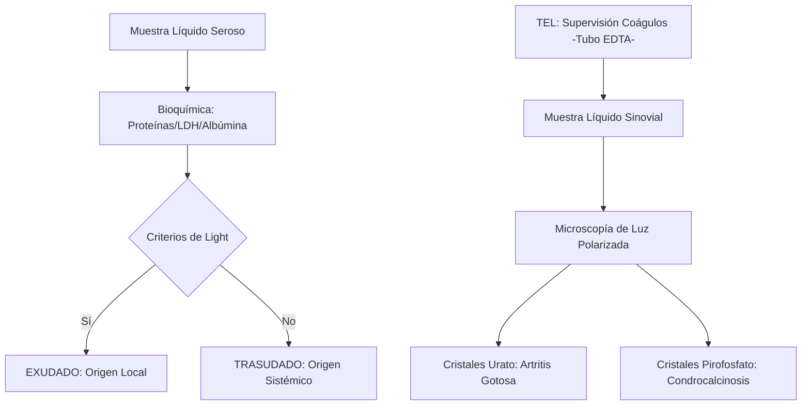
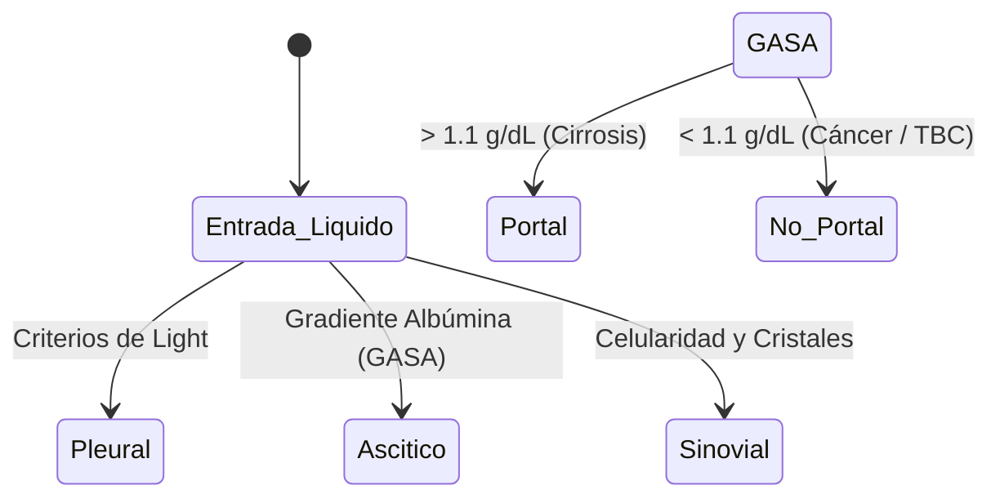

# Semana 5: Más allá de la Sangre
## Lección 5: Casos Clínicos: Mis líquidos favoritos

### 1. Título y Resumen (Abstract)
**Título:** Diagnóstico Diferencial de los Derrames Serosos mediante el Análisis Bioquímico y Citológico: Aplicación de los Criterios de Light y Caracterización de Cristales.
**Resumen:** Este artículo integra el conocimiento sobre líquidos extra-sanguíneos (pleural, ascítico y sinovial) a través de casos prácticos. Se fundamenta la distinción entre trasudados y exudados basándose en la permeabilidad capilar y se evalúa la técnica de microscopía de luz polarizada para la identificación de artritis microcristalina. Se destaca el papel del TSLCB en la validación de ratios suero-líquido y la gestión de la seguridad biológica en muestras de cavidad.

### 2. Introducción (Fundamentos y Objetivos)
#### 2.1. Fisiopatología de las Cavidades Serosas (Módulo 1370)
El currículo de **Fisiopatología General** (Módulo 1370) describe las membranas serosas (pleura, peritoneo, pericardio). El líquido seroso es un ultrafiltrado plasmático que lubrica el espacio entre las hojas parietal y visceral.
- **Formación de Derrames:** Acumulación patológica de líquido por desequilibrio entre formación y reabsorción.
    - **Trasudado:** Resultado de cambios sistémicos (insuficiencia cardíaca, cirrosis) con BHE intacta.
    - **Exudado:** Resultado de inflamación local (infección, cáncer) con aumento de permeabilidad capilar.

#### 2.2. Valoración Bioquímica de Líquidos de Cavidad (Módulo 1371)
El **Módulo de Análisis Bioquímico** incluye la medición de solutos en fluidos:
- **Criterios de Light (Líquido Pleural):** Uso de ratios proteínas y LDH (Líquido/Suero) para clasificar el derrame (Módulo 1371).
- **Gradiente de Albúmina (GASA):** Diferencia entre albúmina en suero y líquido ascítico para detectar hipertensión portal.
- **Detección de Amilasa:** Sugiere pancreatitis o perforación esofágica (Módulo 1371).

#### 2.3. Líquido Articular y Microscopía de Luz Polarizada (Módulo 1368/1371)
- **Cristales (Módulo 1368):** El TSLCB debe identificar cristales de Urato Monosódico (Gota) y Pirofosfato Cálcico (Seudogota) mediante microscopio óptico con filtros polarizadores y placa compensadora (birrefringencia).
- **Recuento Celular:** Diferenciación entre líquido inflamatorio, séptico o mecánico (Módulo 1374).



**Objetivo:** Integrar la valoración analítica de fluidos biológicos en el proceso de validación técnica compleja.

### 3. Material y Métodos
- **Diseño:** Estudio clínico retrospectivo multivariante.
- **Entorno:** Laboratorio de Líquidos y Citología, Hospital Universitario de Getafe.
- **Intervenciones:** Determinación de glucosa, proteínas, albúmina, LDH y colesterol en líquidos y sueros pareados. Recuento celular en cámara de Neubauer. Estudio de cristales mediante microscopio de luz polarizada con placa compensadora de cuarto de onda.

### 4. Resultados (Hallazgos Experimentales)
Diferenciación de perfiles según el origen del fluido:

```mermaid
grid-layout
  - title: Gota (Urato Monosódico)
    content: Agujas finas, birrefringencia negativa intensa.
  - title: Seudogota (Pirofosfato)
    content: Romboedros/Paralelepípedos, birrefringencia positiva.
```

### 5. Discusión y Conclusiones
La interpretación del líquido sinovial debe ser inmediata, ya que los cristales pueden disolverse o cambiar de morfología según la temperatura. Se concluye que el TSLCB debe asegurar que la muestra para recuento celular esté en un tubo con EDTA para evitar microcuágulos que falseen la cifra. El uso del gradiente albúmina (GASA) ha desplazado al ratio proteico en el líquido ascítico por su mayor precisión fisiopatológica.

### 6. Agradecimientos
A los servicios de Neumología y Reumatología del HUGF por la integración de los datos clínicos en los informes de laboratorio.

### 7. Bibliografía (Literatura Citada)
- **Clinical Practice Guidelines for the Management of Pleural Effusion.** [Ver en thorax.bmj.com](https://thorax.bmj.com/content/78/Suppl_3/s1)
- **Estudio analítico de los líquidos serosos - SEQCML.** [Ver en seqc.es](https://www.seqc.es/es/bioquimica-en-el-laboratorio-clinico/manuales-y-monografias/)
- **ACR Guideline for the Management of Gout.** [Ver en rheumatology.org](https://www.rheumatology.org/quality-care/clinical-practice-guidelines/gout)
- **Light's Criteria in the Differentiation of Pleural Effusion.** [Ver en emra.org](https://www.emra.org/emresource-org/percept/lights-criteria/)

---
### Sobre la Ponente
**Verónica Cámara Hernández** es Facultativa Especialista de Área (FEA) de Bioquímica Clínica en el **Hospital Universitario de Getafe**.

*Material pedagógico integrador para la formación continuada del Técnico Superior.*
