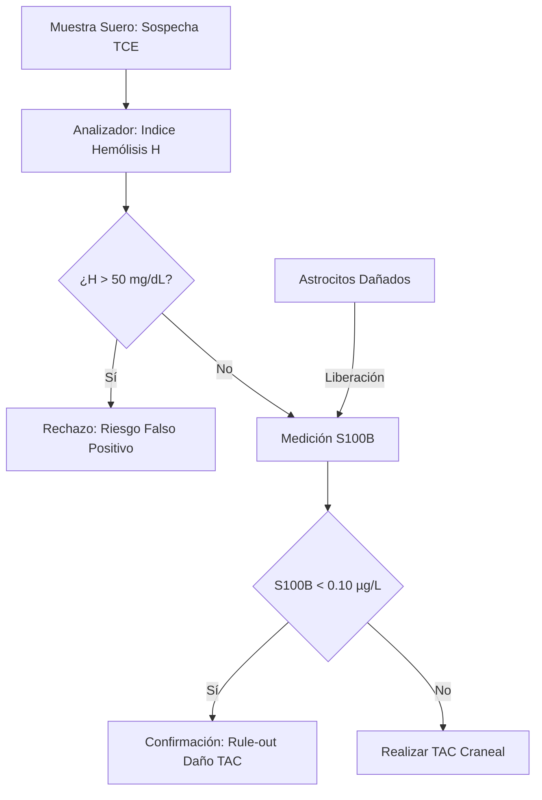
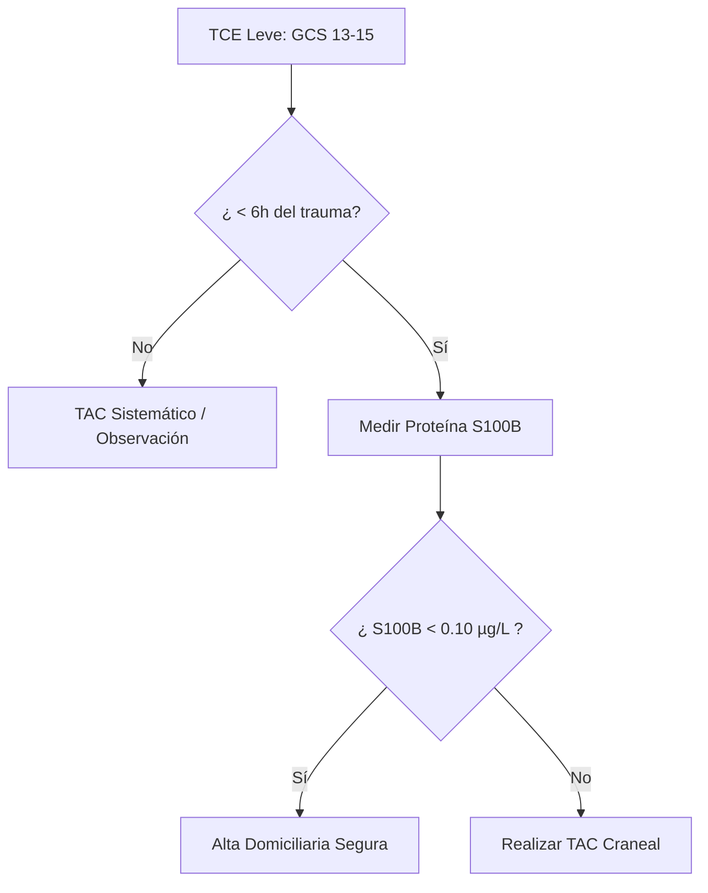
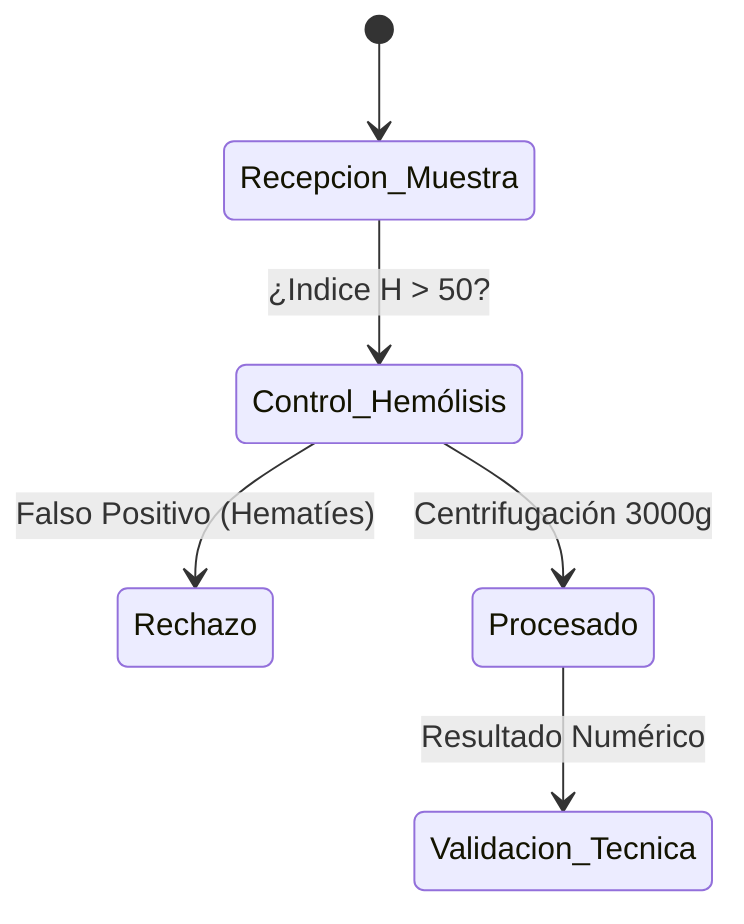

# Semana 6: Nuevos Campos y Técnicas
## Lección 24: Traumatismo Craneoncefálico: Proteína S100B

### 1. Título y Resumen (Abstract)
**Título:** Implementación de la Proteína S100B como Biomarcador de Regla de Exclusión (Rule-out) en el Traumatismo Craneoencefálico Leve: Impacto en la Optimización de Recursos Radiológicos.
**Resumen:** Este artículo analiza los fundamentos bioquímicos de la respuesta astrocitaria al daño cerebral agudo. Se evalúa la sensibilidad de la proteína S100B para predecir hallazgos patológicos en la Tomografía Computarizada (TAC) tras un traumatismo craneoencefálico (TCE) leve. Se fundamenta el papel del TSLCB en la gestión del tiempo de respuesta (TAT) y la validación de interferencias hemolíticas que comprometen la precisión del marcador neuroespecífico.

### 2. Introducción (Fundamentos y Objetivos)
#### 2.1. Fisiopatología del Sistema Nervioso y Glía (Módulo 1370)
El currículo de **Fisiopatología General** (Módulo 1370) establece el estudio del aparato nervioso. El tejido nervioso está compuesto por neuronas y células de la glía (astrocitos, oligodendrocitos, microglía).
- **Astrocitos:** Células de soporte que forman parte de la BHE. Sintetizan la **Proteína S100B**, una proteína de unión al calcio involucrada en el crecimiento y reparación celular.
- **Daño Traumático:** El traumatismo craneoencefálico (TCE) produce una rotura mecánica de los astrocitos y un aumento de la permeabilidad de la BHE (Módulo 1370).

#### 2.2. Marcadores Bioquímicos de Daño Cerebral (Módulo 1371)
El **Módulo de Análisis Bioquímico** incluye la medición de marcadores específicos de órganos:
1.  **Proteína S100B:** Marcador de daño glial. Aparece en sangre a los pocos minutos del trauma debido a su pequeño tamaño molecular (21 kDa).
2.  **Enolasa Neuroespecífica (NSE):** Marcador de daño neuronal e isquemia.
3.  **GFAP (Proteína Fibrilar Ácida Glial):** Nuevo marcador altamente específico de lesión estructural intracraneal.

#### 2.3. Gestión Técnica y Preanalítica Crítica (Módulo 1367/1368)
El TSLCB debe supervisar la calidad de la muestra de suero:
- **Intervalo de Tiempo:** La S100B tiene una vida media corta (~60 min). La muestra debe tomarse en las primeras 6 horas post-trauma (Módulo 1367).
- **Hemólisis (Módulo 1368):** Interferencia crítica. La S100B se encuentra en concentraciones significativas en los hematíes; la hemólisis produce falsos positivos.
- **Técnica:** Inmunoensayo tipo sándwich (Módulo 1372) con detección por quimioluminiscencia.

**Objetivo:** Sistematizar el protocolo de validación de la S100B en el laboratorio de urgencias según los estándares de la Comunidad de Madrid.

### 3. Material y Métodos
- **Diseño:** Estudio técnico-intervencionista sobre seguridad del paciente.
- **Entorno:** Laboratorio de Urgencias, Hospital Universitario de Getafe.
- **Intervenciones:** Determinación de S100B mediante electroquimioluminiscencia (ECLIA).
- **Control Preanalítico:** Tiempo desde el trauma < 6 horas. Muestra libre de hemólisis (la S100B también está presente en eritrocitos y melanocitos).

### 4. Resultados (Hallazgos Experimentales)
Uso de la S100B en el algoritmo de urgencias:

### 5. Discusión y Conclusiones
La S100B ha demostrado reducir el uso de TACs en urgencias en un 30%, disminuyendo los costes y la exposición a radiación ionizante. Se concluye que el TSLCB debe informar proactivamente si la muestra presenta hemólisis, ya que la liberación de S100B de los hematíes puede elevar artificialmente el marcador y llevar a la realización de TACs innecesarios. Hacia 2026, nuevos marcadores como la **GFAP** (Proteína Fibrilar Ácida Glial) complementarán la precisión diagnóstica.

### 6. Agradecimientos
Iniciativa liderada por el equipo de Urgencias del HUGF en coordinación con el Servicio de Bioquímica.

### 7. Bibliografía (Literatura Citada)
- **Scandinavian Neurotrauma Committee (SNC): Guidelines for Management of Mild Traumatic Brain Injury.** [Ver en scandinavian-neurotrauma.org](https://www.scandinavian-neurotrauma.org/guidelines)
- **S100B in the management of head injury: A systematic review.** [Ver en ncbi.nlm.nih.gov](https://www.ncbi.nlm.nih.gov/pmc/articles/PMC8900742/)
- **Utility of Protein S100B in Mild Head Injury Management - IFCC.** [Ver en ifcc.org](https://www.ifcc.org/scientific-activities/clinical-relevance-of-biomarkers/)
- **StatPearls: Traumatic Brain Injury.** [Ver en ncbi.nlm.nih.gov](https://www.ncbi.nlm.nih.gov/books/NBK459146/)

---
### Sobre el Ponente
**Ángel Pablo Pérez Arribas** es Facultativo Especialista de Área (FEA) de Bioquímica Clínica y responsable del Laboratorio de Urgencias del **Hospital Universitario de Getafe**. Su labor se centra en la optimización de biomarcadores para la toma de decisiones clínicas rápidas.

### 8. Charla y Transcripción (Contenido Multimedia)

**Enlace al vídeo:** [Ver en YouTube](https://www.youtube.com/watch?v=JlWRZt4r9xc)

#### Transcripción de la Sesión
Hola a todos, bienvenidos a esta nueva sesión eh dentro de la séptima edición del curso de actualización del laboratorio clínico. Yo soy Ángel Pablo Pérez Arribas, facultativo, especialista en bioquímica clínica y responsable del laboratorio de urgencias aquí en el Hospital Universitario de Getap.

En esta sesión abordaremos un tema eh de mucha actualidad eh dentro de la rutina diaria de un laboratorio clínico y sobre todo urgencias. los marcadores de traumatismos creando antifálicos breves, eh centrándonos sobre todos en el perfil TBI y eh su evolución respecto a otros marcadores eh que también se están empezando a usar como el S1. Eh, el objetivo fundamental de esta charla es que vosotros como eh técnicos de laboratorio clínico conozcáis a fondo eh qué estamos viviendo, de dónde vienen estas proteínas y eh qué problemas planalíticos nos vamos a encontrar, sobre todo eh cómo podemos interpretar eh y validar estos resultados que son críticos para los pacientes en una urgente. Comenzamos.

Bueno, este es el índice que seguirá la sesión de hoy. Comentaremos con una breve introducción visual de lo que ocurre dentro del cráneo en un traumatismo crenacefálico. A continuación definiremos exactamente qué es un traumatismo queencefálico y cómo se clasifica clínicamente. En el tercer punto repasaremos la biología celular básica para entender los diferentes marcadores que tenemos dentro del sistema nervioso. En el cuarto entraremos de lleno a la técnica analítica y la fesiología del del panel que que vamos a utilizar, la combinación del GFUP y la opiquitina L1. El quinto punto es puramente clínico, eh, pero vital para para el laboratorio. Eh, revisaremos un poco lo que es el algoritmo de las guías de de Ansemer de la sociedad de de urgencias de 2024 para entender eh cuándo nos van a llegar estas peticiones al laboratorio y qué va a hacer el médico con estos resultados. Finalmente, cerraremos con unas limitaciones técnicas que eh afectarán a a vuestro día a día y unas conclusiones generales junto con una biología bibliografía como es habitual.

Antes de entrar en números y proteínas, eh quiero que visualicéis el problema. En estas imágenes eh podéis observar lo que es la biomecánica de un impacto en la cabeza. Cuando una persona sufre un golpe brusco, – ya sea para una caída, un accidente, un impacto directo del cráneo, – se detiene en seco, pero el cerebro que está flotando en en el líquido céfaloraquídeo eh va a seguir esta inercia. Eh, como podéis ver en la imagen, el cerebro va a impactar primero una zona eh frontal y luego en la zona – e trasera si el el impacto viniera de delante. Estas fuerzas de aceleración y deceleración provocan una deformación en los tejidos, estirando y rompiendo – pues tanto los axones de las neuronas como las células de soporte. Eh, esta rotura celular microscópica que muchas veces no se ve en un TAC, es precisamente lo que va a hacer liberar – a la sangre las proteínas que vamos a a medir en el laboratorio.

Pasamos a definir la patología. Eh, el traumatismo canencefálico que podéis ver a brevia como TCE o TBI, según sus siglas en castellano en inglés, respectivamente, se define médicamente como una alteración de la función cerebral o otras evidencias. eh de patología cerebral causadas por una fuerza externa. Si observamos en las causas principales, es muy importante destacar que las caídas representan la inmensa mayoría de los casos, concretamente entre un 70 y un 85 82%. Esto tiene un impacto directo en la en la demografía de los pacientes que nos llegan al al hospital, ya que la mayoría serán pacientes eh geriátricos. Como vemos más adelante en el apartado de limitaciones, esta edad avanzada de nuestros pacientes supondrá un reto importante a la hora de interpretar los resultados. Otra causa eh menos frecuente, pero que suele asociar a mecanismos de alta energía son los accidentes con vehículos, deportes, – etcétera. Pero, ¿cómo clasificará el medio el médico de urgencias la gravedad de este golpe? Para ello utilizaremos – la escala como de Glasgow o GCS. Esta escala, como podéis ver en la en la a la izquierda de la diapositiva, evalúa tres dominios. La respuesta ocular, que puntuará entre uno a cu, la respuesta verbal, que irá hasta cinco, la respuesta motora que irá dentro una seis. Entonces, sumando estos puntos, tendremos una puntuación que irá de entre tres a cinco puntos, a 15 puntos, perdón. Eh, nosotros – concretamente nos vamos a centrar en – Glasgow que clasifican en en – traumatismo clanfárico leve, que irá entre 13 a 15. Eh, como podéis fijaros bien en esta tabla, – recogemos – lo que son los criterios de de la OMS y – para definir cada – traumatismo cronentálico. – la escala de Glow nos puede nos permite dividir – entre trauma severo que puntúa con puntuación menor a nu, moderado si va entre 9 y 12 y leve entre 13 y 15. Eh, como ya he comentado, nosotros nos vamos a centrar con nuestros marcadores en exclusivamente en – la primera columna del de la tabla, que es el traumatismo leve. hablamos de pacientes que al entrar por puerta de la urgencia – vendrán caminando o en camilla, pero – con esta puntuación de 13 a 15 lo que podrá ocurrir será que han tenido pues una – pérdida de conciencia leve inferior a 30 minutos o una alteración mental de menos de 24 horas. Eh, lo que puede separado es para estos pacientes que su – imagen estructural en el TAC sea completamente normal. la mayoría de los casos y es precisamente para evitar someter a esta radiación a los pacientes, por lo que nos van a a venir estas solicitudes de los marcadores, de estos marcadores.

Para entender entonces que vamos a medir, debemos bajar a nivel celular, concretamente al sistema nervioso. En este sistema nervioso central tendremos dos grandes grupos de células que van a ser la fuente de nuestros biomarcadores. Por un lado tenemos la neurona que que está representada la desde la imagen a la derecha en naranja. Es la unidad básica nerviosa, la encargada de procesar y – transmitir la formación a través de señales nerviosas eléctricas, perdón. Y por otro lado tenemos la neurroglía o células gliales, como es el astrocito que veis a la izquierda en color morado. A veces son los las grandes olvidadas, pero son las células de soporte del cerdo. No generan impulso eléctrico, pero son vitales para mantener la homeostasis, proteger el neurona y formar – la importantísima barrera hematofálica. Cuando hay un golpe, ambos tipos de células sufren estrés o rotura física y liberan sus proteínas estructurales y citoplasmáticas al torrente sanguíneo. Y lógicamente la neurona – libera un tipo de proteína y la habilidad – libera otros. Eh pasamos un poco a esta diapocitiva en la que – se va a fundamentar el resto de la de la – sesión. – podéis ver en un vistazo rápido tanto una – neurona como una célula glial y qué proteínas – vamos a encontrar en cada uno de los de las células. eh por – echar un vistazo rápido, por ejemplo, – marcadores que están muy de moda – como son los neurofilamentos, que podemos encontrarlos en la neurona, o – un marcador – habitual a nivel tumoral como puede ser S1 en la glía o pasando un poquillo a lo que viene va a ser nuestro tema, – tanto el GEFA en la glía como la ubiquitina en la neuron.

Comenzamos por la por la célula glial o astrocito, como hemos dicho. – Vamos a ver – nosotros concretamente nos vamos a centrar en el S1. Como veis en esta tabla, el S1 sube rápido en las primera de las primeras una a 3 horas y nos servirá como un rivado inicial. Sin embargo, ela tiene un un gran problema, no es – específico del cerebro, también podemos encontrarlo en tejido adiposo, en piel y músculo. Por lo tanto, si un paciente llega la a la urgencia con un golpe a la cabeza, pero además – tiene un traumatismo muscular o presenta – un – melanoma, pues que ese 100 no nos va a servir. – Entonces, ¿cómo vamos a solucionar esto? – pues – vamos a pasar a medir el GEFA, que es concretamente la proteína ácidilar. Su gran ventaja – clínica es que es exclusiva del cerebro y de daño astrocitario y además – tiene una cinética sostenida elevándose entre de entre las 4 a 6 horas, haciendo un pico máximo entre 20 y 24 horas y – persistiendo – sin persistiendo su su detección. eh durante varios días. Por otro lado, la neurona – – ya hemos visto la parte superior del esquema. Vemos que libera – otras proteínas. Entre ellas vamos a destacar lo que hablamos, la obitina – carboxiterminal – hidrosilas. Esta proteína – reside en el cuerpo celular o en la soma de la neurona. Su característica principal es la velocidad de elevación en – así que será tendrá un muy importante papel como – marcador – hiperagudo. Ante el daño neuronal se eleva rápidamente en sangre en la de la primera a la a la cuarta hora haciendo un pico máximo entre – más o menos a las 8 horas y comienza a decaer entre las 24 y 48 horas. Eh, además en este esquema y en la tabla – hay otros biomarcadores, como ya hemos dicho, – como es la neurolasa, los neurofilamentos, la proteína TAU, – que todos van a a reflejar otro daño neuronal, – sin embargo, por su cinética se van a ir más orientados a – enfermedades como puede ser la Cina.

Esta gráfica resume un poco de manera visual cómo van a elevarse – dichos marcadores que que acabamos de ver – con – daños agudos y con con respecto al tiempo. concretamente y lo que a nosotros nos aplica y nos resulta más útil, como podéis ver, van a ser los daños agudos, los que van a estar representados a la izquierda. vemos – como después del daño – esa franja en rojo se van a elevar rápidamente – tanto – Ubikirina como el Gefab representados en línea negra y línea roja discontinua. Sin embargo, otros marcadores como pueden ser pues la tau que veis representada en morada o los neurofilamentos, van a a estar más representadas – patologías con – daños – tipo crónico.

Y es así como llegamos a concretamente a la técnica que vamos a utilizar. – Se denomina panel TBI o TBI. – Y podemos ver como – tras el daño al celular, tanto el jefab como laquipidina atraviesan la barrerafálica dañada y alcanzan el torrete sanguino. – Debajo – tenéis la gráfica de la cinética temporal – real de este ensayo. – Quiero que os fijéis muy bien en el comportamiento de las dos curvas. – La curva amarilla, que es la de la ubiquitina, – va a tener nivel niveles más altos casi en el desde el minuto uno, desde el impacto en el que va a hacer un pico – sobre las 8 horas posteriormente de cae. En contraste, la línea grisoscura es el Gapn – que arranca desde más abajo y va a ir subiendo de manera sostenida haciendo un pico en torno a los 20 horas. se mantiene elevada y se mantiene elevado en sangre mucho tiempo, es decir, tienen cinéticas que se complementan perfectamente. ¿Quién conseguimos a medir ambas a la vez en el mismo tubo de ensine? Pues el Gapn va a medir daño glial, nos aseguramos que es altamente específico y sabemos que – si está elevada proviene concretamente de la estructura del cerebro y no va a venir de otro daño – como pudiera ser un politraumatismo – que pudiera ser muscular. Además, al tener un descenso lento, nos permite detectar – traumatismos que aunque el paciente haya tardado varias horas en llegar a al hospital, pero podemos detectar. Al medir simultáneamente laquitina, que es el marcador neuronal, cubrimos el flanco – hiperagudo. – refleja daño directo en la unidad – del cerebro y – da la cara no inmediatamente, pero podemos ver que el que el pico máximo estará en torno a las 8 horas. – Por lo tanto, la conclusión respecto a esta esta combinación es que cubre de manera muy buena, – dándonos ventaja sobre otros marcadores como pudiera ser el S1 al en el cual a partir de la de la cuarta a la sexta hora empieza a decaer y podemos no no verlo. Entonces, vamos a tener un margen de entre de más o menos unas 12 horas para detectar este impacto.

A efectos, – ¿qué es lo que más os va a influir a vosotros como técnicos de laboratorio? Bien, ¿cómo vamos a medir y dónde lo vamos a medir? – Este ensayo está – comercializado por exclusivamente por Abot, por lo tanto, pues – se va a realizar tanto en Architect como en Almitos I porque es una técnica inmunológica. – Desde el laboratorio de pues estamos valorando en Arquitect porque es el equipo que tenemos, pero bueno, muchos otros sitios como puede ser el Ramón y Cajal, que ya lo lleva teniendo varios varios años o – secho a – alcorcón, etcétera, están – viendo – para implementarlo en Aline. El fundamento de estas un inmunodesayo luminio de micropartículas o clea. – Y bueno, pues una la el tipo de muestra – validada para este tipo de equipo es un suero plasma. – El analizador tarda entre 18 y 20 minutos en dar resultados desde que pipetea. Y bueno, pues – vamos a ver que que va a ser fundamental h la dar prioridad a este tipo de técnicas para dar resultados lo antes posible, ya que no se trata de una técnica – generalmente rápida.

Está claro que como toda técnica tiene tiene sus problemas. Y es fundamental que – eh dentro del trabajo de la del técnico – estar atentos sobre todo a estas limitaciones que se que pueden evitar muchos problemas. – Lo primero es la inspección visual. Si estamos trabajando por con plasma, pues evidentemente que no haya que no haya coágulos. Y – si vamos a trabajar con – con – suero – y conm evidentemente ver – dos problemas importantes que se describen en la bibliografía. En primer lugar es la la hemólisis, – una lisis severa de los róbulos rojos invitro provoca con la falsa elevación de la viquitina. – Entonces, pues bueno, hay que tener mucho cuidado en esta en este tipo de muestras, ya que bueno, pues – la conclusión va a ser que – vamos a dar – falsos positivos – y por lo tanto – se le acabará haciendo más tag a los pacientes. Por ello que la hm detección preco de este de este tipo de de sueros o plasmas enolizados – sería conveniente pues – solicitar una nueva muestra. – En concretamente en este caso, – bueno yo he hablado con con otros laboratorios que lo que lo realizan y me comentan que son a niveles muy muy altos de hemólisis. Es verdad que la bibliografía, concretamente la la – información técnica de – Abot – no da valores de hemólisis ni ni lo refleja, pero bueno, sí que refleja que ha detectado elevaciones de en la ubiquitina. – Y por otro lado son los pacientes anticoagulados. Realmente – esto no es exclusivo de esta técnica. eh viene a darse en todos aquellos pacientes que tienen – – anticoagulante y que por lo tanto muchas veces no realizan la coagulación de forma completa en los tiempos que muchas veces se manejan – de entrega de muestra desde la urgencia. Es por ello que – si se – usa suero es conveniente dejar retraer bien el – coágulo para evitar estos problemas con la fibrina que bueno – son muy recurrentes en – pacientes pues eso, tanto anticoagulados como pacientes oncológicos, etcétera. Por lo tanto, pues de manera para evitar este tipo de problemas, una una opción sería el uso de – plasma, bien sea está validado tanto para Ecta como para ir en el lítio. Y la última limitación y desde mi punto de vista la más importante es pues que tanto en ancianos como pacientes con renal, concretamente en ancianos, ya que va a ser una de las poblaciones objetivo, – de forma natural el los niveles en sangre de estas dos proteínas van a ser más elevados y por lo tanto pues la cantidad de pacientes que se van a beneficiar – de esta técnica serán menores.

Una vez – visto todos estos problemas, vemos vamos a pasar a la interpretación de los de los resultados. El – equipo nos va a dar tres tipos de resultados. En primer lugar, pues dos resultados cuantitativos que son del GUAP y del la de la Ubikina. Y – un tercer punto que será – la interpretación de del TBI concretamente. Es decir, es bastante sencillo, ya que él mismo te va a dar que cuándo es positivo el TBI y cuando no. – Aún así – probablemente muchos sitios sí que se informen la los valores tanto del GFP como la Ubikina y es necesario saber cuáles son estos puntos de cortes. Concretamente, pues – para el GFAP son 35 pico ramos militro y para la vitrina – L1 es son 400 picog militro. – Muy muy importante es que siempre hay que informar estos dos – biomarcadores – conjuntos, es decir, no se recomienda en una valoración de un de una de un traumatismo carencefálico evaluar estos – marcadores por separado. Lo suyo es reportar los dos a la vez y muchos hospitales acaban solo informando la interpretación del TBI conjunta. ¿Cuándo va a ser negativo el TBI? y cuando – dándole valor a – esta técnica, ya que esta técnica va a tener valor predictivo negativo. Es decir, – va a ser importante cuando ambos – marcadores sean negativo, nunca uno de ellos – como podéis ver en la tabla. Entonces, ambos marcadores tienen que estar por debajo de 35 y de 400 respectivamente.

Ahora, una vez que ya se realiza la variación del resultado, se informa al médico qué impacto tiene el trabajo en el flujo del hospital, pues – esto se puede ver reflejado en el algoritmo de la de la guía de las SEMs, que es la Sociedad Española de Medicina de Urgencias y Emergencias. – Y pero bueno, vamos a simplificarlo un poco, ya que tampoco – os resulta – muy muy importante para el día a día de del técnico. Alfencia le llega nuestro paciente de con un traumatismo que encefálico, se le realiza el Glasgow, se evalúa bien el tiempo desde desde el traumatismo, que sea inferior a 12 horas y si todo está dentro del de lo establecido, es decir, que los goen entre 13 y 15 y – menos de 12 horas, se extrae el tubo y se lleva al laboratorio, se realiza el panel de TBI y si este panel de TBI es negativo, se frena la cadena de – del radiación del paciente, es decir, del la realización del TAC. E es verdad que siempre esta guía – prioriza la – opinión o la – decisión del médico por encima de – de esta de estos resultados. Es decir, si el paciente observa que e la clínica del paciente sugiere – que sí que puede – haber un daño – a nivel neuronal o etcétera, pues – y decide realizar el tag, pues – pues es prioritario ante – ante el resultado del DBI. – El un resultado positivo no quiere decir nada más que no se puede evitar el TAC. Y – bueno, – dependiendo un poquillo de la situación del paciente, pues se quedará en – en observación, se realizará una interconsulta de neurocirurugía o pasará aquí a directa.

Para terminar la sesión, quiero que os llevéis estas conclusiones clave para el trabajo del día a día y para el examencillo. – La primera que hay que observar bien la dimensión del problema, es decir, el los traumatismos leves, en el cronoencefálicos leves suponen entre un más o menos un 90% de los traumatismos cronoencefálicos. – Por lo tanto, es imperioso encontrar una herramienta que pueda ayudar a tomar las decisiones médicas – ante la saturación que hay de – pacientes y – el ahorro de radiación que se puede llevar – dicho paciente. En segundo lugar, que existe e un éxito desde el laboratorio encontrando estos biomarcadores como cerarluquina, – carboxiterminal, – hidroxilasa L1 y el GFP. – Además son técnicas que son complementarias porque abarcan tanto la situación la la evaluación – elevación hiperaguda como – la elevación sostenida y que – nos dan un una ventana – diagnóstica de – 12 horas. Además, es un marcador muy muy específico, como decíamos, – ya que el GPAP es el GPAP es específico específico del de el tejido cerebral. Además, pues – podemos ver que hay una seguridad para – para dar el alta del – del paciente, pues – se observan valores cercanos a un a un 100% de valor predictivo negativo. Por lo tanto, nos aseguramos bastante de que la presencia de – de un resultado negativo realmente es negativo. Luego es verdad que tenemos como dos frentes abiertos que nos iríamos a los últimos dos puntos. Primero es el geriátrico, como ya os he comentado, son – un – población diana y que por lo tanto sería – muy bueno – llegar a conseguir ciertos puntos de corte que redujeran esa cantidad de falsos positivos. – Dado que, como ya hemos dicho, – su sus valores de – de GFP y de Wikipedina se elevan de manera natural con el paso del tiempo. Y – otra parte muy importante sería la necesidad de seguir evaluando este panel para establecer puntos de corte robustos en – en menores de edad, ya que de momento no está valorado.

En esta última diapocitiva no dejo reflejada toda la bibliografía, tantoas clínicas como estudios pivotales, como bueno, – las guías y la la guía de la Sociedad Española de las SEMES que podéis consultar y bueno, creo que en un tema de tan actual pues es muy interesante. Por mi parte esto es todo. Os agradezco enormemente vuestra atención y os animo a que sigáis realizando vuestro trabajo de forma rápida y precisa para que – demostrar que el laboratorio de urgencias pues probablemente es muy muy importante dentro de un flujo – clínico del hospital. Un saludo.

#### Explicación de la Ponencia
La sesión aborda los nuevos biomarcadores para el manejo del traumatismo craneoencefálico leve (TBI), centrándose en el panel que combina la proteína ácida fibrilar glial (GFAP) y la ubiquitina carboxi-terminal hidrolasa L1 (UCH-L1). Se explica su cinética complementaria (elevación hiperaguda de UCH-L1 y sostenida de GFAP), su alto valor predictivo negativo (>99%) para evitar tomografías (TAC) innecesarias, y las limitaciones preanalíticas como la hemólisis y el estado del paciente geriátrico o anticoagulado.

*Contenido técnico integral para la excelencia profesional del TSLCB.*
