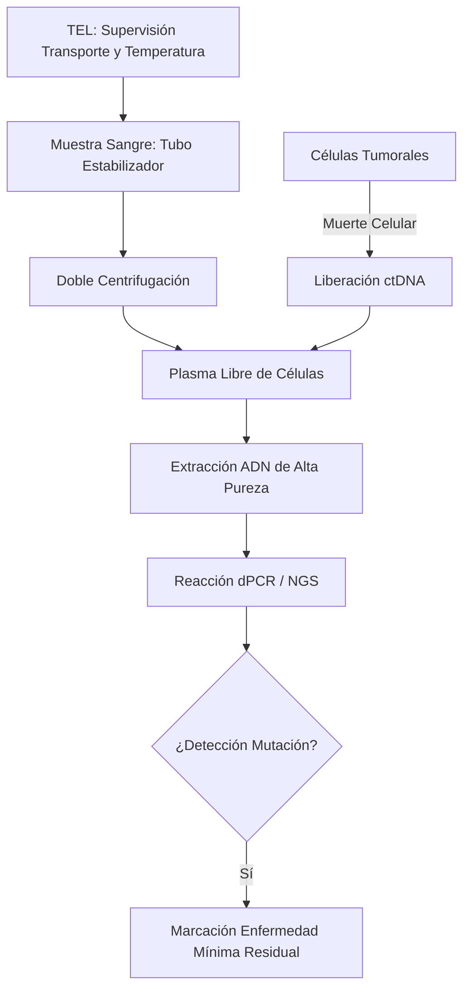
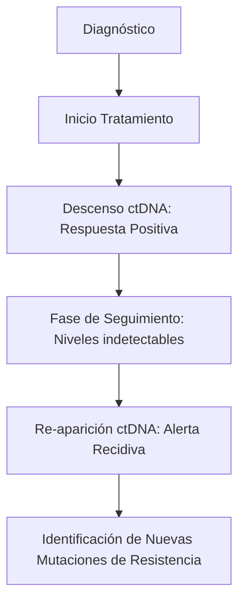
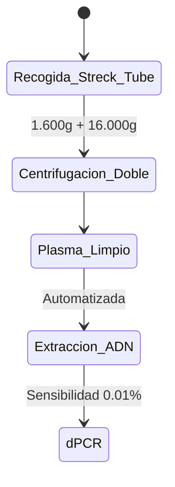

# Semana 6: Nuevos Campos y Técnicas
## Lección 25: Biopsias Líquidas y Exosomas

### 1. Título y Resumen (Abstract)
**Título:** Implementación del ADN Tumoral Circulante (ctDNA) como Herramienta Diagnóstica y de Monitorización en Oncología de Precisión.
**Resumen:** Este artículo analiza los fundamentos moleculares de la biopsia líquida y su capacidad para capturar la heterogeneidad tumoral sistémica. Se evalúan los procesos de liberación de ADN y vesículas extracelulares (exosomas) a la circulación y se justifica la superioridad de la monitorización dinámica sobre la biopsia de tejido sólida. Se destaca el papel del TSLCB en la gestión crítica de la fase preanalítica y el uso de técnicas de ultra-alta sensibilidad como la PCR Digital (dPCR).

### 2. Introducción (Fundamentos y Objetivos)
#### 2.1. Genética del Cáncer y Biología Molecular (Módulo 1370/1369)
El currículo de **Fisiopatología General** (Módulo 1370) describe la carcinogénesis. Las células tumorales presentan mutaciones genéticas (sustituciones, deleciones, amplificaciones) que impulsan su crecimiento.
- **ADN libre circulante (cfDNA):** Fragmentos de ADN (160-200 pb) liberados al plasma por apoptosis o necrosis.
- **ADN tumoral circulante (ctDNA):** Fracción del cfDNA que proviene de las células tumorales (Módulo 1369).
- **Exosomas:** Vesículas de membrana (30-150 nm) que transportan ácidos nucleicos y proteínas.

#### 2.2. Fundamentos de la Biopsia Líquida (Módulo 1369)
El **Módulo de Biología Molecular y Citogenética** incluye el estudio de ácidos nucleicos:
1.  **Aislamiento y Extracción:** Uso de columnas de sílice o perlas magnéticas para concentrar el ADN del plasma.
2.  **PCR Digital (dPCR):** Técnica de cuantificación absoluta. La muestra se divide en miles de microgotas; se realiza una PCR en cada gota y se cuenta cuántas son positivas (presencia de la mutación) frente a negativas (Módulo 1369).
3.  **Secuenciación de Nueva Generación (NGS):** Permite analizar múltiples genes simultáneamente para identificar variantes de resistencia.

#### 2.3. Gestión Crítica Preanalítica (Módulo 1367/1368)
El TSLCB debe asegurar la integridad del ctDNA:
- **Evitar la Lisis Leucocitaria:** El ADN de los glóbulos blancos sanos diluye la señal tumoral. Uso de tubos con estabilizadores celulares (Módulo 1367).
- **Protocolo de Centrifugación (Módulo 1368):** Doble centrifugación (baja y alta velocidad) para obtener plasma libre de detritos celulares.

**Objetivo:** Establecer el protocolo de gestión de muestras para oncología molecular en la red hospitalaria regional.

### 3. Material y Métodos
- **Diseño:** Estudio técnico sobre genómica del cáncer.
- **Entorno:** Instituto de Investigación Sanitaria (IIS), Hospital Universitario de Getafe.
- **Intervenciones:** Extracción de cfDNA mediante kits automatizados. Análisis de mutaciones específicas (ej. EGFR, KRAS, BRAF) mediante **PCR Digital en Gotas (ddPCR)** que permite una cuantificación absoluta sin curva estándar.

### 4. Resultados (Hallazgos Experimentales)
Workflow de monitorización de la carga tumoral molecular:

### 5. Discusión y Conclusiones
La biopsia líquida es el pilar de la Medicina de Precisión. Se concluye que el TSLCB es el garante de la "pureza" de la muestra; un error en la centrifugación (no realizar el segundo paso de alta velocidad) deja restos celulares que invalidan el análisis molecular. Se visualiza que hacia 2026, el análisis de la metilación del ADN en biopsia líquida se utilizará para el cribado poblacional de múltiples tipos de cáncer en una sola toma.

### 6. Agradecimientos
A los oncólogos del HUGF y al personal técnico del IISG por la validación de los perfiles mutacionales.

### 7. Bibliografía (Literatura Citada)
- **ESMO Clinical Practice Guideline: Liquid Biopsy in Cancer Management.** [Ver en esmo.org](https://www.esmo.org/guidelines)
- **Clinical Applications of Liquid Biopsy in Cancer - StatPearls.** [Ver en ncbi.nlm.nih.gov](https://www.ncbi.nlm.nih.gov/books/NBK560662/)
- **Biopsia Líquida: Presente y Futuro - SEQCML.** [Ver en seqc.es](https://www.seqc.es/es/bioquimica-en-el-laboratorio-clinico/manuales-y-monografias/)
- **ASCO: Circulating Tumor DNA - Clinical Applications in Oncology.** [Ver en asco.org](https://ascopubs.org/doi/full/10.1200/JCO.2017.76.8671)

---
### Sobre el Ponente
**José Luis Román Fernández** es investigador en biomedicina traslacional. Su formación académica es en biotecnología, con especialización en bioquímica y biomedicina. Actualmente desarrolla su labor investigadora en el **Hospital Universitario de Getafe** y el **Hospital General Universitario Gregorio Marañón**, formando parte del consorcio **Exet**, dedicado al estudio de las vesículas extracelulares.

### 8. Charla y Transcripción (Contenido Multimedia)

**Enlace al vídeo:** [Ver en YouTube](https://www.youtube.com/watch?v=KHcIemPR9Mk)

#### Transcripción de la Sesión
Buenos días. Mi nombre es José Luis Román Fernández y voy a impartir el seminario sobre bioposias líquidas y exos. Trabajo en investigación en biomedicina translacional. Eh, mi formación académica es en biotecnología, pero me he especializado en biomedicina. Tengo un máster en bioquímica, biología molecular y biomedicina y actualmente estoy cursando un doctorado en biomedicina y ciencias de la salud. Trabajo para Exet, que es un consorcio de laboratorios a nivel nacional que se dedica a ver el rol de las vesículas extracelulares en la fisiopatología hepática. Yo realizo mi investigación en la UCI del Hospital de Getafe y en el departamento de patogastrointestinal en el Gregorio Marañó. Mi experiencia previa siempre ha sido en biomedicina. He trabajado en el CENIC en la unidad de ensayos clínicos. He sido profesor de fisiología humana y he realizado varias estancias eh en el extranjero.

Entrando ya en materia, el primer paso sería definir lo que es una biopsia líquida, que es el análisis de cualquier tipo de biomarcador presente en un fluido biológico, de igual su procedencia, ya sea sangre, orina, saliva, etcétera. La principal ventaja de estas tipo de biopsias con respecto a las tradicionales es su mínima invasión, no requiere ningún tipo de procedimiento quirúrgico, ni siquiera ambulatorio y además nos aporta muchísima más información que las biopsias tradicionales. Es verdad que se tendrían que implantar de una forma complementaria, porque al fin y al cabo la información también es es complementaria, pero las bioseas líquidas nos permiten no solamente la detección temprana de la enfermedad, sino monitorizar al paciente y el efecto del tratamiento.

El siguiente paso sería definir lo que es un exosoma. Un hexosoma es un tipo de vesícula extracelular que presenta un tamaño de entre 30 y 150 nanm. Las vesículas extracelulares no son más que bicapas lipídicas producidas por las células que pueden contener cualquier tipo de material biológico que tenga la célula de origen, ya sea proteína, nucleótidos, ADN, ARN, metabolitos, incluso virus si la célula de origen está infectada. Prácticamente todas las células del organismo producen exosomas y se ha visto que cuando la célula o el órgano está dañado, su producción aumenta. Suiciada función es de la comunicación celular, permite la comunicación entre órganos muy distales y además permite que esta comunicación sea específica, ya que pueden presentar marcadores de membrana que hacen que estos solamente puedan ser captados por sus células diana. En mi caso trabajo con la comunicación entre el hígado y el pulmón y hay exosomas que produce el hígado que solamente pueden ser captados por el por el pulmón.

Con esta diapositiva lo que quiero que entendáis es que el estudio de las bioseas líquidas o esosomas, pículas extracelulares son ramas del conocimiento muy nuevas. Es verdad que en 1869 Thomas Aswood ya detectó las primeras células tumorales circulantes y que en 1948 se detectó el primer ADN libre circulante. Pero no fue hasta en los años 60 en el que este ADN circulante se empezó a relacionar con patologías. En el 94 se detestó la primera mutación RAS en este DNA circulante que estaba relacionado con fenotipos tumorales. En la década de la 2000 aparecieron los primeros kits. El primer kit fue para la detección de células tumorales circulantes, pero no fue hasta la hasta 2010 cuando Catherine Alix y Klaus Panther acuñaron el término de biosias líquidas. Además, tenemos que esperar hasta muy recientemente, 2013-2016 que se aprobaron porad los primeros kits comerciales para la detección de biosas líquidas. Fue en 2013 la detección de células circulantes y tumorales y 2016 la detección de DNA libre circulante.

En el caso de las vesículas extracelulares se empezaron a estudiar entre los años 40 y 60, pero se se denominaron como basura celular y se creía que eran solamente una forma de eliminar residuos. En el 71, por fin se acuñó el término de vesículas intracelulares y extracelulares. Y en el 81 se empieza a hablar de exosomas. En los años 90 empezaron a aparecer las primeras funciones, pero muy difusas y en el año de los 2000 por fin se estableció que su principal función era la comunicación celular, ya que se vio una molécula dentro de la RN que permitía modificar la fisiopatología de la célula diana. En 2011 se generó la Sociedad Internacional para las vesículas extracelulares y no fue hasta el 2018 cuando se publicó el MICEF. El MISES es una publicación periódica que establece las bases y las novedades en el estudio y la investigación de vesículas extracelulares. En la gráfica muestro el número de publicaciones en PANM de vesículas extracelulares y como podéis comprobar es a partir de la publicación del MIEF cuando su crecimiento es exponencial. Además, también represento el número de publicaciones que hay relacionadas con estudios de cáncer, porque actualmente suponen casi el 50% de de las publicaciones de vesículas extracelulares. Y es verdad que la historia de las biosas líquidas y de los exosomas está muy ligada al cáncer, pero me gustaría recalcar que son que son importantes en muy diversas patologías y que deíamos fomentar el estudio de otras enfermedades.

Aquí presento el esquema de trabajo con vesículas extracelulares o xosomas desde la recolección de las muestras hasta su aislamiento y procesamiento. En el tema de la recolección de muestras no me voy a parar mucho porque ya sois expertos en los laboratorios clínicos de los hospitales. Y por último, decir que el almacenamiento de las muestras de exosomas es verdad que se suele hacer a -80 gr para preservarlas, pero ya hay kits comerciales que incluso eh permiten preservar muestras durante años a temperatura ambiente. los distintos métodos de aislamiento de vesículas extracelulares de distintos fluidos donde nos vamos a parar.

En la siguiente tabla muestro los distintos métodos de purificación de exosomas. Algunos de estos son más fáciles de implantar en clínica que en otros. Voy a empezar por los que son un poquito más complicados. El primero de todo sería la centrifugación diferencial y la centrifugación en gradiente de densidad. Ambos son bastante complicados porque se requiere una alta inversión tanto en la maquinaria, una ultracentrífuga, como en todo el material diario que se usa eh la ultracentrífuga. Además, presenta muchas contaminaciones por lipoproteínas. Al fin y al cabo, todo material biológico que presente el mismo coeficiente de sedimentación que el exosoma se va a purificar con nuestra muestra. Además, la ultracentrifuguación eh genera muchos artefactos, ya que debido a las altas presiones que sufre la muestra se producen agregados. Los niveles de de purificación tampoco son tan altos con respecto a las otras técnicas y además los tiempos eh los que se mueven los ensayos con una volta centrífuga son muy grandes. Además los volúmenes requeridos de muestra también son muy altos. La siguiente método que no se podría implantar en clínica sería la ultrafiltración. También es un proceso muy caro que tampoco tiene una recuperación de vesículas extracelulares muy alta y también presenta muchísimas contaminaciones por partículas que tengan un tamaño similar al exosoma.

Ahora vamos a las métodos o técnicas que sí son más fáciles implantarlas en clínica. La primera sería la cromatografía de exclusión por tamaño. En esta técnica ya existen kits comerciales que son rápidos y sencillos. El único problema es que la eficiencia es relativa dependiendo del kit, que puedes necesitar bastante cantidad de muestra para usarlos y también presentan contaminaciones por lipoproteínas, agregados, virus, etcétera. Des mi punto de vista, las dos técnicas más fácil de su implantación en clínica sería la captura inmunológica. Eh, no pongo la recuperación de vesículas extracelulares porque depende de la cantidad de anticuerpo, del tipo de anticuerpo y la eficiencia de este. Es verdad que presenta contaminaciones por eh proteínas solubles, pero las concentraciones o las muestras de partida pueden ser muy bajas. Y por último, la precipitación. La precipitación es un proceso que usamos nosotros en el laboratorio. Añadimos una resina que es hidrofóbica, une los exosomas y nos permite precipitarlos y purificarlos con centrifugaciones a muy baja velocidad. Es verdad que presenta contaminaciones por proteínas, pero nos permite purificar muy bien los nucleótidos. Es decir, son muestras que si queremos hacer un estudio de cualquier tipo en ADN o ARN, serían muestras muy puras y están muy bien establecidas para para el uso de nucleótico.

El siguiente paso sería la caracterización de las vesículas que hemos purificado. Cuando evolvamos una herramienta de caracterización, nos tenemos que fijar si nos proporciona la información sobre el tamaño de las vesículas, ya que los exosomas presentan un tamaño muy concreto, la cantidad, la concentración de estas vesículas en nuestras muestras, si nos permiten detectar algún tipo de fenotipo o morfología, nos dan una visualización directa de la muestra, una visualización indirecta y si nos permiten hacer análisis individual de cada uno de los sexosomas o colectivo. También es muy interesante si requiere un aislamiento o podemos hacer un uso de la muestra directamente. eh las tres herramientas más típicas en la caracterización de exasomas son el nanopartical tracking analisis, la acitometría de flujo y el análisis fluorescente de eh partícula única. El NTA es un microscopio de alta potencia acoplado a un sistema de flujo que nos permite pasar nuestra muestra a una velocidad conocida. Este microscopio graba un vídeo eh que mediantura en el cio informático permite medir el movimiento de cada una de las partículas que aparecen y nos da una gráfica que nos representa el tamaño de cada partícula distribuido por su concentración. Esta herramienta bioinformática lo que usa es el movimiento brauniano, que es el movimiento aleatorio de las partículas cuando chocan con los moléculas del soluto. Y se ha visto que partículas muy pequeñas presentan movimientos rápidos y partículas más grandes movimientos más lentos. Entonces, mediante la ecuación de stocking nos podemos calcular el tamaño de cada de cada partícula. Estos sistemas también se pueden acoplar a láseres y sistemas de fluorescencia, marcando con fluoróforos o fluorescencia autóloga de la muestra, pero es verdad que todavía en el tema de la fluorescencia eh les queda mucho por avanzar.

La siguiente técnica sería la acometría de flujo, que es una técnica que lleva implantada en clínica muchísimas años en el estudio de las células sanguíneas. Es, al fin y al cabo otro sistema de de fluido en el que se hace pasar una muestra que se incide con un láser y mediante unos espejos y unos detectores consiguen ver el tamaño y la complejidad de de las partículas. Además, también permiten análisis de esas partículas puesto que permiten añadir anticuerpos para ver proteínas específicas o sondas para ver nucleótidos específicos. En la gráfica quiero mostrar un experimento de nuestro laboratorio en el que hemos analizado la purificación de de vesículas extracelulares. En el eje X tenemos el marcaje por una sonda específica de fosfolípidos y en el eje I marcaje por CD9 que es un marcador específico de exosomas. Y con eso consiguió detectar la población de vesículas extracelulares, que son las que están marcadas por el fingolípidos, y eh la población de – de hexosomas, que sería los que tienen el doble marcaje, tanto nuestro marcaje específico de membranas como el marcaje por CD9. Nuestro laboratorio también ha conseguido que en esta población de hexosomas ver la procedencia de estos. Hemos detectado exosomas procedentes de plaquetas y de plaquetas activadas y ahora estamos trabajando en la detección de exosomas procedentes de órganos específicos. como son el pulmón o el hígado.

La última técnica de caracterización de la que voy a hablar es la detección de molécula única por fluorescencia. Es la más nueva de todas. Un ejemplo de es el exob. – consta de una microscopio de fluorescencia con una lente de muy alta resolución en el que usando unos chips en los que se unen anticuerpos específicos se puede detectar distintas poblaciones de no solamente de exosomas, sino de – de vesículas sin una muestra. En el chip se unen anticuerpos específicos de marcadores de vesículas extracelulares o exosomas. Entonces, ha de pasar el flujo de nuestra muestra, nuestros hexosomas se quedan adheridos al chip y se hace pasar un nuevo flujo con – anticuerpos contra marcadores específicos. – con este proceso no solamente podemos caracterizar la muestra, sino que también podemos – podemos ver biomarcadores en – patologías, en pacientes y dannos información biológica como biopsia líquida. Además es una técnica que aunque parezca muy innovadora, se basa en los métodos Elisa, que también son bastante comunes en – en los laboratorios clínicos. En estas gráficas muestro solamente un ejemplo de una publicación en el que se han medido la distribución de las distintos marcadores de los exosomas en la en la población de exosomas.

Por último, vamos a hablar de los análisismicos, tanto trasquiptómica, como genómica, proteómica y lipidómica y también de los ensayos funcionales, que aunque son menos relevantes en clínicas, son muy importantes en investigación. Las dos ómicas que se pueden aplicar más fácilmente a la clínica sería la proteómica y la transcriptómica. En el caso de la proteómica es el estudio de la composición en proteínas de de los exosomas. Se buscan biomarcadores tanto de superficie como internos. Y como hemos visto las colastíncas anteriores ya podemos realizar ciertos estudios en proteínas y también – nucleótidos gracias a la acitometría de flujo, por ejemplo. Hay otras técnicas que son masivas como es proteica de de la muestra o Westerbog y Elisa que sí son más dirigidos y requieren muchos ensayos ensayos previos. Pero bueno, ela también es una técnica que está muy establecida – en la clínica, así que también sería fácil de – de su incorporación. – la trapquistómica también nos puede aportar muchísima información en la regulción génica que se produce por la mediación de exosexosomas. Y también es verdad que – son técnicas que están también muy establecidas en clínica gracias a las PCR cuantitativas que se realizan para detectar enfermedades como son el UIH, etcétera. La lipidómica, que es el estudio de la composición de esas membranas lipídicas que tienen los exosomas, es verdad que es mucho más enfocada a investigación y a su relación con la unión de las con función de membranas, etcétera, y mucho menos con la con la clínica. Lo mismo pasa con la metabolómica, son tramas que todavía están menos avanzadas que las dos anteriores y entonces – todavía sería difícil poderlo aplicar en un ambiente hospitalario. Cuando vamos a los ensayos funcionales, – es verdad que esto sería lo que menos aplicaría en vuestro caso y está mucho más ligado a la investigación, ya que se intenta dilucitar el efecto real que tienen sobre las células diana esos exosomas o esa o esa comunicación. Con todo esto, lo que hay que tener en cuenta que el objetivo es generar kits comerciales, que no solamente se puedan – incorporar nuevas máquinas al laboratorio, sino que mediante kits comerciales que anticuerpos, elas, etcétera, nos permitan realizar las pruebas diagnósticas de una forma sencilla, reproducible y sobre todo barata.

Bueno, después de tanta teoría, un pequeño caso práctico para que veáis más o menos cómo sería el funcionamiento o la incorporación de los – de las biosas líquidas de vesículas extracelulares en la clínica. Esto sería un caso ficticio de un hombre de 62 años que presenta tabaquismo crónico, fuma dos paquetes de tabaco al día durante los últimos 20 años, ha tenido una pérdida de peso gradual y – ahora mismo tiene una tos persistente. Se le realiza un TAC, se detecta una lesión pulmonar y mediante una biopsia tradicional se llega a la conclusión de que es una denocacinoma pulmonar. Esperemos que en un futuro cercano el oncólogo pueda solicitar un análisis de biomarcadores en vesículas extracelulares de plasma, suero o otros tipos de fluidos biológicos. ¿Qué implicaciones puede tener este tipo de análisis para los pacientes o en la clínica? Por ejemplo, la selección de – de terapias, – medicina personalizada para cada uno de los pacientes, viendo su background genético o – molecular y las características del tumor. Por ejemplo, unos altos niveles en PDL1 implica que el paciente es un candidato para terapias inmunológicas. – que presente el EGF remutado significa que es un buen candidato para terapias con inhibidores de la tirosinquinasa. que presente el carras mutado significa que muy probablemente nuestro paciente tenga resistencia a muchísimas de las terapias que se realizan de última generación en los – hospitales en oncología. También nos permite monotizar la respuesta. Cambios en las concentraciones de exosomas o cambios en marcadores de estos exosomas puedes pueden indicar si la terapia a la que estamos sometiendo el paciente tiene eficacia o no tiene eficacia. también nos permite dar un pronóstico. Si las concentraciones de exosoma nos pueden indicar si el paciente o no está respondiendo al tratamiento, concentraciones altas de estos exosomas pues están muy relacionados con una mayor agresividad tumoral y muchísimo más riesgo de metástasis. También marcadores de estos mismos exosomas es el caso del micro RNA21, que cuando se presentan exosomas tumorales en unas altas concentraciones implica que tiene un mal pronóstico en la denogastrinama del pulmón.

Por último, voy a destacar las ventajas y las limitaciones que tienen las brillosas líquidas de de exosomas. Entre sus ventajas, la principal es la que hemos dicho al principio de todo, que son técnicas mínimamente invasivas, no requieren ningún tipo de de intercción, aunque sea aunque sea ambulatoria. esta facilidad de toma de muestras, lo que hace que estas muestras puedan ser tomadas periódicamente, los que nos permiten monitorizar el paciente, ver cómo responde a tratamientos y cómo evoluciona. Además, – presenta recursos para poder analizar partículas únicas que nos permiten ver la heterogenicidad de las distintas enfermedades. En el caso de – del cáncer, siempre obtenemos un tumor primario, por ejemplo, que podemos ver la información de este tumor primario, tumores adyacentes o tumores metastáticos, que también podríamos ver – cómo se caracterizar esta estos tumores. La posiblemente la característica más importante de las biases líquidas es que permite una detección muy temprana y esto no solamente ahorra problemas al paciente y y posibles secuelas de la – de la enfermedad, sino ahorra costes al sistema sanitario. Cuando hablamos de las limitaciones es una ciencia que lleva muy poquito tiempo. Como hemos visto hasta 2018 no se establecieron los mínimos para el estudio de vesículas extracelulares. Eso hace que todas las publicaciones tengan una viabilidad enorme tanto en las técnicas de purificación como en las técnicas después de analizar – estos – estos exosomas. Entonces, aunque se está haciendo muchísimo en la búsqueda de biomarcadores de todo tipo en estas en estas moléculas, lo que necesitamos es una validación clínica. Ahí donde estáis vosotros. Necesitamos muestras, pacientes, historiales, etcétera, que nos permiten relacionar la subida y la bajada de ciertos biomarcadores con con clínica, con – con pronóstico, etcétera. El caso de los costes económicos es el reto más importante que tiene que afrontar el estudio de las bióxidas líquidas, ya que por ahora son muy caros. Ya no es solamente el aparato, la impresión inicial que hay que hacer, que suele ser de un coste muy elevado, sino el funcionamiento y y los reactivos que – requieren suelen ser reactivos – muy caros.

¿Y qué necesitaríamos para que esto se haga realidad? Para que podamos incorporar a la clínica el estudio de las vesículas extracelulares? pues incorporación de técnicas. Hemos visto que en el caso de la citometría puede ser una técnica que ya está aplicada a la a la clínica que se amplía o se modifica para el uso también de vesículas extracelulares o técnicas como es el NTA que se puede acoplar a otras máquinas para obtener resultados sin tener que gestionar muestras diferentes, etcétera. – también necesitaríamos la generación de paneles de biomarcadores, como hemos dicho, validación de biomarcadores que nos digan qué evolución o qué pronóstico tiene cada uno de – de los pacientes. Esto lo que se pide es que las farmacéuticas o la investigación genere – genere kits comerciales. Al fin y al cabo, – una cromatografía como el alquide de embarazo o cualquier otro tipo k hacen que sea reproducible, barato y muy – muy implantable en clínica. Y ya por último, que sería lo que – lo que estamos haciendo en estos cursos de – de formación, sería formación continua al personal de – de laboratorio del hospital. Bueno, pues muchas gracias por vuestra atención. Aquí os dejo mi mail para cualquier consulta o pregunta que – tengáis y recordaros que estoy en la Fundación de Investigación Biomédica del Hospital – Universitario de Getafe y que podéis venir cuando queráis para ver lo que estamos haciendo allí, informaros o simplemente curiosidad de cómo es – el trabajo diario con las vesículas extracelulares. Muchas gracias. M.

#### Explicación de la Ponencia
La sesión define la biopsia líquida como el análisis de biomarcadores en fluidos biológicos, destacando su naturaleza mínimamente invasiva. Se centra en los exosomas (vesículas de 30-150 nm) como herramientas de comunicación intercelular y fuentes de biomarcadores (ADN, ARN, proteínas). Se detallan métodos de aislamiento (ultracentrifugación, exclusión por tamaño, captura inmunológica) y caracterización (NTA, citometría de flujo), subrayando su potencial en la oncología de precisión para la detección temprana, selección de terapias y monitorización del pronóstico.

*Contenido técnico integral para la excelencia profesional del TSLCB.*
