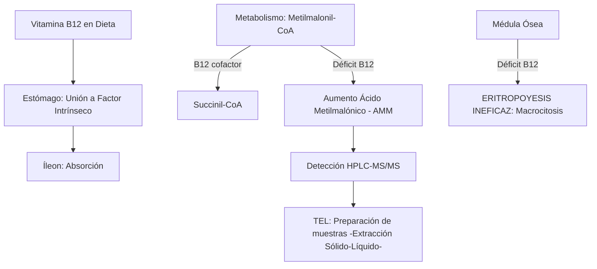
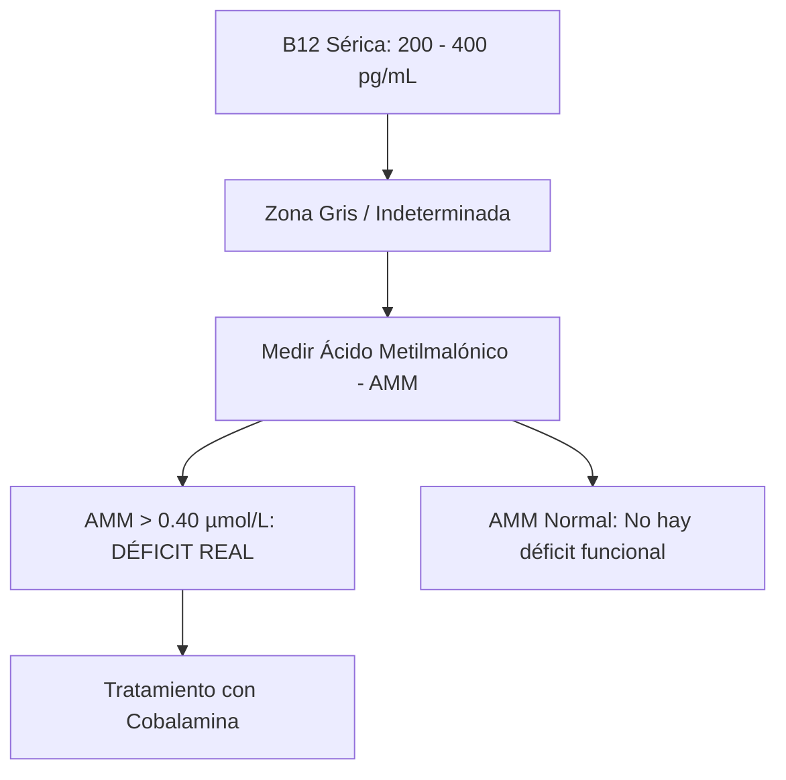
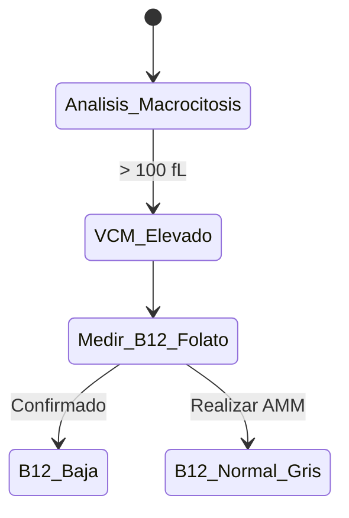

# Semana 6: Nuevos Campos y Técnicas
## Lección 26: Ácido Metilmalónico: Indicador de déficit de vitamina B12

### 1. Título y Resumen (Abstract)
**Título:** Valoración Funcional del Déficit de Cobalamina mediante la Cuantificación de Ácido Metilmalónico por Espectrometría de Masas: Superando las Limitaciones de la Vitamina B12 Sérica.
**Resumen:** Este artículo analiza la ruta metabólica de la Vitamina B12 y el papel del Ácido Metilmalónico (AMM) como biomarcador de deficiencia a nivel celular. Se fundamenta el proceso de conversión de Metilmalonil-CoA a Succinil-CoA y las consecuencias de su bloqueo. Se evalúa la superioridad de la cuantificación por LC-MS/MS frente a los niveles de B12 convencionales, destacando el papel del TSLCB en la gestión de técnicas cromatográficas de alta sensibilidad.

### 2. Introducción (Fundamentos y Objetivos)
#### 2.1. Metabolismo de la Vitamina B12 y Cobalaminas (Módulo 1370)
El currículo de **Fisiopatología General** (Módulo 1370) incluye el estudio del sistema hematopoyético y digestivo. La Vitamina B12 (Cobalamina) es esencial para la hematopoyesis y el mantenimiento de la mielina.
- **Absorción (Módulo 1370):** Requiere la unión al **Factor Intrínseco** (FI) secretado por las células parietales gástricas y su posterior absorción en el íleon terminal.
- **Funciones Metabólicas:** Actúa como cofactor de la L-metilmalonil-CoA mutasa, encargada de la conversión de metilmalonil-CoA en succinil-CoA (Ciclo de Krebs).

#### 2.2. Fisiopatología del Déficit y Acumulación de AMM (Módulo 1371/1374)
- **Anemia Megaloblástica (Módulo 1374):** La deficiencia de B12 altera la síntesis de ADN, provocando macrocitosis (VCM alto) e hipersegmentación de neutrófilos.
- **Ácido Metilmalónico (AMM):** En ausencia de B12, la ruta mitocondrial se bloquea, acumulándose ácido metilmalónico en sangre y orina. Es un marcador de "déficit funcional" (Módulo 1371), más sensible que la B12 sérica en fases precoces.

#### 2.3. Técnicas Instrumentales de Alta Sensibilidad (Módulo 1368/1369)
El TSLCB aplica técnicas de separación y detección avanzada:
- **Cromatografía Líquida - Espectrometría de Masas (LC-MS/MS):** Técnica de elección para la cuantificación de ácidos orgánicos.
    - **Cromatografía (Módulo 1368):** Separación de los componentes de la muestra según su interacción con la fase estacionaria.
    - **Espectrometría (Módulo 1369):** Identificación por la relación masa/carga ($m/z$). Permite la detección de niveles de AMM en el rango de micromoles.

**Objetivo:** Sistematizar el algoritmo de estudio de la anemia macrocítica y la deficiencia de cobalamina en la Comunidad de Madrid.

### 3. Material y Métodos
- **Diseño:** Estudio técnico-descriptivo sobre marcadores metabólicos.
- **Entorno:** Laboratorio de Metabolismo y Vitaminas, Hospital Universitario de Getafe.
- **Intervenciones:** Determinación de B12 sérica por quimioluminiscencia. Cuantificación de Ácido Metilmalónico mediante HPLC acoplada a Espectrometría de Masas en Tándem (LC-MS/MS).

### 4. Resultados (Hallazgos Experimentales)
Interpretación de resultados y zonas grises:

### 5. Discusión y Conclusiones
El AMM es el marcador más específico, salvo en pacientes con insuficiencia renal avanzada (donde se acumula por falta de eliminación). Se concluye que el TSLCB debe dominar la fase de extracción sólido-líquido para purificar el AMM antes de la inyección en el espectrómetro de masas. Hacia 2026, el cribado de AMM será el estándar para la detección precoz de daño neurológico irreversible en ancianos y pacientes veganos.

### 6. Agradecimientos
Al equipo de Hematología del HUGF por la provisión de frotis de sangre periférica con neutrófilos hipersegmentados.

### 7. Bibliografía (Literatura Citada)
- **Vitamin B12 Deficiency: StatPearls - NCBI.** [Ver en ncbi.nlm.nih.gov](https://www.ncbi.nlm.nih.gov/books/NBK441923/)
- **Methylmalonic Acid Test - Testing.com (AACC).** [Ver en testing.com](https://www.testing.com/tests/methylmalonic-acid/)
- **Guía SEQCML: Estudio analítico de la vitamina B12 y metabolitos.** [Ver en seqc.es](https://www.seqc.es/es/bioquimica-en-el-laboratorio-clinico/manuales-y-monografias/)
- **Linus Pauling Institute: Vitamin B12.** [Ver en oregonstate.edu](https://lpi.oregonstate.edu/mic/vitamins/vitamin-B12)

---
### Sobre el Ponente
**Rafael López Moreno** es residente de Bioquímica Clínica en el **Hospital Universitario de Getafe**. Su enfoque se centra en el estudio de los errores congénitos del metabolismo y el uso de técnicas de espectrometría de masas para el diagnóstico metabólico.

### 8. Charla y Transcripción (Contenido Multimedia)

**Enlace al vídeo:** [Ver en YouTube](https://www.youtube.com/watch?v=lwmcKsWRWng)

#### Transcripción de la Sesión
Hola, yo soy Rafael López Moreno, residente de Bioquímica Clínica del Hospital Universitario de Getafe y en el curso de actualización en el laboratorio clínico de este año os voy a hablar un poco del ácido metilmalónico como indicador del metabolismo intermediario.

Vamos a empezar viendo un poco dónde se genera este ácido metilmalónico. Pues bien, si recordamos un poco, hay unos aminoácidos que se llaman aminoácidos ramificados. Son la leucina, la usoleucina y la balina. La degradación de estos aminoácidos ramificados es bastante compleja, tiene muchos intermediarios. A partir de la lucina, por ejemplo, se genera la isobalilco encima A, que está asociada a la acidemia isobalérica y finalmente se va a generar aceto cetato. Y de la isolucina y de la balina vamos a terminar en el dos metil acetoacetil coencimada y en el selmialdeido metil malónico. Eh, estos dos compuestos van a terminar formando propiocoenzima A y es este propiocoenzima A el que en su proceso catabólico genera metilmalonilco encima y subuccinilco encima. ese subcinilencima es un intermediario del ciclo de creps, recordamos, y eh se puede incorporar para su degradación completa. Bien, aquí tenemos eh nuestro primer eh metil malónico como origen de la degradación, sobre todo de la isolucina y de la balina.

La otra fuente de ácido metil malónico va a ser la degradación de ácidos grasos de cada impar. Si recordamos un poco la betoxidación, la betoxidación es un es un proceso cíclico en el que en cada ciclo se van a ir eliminando dos átomos de carbono del ácido graso que constituyen en una oxidación, se quita una hidratación, de nuevo una oxidación y finalmente esta tiolasa va a ser la que rompa el ácido graso unido a carnitina eh coenzimada A, perdón, e generando un acetil coencimada A, es decir, un grupo de dos carbonos unido a este coencima y un acil coen encima, es decir, un ácido graso – unido concima reducido en dos carbonos para volver a entrar en el ciclo aquí y volver a producirlo. Pues bien, en los ácidos grasos de cardena impar, lo que vamos a tener en el último ciclo es un grupo de cinco carbonos. Este grupo de cinco carbonos va a ser – se va a romper por la tiolasa generando acetilco encima A y propionil coenzima A que tiene tres carbonos. Este propiocoenzima A como ya sabemos se va a transformar en metil malonilcoenzima y el metil malonilcoenzima a su vez en subcinil para incorporarse al ciclo de creps.

Vamos a ver un poco el metabolismo de esta última parte. El propio Nilco encima A se transforma en metilmalco encima A y en sucinilco encima por una serie de enzimas que van a ser muy importantes en la degradación y además vamos a ver que es muy importante también que hay una serie de coencimas que son importantes en este proceso y van a ser importantes porque si fallan estas coencimas o si tenemos un déficit de estas coencimas – también se va a detener o va a ser defectuoso. La proponilcoenzima A se transforma por la carboxilasa en metilmalonilcoenzima A en el isóo D dependiente de biotina. Esta a su vez por una raza de masa la transforma en el isomero L. Y finalmente la metil malonil con encima mutasa mueve este – grupo carboxilo a el otro carbono para formar el subcinilco enzima. Esta encima la mutasa es es dependiente de vitamina B12 y es muy importante saber que es pendiente de vitamina B12 porque la incorporación de la vitamina B12 y el metabolismo de la vitamina B12 son bastante complejos y van a influenciar mucho en cómo funciona esta enzima.

Si recordamos un poco – la incorporación de la vitamina B12 con la dieta, con – cualquier tipo de de alimentación, excepto la vegana, que suele ser un poco deficitaria en vitamina B12. Eh, tiene diferentes procesos en el todo el sistema digestivo antes de su incorporación al torrente sanguíneo. Primero, – suele estar – introducida dentro de las propias proteínas de la dieta que son degradadas o que se separan de la vitamina B12 en el estómago y es en el estómago para protegerlo un poco de el ácido estomacal que se une a la – aptocorrina. Laptocorrina es una – una proteína protectora de la vitamina B12 que ha sido a su vez secretada en las glándulas salivales. Siempre se se une a una proteína que ha sido secretada en un punto anterior. En el caso del estómago se une a la aptocorrina. unida a la aptocorrina, la vitamina B12 pasa al intestino delgado y en el intestino delgado con el cambio de pH se libera de la aptocorrina y se une al factor intríseco, que hemos dicho siempre que se genera en un punto anterior, o sea, que el factor intrínseco se ha generado en el estómago. Unido este factor intrínseco, la cobalamina o la vitamina B12 es absorbida por la mucosa del hileón, donde dentro del enterocito se separa de la del factor intrínseco y pasa al torrente sanguíneo, esta vez unida a otra proteína que es la transcobalamina. Y es así como se transporta dentro del cuerpo, unida transcobalamina.

Dentro de las células diana, donde haga falta una dosis de vitamina B12. Esta vitamina B12 – va a sufrir una serie de transformaciones para su para el metabolismo. Y es que la vitamina B12 es muy importante en el metabolismo monocarbonado, en la síntesis de ADN, en la regeneración de ácido fólico. Entonces, hay diferentes formas de vitamina B12 que – van a tener diferentes funciones. Pues bien, para su metabolismo vamos a tener principalmente varias enzimas que están codificadas por diferentes – genes. – vamos a tener el CBLC y el CBLD y luego el CBLA y el CBLB. Y las formas activas de vitamina B12 van a ser la metilcobalamina y la adenosilcobalamina. La metilcobalamina, por ejemplo, es importante para la síntesis de meteonina a partir de homocisteína. Y la adenosilcobalamina, que es precisamente la que a nosotros nos incumbe, es la que se utiliza para la síntesis de subctinilcoenzima A partir de malonil coenzima A. Fallos en los genes CBLC y CBLD van a afectar tanto a la síntesis de metilcobalamina como de adenosilcobalamina, mientras que los fallos en CBLA y CBLB van a afectar solo a los de a la síntesis de adenosil cobalamina.

En una cidemia metilmalónica, es decir, en una elevación de metilmalónico por causa genética, vamos a encontrar principalmente tres puntos – en los que podemos detectar – alteraciones genéticas. El primero va a ser la mutasa. Independientemente de los vitaminas, de los niveles de vitamina B12, si la mutasa está alterada, vamos a ver que hay una elevación de ácido metil malónico. Y el otro punto o los otros dos puntos en los que podemos encontrar – mutaciones van a ser precisamente en los genes que se encargan de la del metabolismo de la vitamina B12, ya sea CBLC y CBLD o CBLA y CBLB.

Haciendo un poco recapitulación de dónde – se genera el ácido metilmalónico, hemos visto que se genera a partir de aminoácidos ramificados, especialmente la isoleucina y la balina, y de ácidos grasos de cadena impar. Esos son principalmente las dos fuentes de síntesis de ácido metilmalónico, pero tenemos otras un poco minoritarias que también puede dar elevaciones de ácido metilmalico por el metabolismo. Serían – la degradación de colesterol, la degradación de otros aminoácidos, principalmente la trionina y la meteonina, y también a partir del ácido propiónico procedente de la flora intestinal que se puede absorber a través de la mucosa y que se – transformaría en metilmalónico y luego en sucinilco encima. Como hemos visto, este melil malónico es dependiente de vitamina B12 para su degradación en sucinilcozim y este subcinilco encima ya se incorporaría al ciclo de creps para su oxidación.

Pues bien, ¿qué pasa cuando ese metil malónico y el ácido propiónico que es intermediatamente anterior? Normalmente cuando se eleva un metabolito siempre se eleva el anterior también. ¿Qué pasa cuando tenemos niveles elevados de metil malónico en el cuerpo? ¿no? En el metabolismo, ¿qué se interfiere? pues vamos a encontrarnos una hiperamonemia porque inhibe en la formación de carbamil fosfato en el ciclo de laurea, por lo que se elevan los niveles de amonio. También vamos a ver que inhibe la el metabolismo del pirubato, por lo tanto no se forma acetilco enzima A que se incorporaría al ciclo de creps, y es el pirubato el que se convierte en el aceptor de electrones transformándose en lactato. y tampoco se permite la transformación del pirubato en oxalacetato para la formación de nueva glucosa. Por lo tanto, vamos a tener una acetoacidosis láctica por esa elevación de lactato y una hipoglucemia por esa inhibición de la síntesis de glucosa. Y finalmente también se inhibe – la degradación de glicina causando una hiperglicinemia.

Entonces, ¿cuáles son los síntomas que vamos a asociar a una – elevación de metilmalónico y de propiónico? Pues vamos a encontrar vómitos y anorexia al estar con la comida, hepatomegalia principalmente por la hiperamonemia que va a causar esa ese daño hepático, encefalopatía, de nuevo por esa hiperamonemia y por la el el déficit de glucosa. Luego hipotonía, distonía, corea, es decir, problemas musculares, precisamente porque hay una alteración en el metabolismo proteico y en el metabolismo de la glucosa que son importantes para el comportamiento normal del músculo. problemas de aprendizaje cuando esta esta cidometilmalónica está prolongada en el tiempo precisamente porque el el cerebro se ve afectado. Fallos de medro, es decir, no hay un correcto crecimiento, un correcto desarrollo, precisamente porque el metabolismo en general está viendo se está viendo alterado. No hay síntesis prótica adecuada, no hay síntesis de glucosa y finalmente una insuficiencia renal porque muchos de estos metabolitos van a eliminarse vía renal y hay un momento en el que el riñón va a fallar debido a la acidosis y a la gran cantidad de metabolitos que se están eliminando.

¿Qué hace el cuerpo ante una elevación de ácido metilmalónico para intentar – eliminarlo? Pues bien, ese metil malonil coenzima, que finalmente terminará en forma de ácido metil malónico porque se eliminará el coenzima, – el cuerpo tiene como dos formas de intentar eliminarlo. Uno es uniéndolo a carnitina, formando metilmalonil carnitina o si es la forma de ácido propiónico, propio carnitina. – las carnitinas se conocen normalmente con el número de carbonos. Entonces, el propioil carnitina como tiene tres carbonos, se conoce como C3 y el metil, la metil malonilcarnitina se conoce como C4 DC. Luego lo vemos un poco mejor. Y la otra forma de intentar detoxificar el ácido metilmalónico es uniéndolo a glicina en forma de metil malonil glicina.

¿Cómo podemos medir estos diferentes compuestos en el cuerpo? ¿Y en qué matrices los podemos medir? Porque no se pueden medir todos los compuestos en todas las matrices. Pues bien, los perfiles de acilcarnitina se pueden medir tanto en sangre total impregnada en papel y en plasma. La sangring total impregnada en papel seguro que os suena del crevado neonatal de la prueba del talón de los niños que a las 48 horas tras el nacimiento se les hace un pequeño una pequeña incisión en el talón y se deja de manera gravitacional que caiga una gota sobre el papel y es aquí donde se hace el cribado neonatal de las enfermedades endocrinometabólicas. Luego, el ácido metilmalónico por sí solo se puede medir tanto en plasma y si está muy elevado y se elimina por la orina también se puede medir en la orina. Y luego la el metilmaloniglicina se puede medir como – pequeñas – proporciones dentro de la orina también debido a su detoxificación.

¿Cómo se van a medir? Pues bien, para esto vamos a utilizar una cromatografía líquida asociada a una espectrometría de masas y – una cromatografía de gases en el caso de la orina también asociada a una espectrometría de masas. Y es que las cantidades son muy pequeñas tanto en el suero como en plasma. O sea, como tanto en sangre como en plasma como en la orina y necesitamos – técnicas muy robustas para detectarlos. Por eso esa necesidad de la espectrometría de masas en cualquiera de los casos. Vamos a ver un poco cómo funcionan el perfil de acilcarnitinas. Se suele hacer en una cromatografía líquida asociada a esta espectrometría de masas, normalmente en forma de HPLC, aunque a veces se hace UHPLC. Y en algunas ocasiones se elimina esa cromatografía y lo que se hace es una inyección directa al espectrómetro de masas. Pero bueno, supongamos que hay una cromatografía líquida, vamos a ver un poco cómo funciona el proceso. Lo que se hace es una extracción de los compuestos de la manera que sea y – eso se va a pasar por una columna de cromatografía. Esa columna de cromatografía lo que hace es separar los compuestos normalmente debido a su peso molecular o a su carga dependiendo de lo que tengamos en la columna para que retenga. Una vez separados por un tiempo de retención diferente, – los diferentes compuestos van a ir entrando en el espectrómetro de masas a través de un inyector. Y en el espectrómetro de masas lo que se – presenta es un – campo magnético que va a ionizar. Bueno, se produce primero una ionización y luego un campo magnético que lo que va a hacer esos iones generados – romperlos y – separar diferentes iones de cada compuesto. Finalmente, lo que se obtiene es un tiempo de retención debidos a la cromatografía y un conjunto de iones obtenidos de cada tiempo de retención. Ese conjunto de iones específicos con una más y carga concretas y el tiempo de retención nos van a permitir identificar de manera super precisa cada compuesto porque es como una huella digital de cada compuesto. En el caso de las acilcarnitinas, lo que se obtiene es un perfil completo de de ellas y hemos dicho que se suele nombrar con el número de carbonos de las que están compuestos. Así, por ejemplo, la acetilcarnitina sabemos que está a partir de ácido acético, pues el ácido acético, que tiene dos carbonos, la acetilcarnitina, se suele llamar como carnitina C2. La propiilcritnitina, que hemos dicho que tiene tres carbonos, pues – eh carnitina C3 y así sucesivamente hasta el carbono 18 o el carbono 20, dependiendo del método. ¿Cuáles nos van a interesar a nosotros? Pues bien, hemos dicho que el ácido propiónico se degrada en ácido metilmalo y el ácido metilmalónico en ácido sucínico, todos normalmente en forma asociada al coenzima. En el caso de que falle esa transformación de ácido metilmalónico en ácido sucínico, vamos a ver una elevación de ácido metilmalic y del compuesto inmediatamente anterior, que es el propiónico. Entonces, vamos a tener elevación de metil malónico, elevación de metil – de propionil y por lo tanto elevación de propionil carnitina, la C3. y de metil malonil carnitina que la C4DC que tiene el mismo tipo de retención que la tres hidroxidisobaleril carnitina que es la C5H. Entonces se suelen cuantificar en conjunto.

En cuanto a los ácidos orgánicos en orina, lo vamos a hacer con una cromatografía de gases que es ligeramente diferente. Se hace hace falta primero una una derivatización de los compuestos, es decir, hace hace falta marcarlos de alguna manera para que vuelen mejor. Las columnas suelen ser muy muy largas porque son compuestos muy difíciles de separar y además no van a estar tan definidas las masas y cargas y los tiempos de retención como en el caso de la cromatografía líquida, porque en la orina hay muchos compuestos de deción. Vamos a tener compuestos del degradados del metabolismo propio del ser humano y también si la muestra no se ha enfriado h con el tiempo suficiente o no se ha congelado, pues también producto de la degradación del metabolismo bacteriano de la propia flora que acompañará la orina. Así tenemos, por ejemplo, una gran cantidad de picos que son diferentes metabolitos. En el caso del metil balónico es este que está en torno al 9 y5 10 minutos y otros muchos compuestos que de nuevo se separan y se reconocen precisamente por el tiempo de retención y por el perfil de iones. Como tenemos elevación de metilmalónico, no en una cidadilmalónica, también vamos a ver elevación de ácido propiónico y vamos a tener los productos de detoxificación y otros productos secundarios del metabolismo que sí que se pueden ver en eliminados en la orina. Entonces vamos a tener propilicina y metilmaloncina, que hemos dicho que eso era la forma de degradar, de detoxificar del cuerpo, y tres hidroxipropiónico y metil cítrico.

Vamos a explorar un poco – la acidia metilmalónica con un par de casos clínicos que yo creo que va a quedar mucho más claro y lo vamos a entender mucho mejor. Y para ello lo vamos a hacer de mano de Hugo de 10 días y de y de Laura de 7 días. Tanto Hugo como Laura en la prueba del talón que le hicieron a los 48 a las 48 horas de vida, dieron positivo en el cribado en Natal con una elevación de C3 y una elevación de la proporción C3 C2 que se utiliza a veces para normalizar los niveles de C3 y ver que no sea una elevación secundaria o a una elevación generalizada de acilcar retinas. Pues bien, con esa elevación de C3 y esta elevación de C3 C2, ¿qué es lo que hacemos? Pues vamos a hacer tres cosas principalmente. La primera, una confirmación de hm de este cribado natal midiendo los niveles de ácido metilmalónico, los niveles de homocisteína que recordemos que estaba h relacionada con el metabolismo de del ácido metilmalónico y de la vitamina B12 y ócidos orgánicos en orina. También vamos a hacer una cuantificación de vitamina B12 para ver que esta elevación de C3 no sea secundaria a un déficit. Y también vamos a hacer un estudio en la madre, tanto en la madre de Laura como en la madre de Hugo. ¿Por qué? Pues porque durante el embarazo y durante los primeros meses de vida debido a la lactancia, el metabolismo de la madre va a influenciar por completo en el metabolismo del niño. Entonces, vamos a intentar descartar que no sea una vitamina de B12 materna es la que cause esta elevación de metil malónico en el niño. Entonces, ¿qué vamos a hacer? Vamos a muestras de sangre y orina, tanto de Hugo como de Laura. Y vamos a muestra de sangre de la mamá de Laura y de la mamá de Hugo para esas mediciones.

Vamos a ver los resultados. En el caso de Hugo tenemos que se confirma esa elevación de C3 sin llegar a verse una elevación de C4 DC. También tenemos una elevación de metil malónico en plasma bastante elevado. No tenemos un déficit de vitamina B12, aunque está en el rango bajo, pero no tenemos un déficit de vitamina B12. Y si tenemos una elevación de homocisteína, teniendo en cuenta que tenemos ligera elevación de metilmalónico, ligera elevación de mociesteína con una B12 un poco baja, podríamos asociarlo a un caso genético en en la parte que afectaba tanto a la homocisteina como el metilmalónico o a un déficit funcional. En el caso de la orina encontramos solamente un ácido metilmalónico sin otros metabolitos. Ahora bien, en el estudio de la madre, aquí sí, aquí tenemos una elevación de ácido metilmalónico, una disminución de vitamina B12, un déficit de vitamina 12 y una elevación de homociste además presenta una ligera anemia de 11 g dcl de hemoglobina.

Vamos a ver el caso de Laura. Laura tiene también una elevación de C3, el C4 DC en el límite superior de la normalidad, un metil malónico mucho más elevado, una vitamina B12 normal y una mocisteína normal. Y su madre, ah, perdón, y en la orina también se encontran – otros metabolitos, no solamente encontramos metil malónico, encontramos también metil cítrico, propionil glicina y tres hidroxipropiónico. En la madre, sin embargo, tenemos todos valores normales sin un déficit de vitamina B12.

Recapitulando un poco, lo que tenemos es una elevación de C3, homocisteína y metilmalónico en el caso de Hugo, una madre con un déficit de vitamina B12 y una anemia, aunque sea ligera. Y el juicio clínico aquí va a ser una elevación secundaria de COTIL malónico debido a un déficit de vitamina B12 materno. ¿Qué se va a hacer? Pues lo que vamos a hacer es una suplementación con cianocobalamina en la madre para corregir ese déficit y hidroxicobalamina semanal en el niño. El evolutivo pues a los dos meses se ha normalizado los niveles de ácido metilmalónico y de acilcarnitinas, lo que confirma el diagnóstico y la madre presenta valores normales de vitamina B12, metil malónico y homocisteino, por lo que concluimos que el caso de Hugo es un déficit de B12 de origen materno.

Ahora vamos con Laura. Laura tiene una elevación de C3 y de metil malónico, pero no tiene elevación de homocisteína en suero. La elevación de ácido metil malónico y de otros metabolitos en orina nos orienta un poco quizá a algo más – fallo metabólico que a un déficit. Además, la madre tiene valores totalmente anormales. El juicio clínico en este caso, va a ser una acidemia metilmalónica y se solicita un estudio genético para su confirmación. Además, en la consulta, en el momento en el que vienen para hablar del estudio molecular, se objetiviza una ligera hipotonía. Tiene menos tensión en los músculos de los brazos y la madre comenta que últimamente tiene dificultad para comer. De manera preventiva y ante y pidiendo de manera urgente el estudio genético, se da carnitina para intentar detoxificar esas esos niveles elevados de C3 y de C4 DC y facilitar de alguna manera – esa detoxificación. Finalmente, el estudio genético nos devuelve un resultado positivo con una mutación – en la metil malonil mutasa, que era la que transformaba el ácido metilmalonil, bueno, el metil malonil coenzima A en sucinil coenzima A. Esta mutación – nos confirma el diagnóstico de una acidemia metilmalónica, por lo que se pone automáticamente una dieta restrictiva en precursores. Es decir, se intenta eliminar la incorporación de aminoácidos ramificados como la balina, la isolucina y de otros aminoácidos como la meteonina. Además, se va a suplementar con carnitina oral para intentar facilitar esa detoxificación y se suplementa con hidroxicobalamina, es decir, con vitamina B12, porque se sabe que esta mutación, que es un poco más común que otras dentro de lo raro que es la enfermedad, es sensible a B12. Es decir, la metil malonil mutasa que genera no es totalmente ineficaz, sino que tiene una función lenta en la degradación del metilmal del metilmal coencimado, por lo que con un un nivel elevado de vitamina B12 se facilita esa transformación en suctinilco encima. ¿Cómo evoluciona Laura? Pues se produce un descenso de los niveles de metil malónico, aunque no se negativizan, siempre se mantienen elevados. – se produce un desarrollo neurológico normal y tiene descompensaciones puntuales normalmente asociadas a procesos infeisiosas que requieren siempre un manejo hospitalario para que no haya complicaciones como una hiperamonemia y una encefalopatía.

Estos dos casos nos hacen entender lo importante del cribado neonatal y es que el cribado neonatal en España en concreto tienen dos puntos débiles. El primero es que – no está unificado en todas las comunidades autónomas. Hay comunidades que hacen el mínimo obligado por la – por el Ministerio de Sanidad y hay otras comunidades en las que se aprovecha el los perfiles que hay para intentar civar el máximo de – enfermedades posibles. Esta desigualdad, evidentemente, genera también que haya comunidades en las que no se detectan algunas enfermedades. Y la segunda parte es que – vamos a veces un poco lentos – en la incorporación de enfermedades, aunque estén ya más que testadas a nivel internacional. Así, por ejemplo, la acidemia metilmalónica, – tanto con homocistinuria como sin homocistinuria y la acidemia propiónica se han incorporado muy recientemente en el sistema nacional de salud – de manera obligada en todas las comunidades, tan reciente como 2025, finales de 2025. Entonces, – teniendo en cuenta que son enfermedades que se pueden tratar – a muy temprana edad y se pueden evitar – grandes consecuencias para la vida del niño, – es importante que se escriben lo máximo posible en – en esta prueba del talón.

Y bueno, con esto concluimos una pequeña bibliografía si queréis – aumentar un poco la información, sobre todo el los protocolos de diagnóstico y tratamiento de los errores congénicos del metabolismo de la sociedad española, de errores de congénitos del metabolismo y ya está. Muchas gracias. M.

#### Explicación de la Ponencia
La ponencia explora el metabolismo del ácido metilmalónico (MMA), derivado de la degradación de aminoácidos ramificados (isoleucina, valina) y ácidos grasos de cadena impar. Se detalla el papel crucial de la vitamina B12 como coenzima de la metilmalonil-CoA mutasa y las consecuencias bioquímicas de su déficit o alteración genética (acidemia metilmalónica), tales como hiperamonemia y acidosis láctica. Se describen las técnicas de diagnóstico mediante espectrometría de masas (LC-MS/MS y GC-MS) y la importancia del cribado neonatal para la detección temprana y el tratamiento nutricional/farmacológico.

*Contenido técnico integral para la excelencia profesional del TSLCB.*
