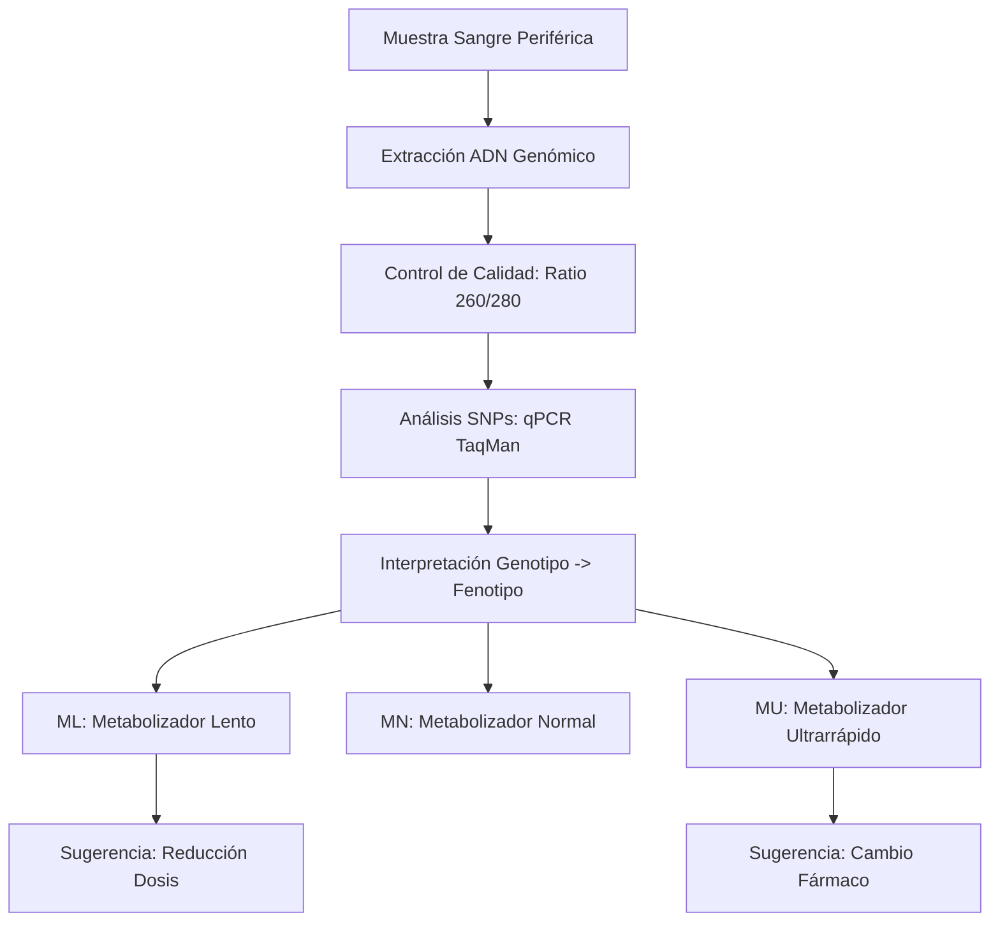
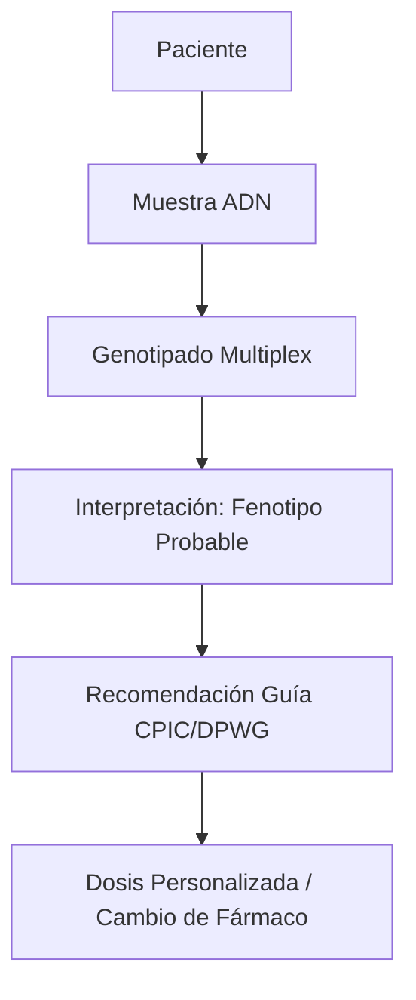
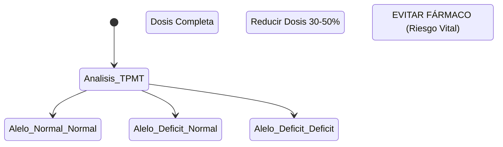

# Semana 6: Nuevos Campos y Técnicas
## Lección 27: ¿Qué es la Farmacogenética? Avanzando en la Medicina de Precisión

### 1. Título y Resumen (Abstract)
**Título:** Impacto del Genotipado de los Citocromos P450 en la Seguridad del Paciente Polimedicado: Una Perspectiva Farmacogenética y Molecular.
**Resumen:** Este artículo analiza cómo la variabilidad genética individual condiciona la respuesta a los fármacos. Se fundamentan los conceptos de Farmacocinética y Farmacodinámica, profundizando en el papel de las variantes polimórficas (SNPs) de las enzimas del Citocromo P450. Se evalúa la utilidad de identificar fenotipos metabolizadores (lentos, intermedios, ultrarrápidos) para prevenir la toxicidad y optimizar la eficacia terapéutica, destacando el papel del TSLCB en la extracción de ADN y la interpretación de genotipos complejos.

### 2. Introducción (Fundamentos y Objetivos)
#### 2.1. Farmacología y Metabolismo (Módulo 1370/1371)
El currículo de **Fisiopatología General** (Módulo 1370) introduce los principios de la acción de los fármacos.
- **Farmacocinética (ADME):** Absorción, Distribución, Metabolismo y Excreción. El hígado es el principal órgano metabolizador mediante el sistema de oxigenasas del Citocromo P450 (CYP).
- **Bioquímica Clínica (Módulo 1371):** El laboratorio monitoriza los niveles plasmáticos de fármacos (TDM) para asegurar el rango terapéutico (ej. Digoxina, Vancomicina).

#### 2.2. Polimorfismos Genéticos y Farmacogenética (Módulo 1369)
La farmaco-genética estudia cómo las variaciones en el ADN (SNPs) afectan la respuesta a medicamentos.
- **Citocromos (CYP2D6, CYP2C19):** Enzimas que metabolizan antidepresivos y antiagregantes. 
    - **Metabolizadores Lentos (ML):** Carecen de alelos funcionales. Riesgo de acumulación y toxicidad (ADR).
    - **Metabolizadores Ultrarrápidos (MU):** Varias copias del gen. Riesgo de ineficacia terapéutica.
- **Genotipos Críticos:** *TPMT* (tiopurinas), *DPYD* (5-fluorouracilo), *HLA-B*57:01* (abacavir).

#### 2.3. Técnicas de Genotipado y Calidad (Módulo 1369)
El **Módulo de Biología Molecular** describe las técnicas para detectar estas variantes:
1.  **Aislamiento de ADN:** Extracción de sangre periférica mediante sistemas automáticos de perlas magnéticas (ADN de alta pureza).
2.  **PCR en Tiempo Real (Sondas TaqMan):** Detección de polimorfismos de un solo nucleótido (SNPs) mediante sondas específicas de alelo (Módulo 1369).
3.  **Secuenciación Sanger:** Gold standard para la validación de variantes raras o estructurales.

**Objetivo:** Sistematizar el flujo de diagnóstico farmacogenético previo a la prescripción según las guías clínicas de la Comunidad de Madrid.

### 3. Material y Métodos
- **Diseño:** Análisis prospectivo de farmacoseguridad.
- **Entorno:** Laboratorio de Bioquímica y Farmacogenética, Hospital Universitario Severo Ochoa.
- **Intervenciones:** Extracción de ADN de sangre periférica mediante sistemas automáticos de perlas magnéticas. Genotipado de variantes específicas mediante PCR en tiempo real (Sondas TaqMan) y Secuenciación Sanger.

### 4. Resultados (Hallazgos Experimentales)
Workflow interpretativo basado en guías internacionales:

### 5. Discusión y Conclusiones
La farmacogenética transforma el modelo de "ensayo y error" en una medicina predictiva. Se concluye que el TSLCB debe asegurar la máxima calidad del ADN (Ratio A260/A280 ~1.8), ya que contaminantes en la extracción pueden inhibir la PCR y dar resultados erróneos de "metabolizador lento" por falta de amplificación de un alelo. Hacia 2026, la farmacogenética se integrará en las recetas electrónicas mediante sistemas de soporte a la decisión clínica.

### 6. Agradecimientos
Al personal de Farmacia Hospitalaria por la recopilación de reacciones adversas medicamentosas para la validación de los perfiles genéticos.

### 7. Bibliografía (Literatura Citada)
- **CPIC: Clinical Pharmacogenetics Implementation Consortium Guidelines.** [Ver en cpicpgx.org](https://cpicpgx.org/guidelines/)
- **PharmGKB: The Pharmacogenomics Knowledgebase.** [Ver en pharmgkb.org](https://www.pharmgkb.org/)
- **Farmacogenética en el laboratorio clínico - SEQCML.** [Ver en seqc.es](https://www.seqc.es/es/bioquimica-en-el-laboratorio-clinico/manuales-y-monografias/)
- **SEFF: Sociedad Española de Farmacogenética y Farmacogenómica.** [Ver en seff.es](http://www.seff.es/)

---
### Sobre las Ponentes
**Ana Irusta Gonzalo** y **Teresa Madero Jiménez** son residentes de cuarto año (R4) de Bioquímica Clínica en el **Hospital Universitario Severo Ochoa**. Su especialización se centra en la implementación clínica de la farmacogenética y la medicina personalizada de precisión para la optimización de terapias farmacológicas.

### 8. Charla y Transcripción (Contenido Multimedia)

**Enlace al vídeo:** [Ver en YouTube](https://www.youtube.com/watch?v=fMrM1uvwa5c)

#### Transcripción de la Sesión
Buenos días, yo soy Ana Irusta, R4 de Bioquímica Clínica y junto con mi compañera Teresa Madero, R4 de bioquímica, ambas del Hospital Universitario Severochoa, queremos explicaros hoy qué es la farmacogenética y si esta podría sernos útil para avanzar en la medicina personalizada de precisión.

Bien, pues vamos a proceder primero con la introducción. ¿Qué es la farmacogenética? pues es el estudio de las variantes genéticas específicas relacionad con la variabilidad en la respuesta a los medicamentos, de manera que se va a centrar en predecir qué medicamento y a qué dosis nos va a proporcionar un mayor beneficio terapéutico y una menor probabilidad de desarrollar reacciones adversas. Así, ¿qué podemos conseguir? Maximizar la eficacia y minimizar la toxicidad de los fármacos. Esto que nos lleva a que los pacientes van a tener una mayor adherencia al tratamiento porque al tener menos efectos adversos hacen mejor esa pauta de medicamento y además esto reduce los costes del sistema nacional de salud no solo a nivel de consultas a médicos, sino también consultas a urgencias e incluso ingresos hospitalarios.

En la práctica terapéutica, la farmacogenética se aplica considerando también la farmacocinética y la farmacodinamia. Al conocer los genes que codifican las proteínas transportadoras del fármaco, las enzimas que lo metabolizan y las dianas o receptores del medicamento implicados en su mecanismo de acción, se pueden identificar polimorfismos genéticos relevantes. Y a este nivel, donde más polimorfismos genéticos importantes va a haber, va a ser a nivel de esas enzimas que metabolizan los fármacos.

Continuando con la introducción, vamos a hablar ahora de la medicina de precisión. La medicina de precisión es un concepto más amplio que la farmacogenética y se define como la atención sanitaria basada en las características específicas del paciente. En sí, no es una herramienta, de hecho estudiaremos más adelante cuáles son las herramientas, sino un enfoque de la medicina que va a abarcar aspectos preventivos, diagnósticos, pronósticos y terapéicos. En la terapia clásica, el tratamiento se establece a los datos de eficacia y efectividad. obtenidos de ensayos clínicos, metaanálisis o la propia práctica clínica habitual y son tratamientos estandarizados, es decir, se eligen en función de la enfermedad o manifestaciones clínicas de los pacientes y son iguales para todos. ¿Qué es lo que ocurre? Que muchas veces estos pacientes, en estos pacientes la eficacia puede ser total, parcial o nula.

La medicina de precisión, por tanto, quiere aportar un nuevo enfoque de la medicina. El objetivo es alejarse de la visión clásica de estandarizar un tratamiento para distintos pacientes con una misma enfermedad y avanzar hacia una terapia personalizada, donde estudiaremos cada caso individualmente y aplicaremos diferentes tratamientos que puedan resultar en una mayor eficacia farmacológica para todos y cada uno de los pacientes y que la eficacia sea, como vemos, del 100%. En este caso, en las terapias personalizadas y hacia lo que quiere avanzar la medicina de precisión, es profundizar más en el estudio de cada individuo y elegir estos tratamientos en base a datos clínicos, factores externos que puedan afectar a cada individuo, datos genéticos o incluso datos obtenidos a través de ciencias como la transcriptómica, la proteómica o la metabolómica.

Para llevar a cabo esta terapia personalizada, necesitamos distintas herramientas. Una de ellas es la farmacogenética, que se posiciona así como la herramienta clave dentro del enfoque terapéutico de la medicina de precisión que va a permitir adaptar los tratamientos a la constitución genética individual y optimizar estos resultados clínicos. Además, también hay que tener en cuenta factores ambientales, estilos de vida o las características específicas de cada paciente.

A continuación hablaremos de las dianas terapéuticas más estudiadas para realizar este análisis farmacogenético. Y como hemos mencionado anteriormente, los polimorfismos genéticos más relevantes y más estudiados a día de hoy se encuentran a nivel del metabolismo de los fármacos. Es por tanto esta parte en la que nos vamos a centrar y vamos a ir explicando cada una de las distintas enzimas de biotransformación o proteínas transportadoras a nivel del metabolismo.

Vamos a dividir la explicación en dos bloques. En primer lugar hablaremos de las enzimas de biotransformación que existen en el metabolismo de los fármacos y luego hablaremos de las proteínas transportadoras también a nivel del metabolismo. Dentro de las enzimas de biotransformación podemos encontrar dos tipos de reacciones. las reacciones de fase uno, que son reacciones de oxidorrededucción, metilación y de sulfuración, que transforman los fármacos en metabolitos polares y activos. En este grupo destaca la superfamilia genética de citocromo P450 y la dihidropirimidina deshidrogenasa, también conocida como DPID. Y luego tenemos las reacciones de fase dos. En este caso, estas reacciones van a conjugar el fármaco o metabolito con otras sustancias endógenas. mediante reacciones de glucuronidación, acetilación, metilación o esterificación, entre otras, que tienen como objetivo potenciar la inactivación y facilitar así la excreción del fármaco.

Por tanto, los polimorfismos genéticos de estas enzimas implicadas en las reacciones tanto de fase uno como de fase dos son un factor muy influyente en la concentración plasmática de los fármacos y la farmacocenética de los tratamientos, clasificando así a los sujetos como metabolizadores pobres o lentos, metabolizadores normales o extensivos o metabolizadores rápidos o ultra rápidos.

Conviene recordar también que estas enzimas de biotransformación pueden jugar dos tipos de papel, activar o desactivar el fármaco. En aquellos fármacos en los que estas enzimas sean necesarias para activarle, es decir, estaríamos hablando de lo que se conoce como profármacos. En caso de que tengamos un paciente que sea un metabolizador lento, si la activación es mucho menor, pues tendrá menor efecto el fármaco, pues ese profármaco no se convertirá en el fármaco. Si es un metabolizador normal, el efecto será normal. Si es un metabolizador rápido o ultra rápido, más rápidamente ese profármaco se transformará en el fármaco activo y hay un mayor riesgo de toxicidad y reacciones adversas. Sin embargo, si las enzimas implicadas lo que hacen es todo lo contrario, es decir, inactivar el fármaco, vamos a ver que estos metabolizadores cobran un papel completamente opuesto al anterior. Si el metabolizador es lento y tarda más tiempo en inactivarse, pues ese fármaco permanecerá más tiempo en las concentraciones plasmáticas y por tanto lo que nos vamos a encontrar es un mayor riesgo de toxicidad o de reacciones adversas. el efecto normal en los metabolizadores normales y si el metabolizador es rápido o ultra rápido, pues el el el fármaco apenas tendrá efecto, pues rápidamente será inactivado y eliminado.

Empezamos hablando de las reacciones de fase uno y concretamente nos vamos a centrar ahora en los citocromos. Bien, el primer citocromo del que vamos a hablar, que es el que remarco aquí, es el citocromo 2C9. eh a través del citocromo 2C9 es una vía principalmente de inactivación de fármacos, es decir, donde van a tener lugar una serie de reacciones que van a modificar el fármaco previo a ser eliminado. E de izquierda a derecha voy a leer cuáles son las características principales que podemos encontrar en este cuadro relacionado con este citocrombo. En primer lugar, vemos que existen bastantes variantes genéticas que se pueden encontrar en este citocromo. El cambio génico te dice cuál es la base que está cambiando. Son todo SNPs, es decir, variantes puntuales y a qué nivel de genoma nos lo podemos encontrar. Y llama la atención que la actividad enzimática en todas y cada una de estos cambios puntuales se ve disminuida. Es por tanto que si es una vía de inactivación del fármaco y la actividad enzimática va a estar disminuida, el fármaco va a permanecer más tiempo en el organismo. Los fármacos metabolizados, que son los que aparecen a la derecha del cuadro, eh los tenéis ahí recogido, como son la guarfarina, la fenitoína, aines, acenocumarol o el o la familia de los coxip, ¿no? Especialmente el celecopsip. De hecho, los alelos más estudiados son el dos y el tres, que producen hasta un 90% en la reducción de la actividad de la enzima. Si eres homocigoto o heterocigoto, pues e dependerá para que tengas ya una reducción total o parcial de la actividad de esa enzima. Además, en metabolizadores lentos, si el fármaco va a permanecer más tiempo en nuestro organismo, hay una mayor incidencia de estas reacciones adversas, ¿no? Pues las gastropatías provocadas por los aines, un posible sangrado por la walfarina o el acenocumarol o riesgo de toxicidad neurológica en fármacos como la fenitoína.

A continuación hablaremos de otro citocromo que es el citocromo 2C19 que como vemos muchísimos fármacos son metabolizados a través de esta vía. Esta enzima va a producir tanto activación como inactivación de fármacos, como hemos visto anteriormente en algunos individuos con el fenotipo metabolizador lento para profármacos como el clopidogrel. vamos a ver que tienen un menor efecto antiplaquetario. Es decir, si la vía de activación de este profármaco está disminuida, pues el efecto antiplaquetario va a ser menor o ausente. De hecho, los alelos más estudiados son los alelos dos y tres, que como podéis ver en el cuadro, te indica cuál es el cambio de la base nitrogenada que se produce y a qué nivel y que efectivamente esta vía de activación estaría disminuida. Sin embargo, esta enzima también tiene un papel de inactivación de los fármacos. Otro alelo, como es el alelo 17, en este caso son metabolizadores rápidos. metabolizan, pues, por ejemplo, la familia de los IBP a una velocidad tal que requieren hasta dosis cuatro veces mayor que los individuos que tienen un fenotipo de metabolizador lento para poder alcanzar concentraciones séricas y efectos similares a los del fármaco. Es decir, en este caso, como vemos en el cuadro, muchísimos fármacos son metabolizados a través de esta vía. Algunos les afecta la vía de activación, otros de la inactivación. Y si vamos viendo cada uno de los alelos con sus cambios puntuales, podemos saber cuándo la actividad está disminuida o cuando la actividad está aumentada, siendo los alelos que he mencionado los más importantes y los más frecuentes en la población.

El gen DPID codifica para la enzima de hidropirimidina hidrogenasa, la cual juega un papel fundamental en el metabolismo de las fluoropirimidinas, incluyendo el cinco fluoracilo y su profármaco la capecitavina. Ambos son fármacos utilizados para cáncer de colon, cáncer de mama y cáncer gaste. Las variantes genéticas en el genide pueden llevar a una disminución o ausencia de la actividad enzimática, esto que conlleva un riesgo de toxicidad severa que incluye neutropenia, náuseas, vómitos, diarrea severa e incluso esta toxicidad puede llegar a ser potencialmente letal. Ante este riesgo resulta de gran importancia realizar un análisis fármacogenético de este gen de PIDE antes de iniciar el tratamiento con fluoropirimidina. Por ello, en mayo de 2020, tanto en España como previamente en la Unión Europea, se emitió una alerta sanitaria recomendando el genotipado del DPID para prevenir la toxicidad asociada a estos fármacos. Existen cuatro variantes del gen de PID que codifican para esa enzima de hidroprimidina de hidrogenasa, cuya presencia causa una deficiencia completa o una reducción de la actividad esta enzima. Esas son las cuatro variantes principales y son las que estudiamos en nuestro hospital. Y se estima que entre el 3 y el 8% de los pacientes caucásicos son portadores heterocigotos de al menos una variante asociada a esa pérdida de actividad de la enzima, mientras que entre el 0,01% y el 0,5% son homocígotos, presentando un riesgo aún mayor. Una vez realizado el genotipad del TPID, se puede predecir el fenotipo metabolizador del paciente, si es normal, intermedio o lento. Y basándose en esto, diversas sociedades científicas han elaborado guías y recomendaciones para el ajuste de dosis. Pacientes que tienen una metabolización intermedia, es decir, que tienen un alelo de función normal y uno reducido o dos de función reducida, al final van a tener una actividad global en torno a 1 1, 1,5. En estos pacientes lo que se recomienda es disminuir la dosis inicial un 50% y siempre realizar un seguimiento clínico y farmacocinético estrecho. En pacientes que son metabolizadores lentos con una actividad global mucho más reducida en torno a 0,5 o que incluso puede ser nula si los dos alelos tienen pérdida de función completa, lo que se recomienda es evitar el uso de estas floropirimidines.

El gen UGT1A1 codifica la enzima UDP glucuronosil transferasa, que es clave en el metabolismo de ciertos fármacos como el irinotecán. El irinotecán se convierte en el hígado en su metabolito activo que se denomina SN38. Y está encima la UDP glucuronosil transferasa lo que hace es que inactiva ese metabolito. De manera que si la actividad enzimática es reducida, el metabolito SN38 se acumula aumentando el riesgo de toxicidad en el paciente, sobre todo esa toxicidad en que se basa neutropenía grave y diarrea severa. El alelo más conocido que produce esa disminución de la actividad enzimática es el 28. De manera que esos pacientes tienen un mayor riesgo de toxicidad severa porque se acumula, como bien hemos dicho antes, ese metabólito activo, el SN38. ¿Qué frecuencia tiene este polimorfismo? Pues en torno a un 8 o 20% en población europea, africana, de cercano oriente y América Latina.

A continuación nos centraremos en otro bloque muy importante a nivel del metabolismo, que son las proteínas transportadores de estos fármacos. son transportadores que juegan un papel muy importante en los procesos de absorción, distribución y excreción de los medicamentos. En este sentido, es indudable la importancia de los transportadores llamados ABC o ATP Binding Cassette, cuya misión es la de exportar compuestos desde el interior al exterior de las células. El transportador más estudiado es la glicoproteína P codificada por el gen ABCB1 o MDR1, cuya expresión en varios tejidos normales sugiere su importante papel en la excreción de metabolitos a la orina, bilis o lumen intestinal, mientras que en la barrera hematoencefálica limita la acumulación de varias drogas en el cerebro. Además, la glicoproteína P, transportadora de fármacos, se considera responsable de un fenómeno conocido como resistencia a múltiples fármacos. Es de especial interés comprobar que la glicoproteína P se expresa funcionalmente en la barrera a nivel del intestino y xenobióticos en general. Puede condicionar la biodisponibilidad de fármacos como la ciclosporina A, la digoxina o la bimblastina entre otros. También me gustaría destacar que existe un polimorfismo muy estudiado, el cambio de C por T a nivel de 3435 o el RDS, como vemos a continuación que está ahí descrito. En este caso, si el genotipo este TT, es decir, homocigoto, se presenta una muy baja expresión del gen, lo que resulta una baja presencia de la glicoproteína P en la membrana y, por tanto, una muy baja expulsión hacia el lumen de los fármacos. Es decir, va a haber una alta absorción del fármaco que pasará a la sangre. Es clave en fármacos con un estrecho margen terapéutico realizar una monitorización, pues podríamos encontrarnos en situaciones donde el fármaco quede eh muy elevado en sangre durante mucho tiempo en estos pacientes.

Para ver qué métodos de análisis podemos utilizar, vamos a diferenciar en si conocemos la mutuación o si no sabemos de qué mutación podemos estar hablando. Si conocemos la mutación, podemos tener técnicas de baja capacidad como la minisecuencia acción snapshot, técnicas de capacidad media como la espectrometría de masa o la PCR en tiempo real o técnicas de alta capacidad como los microarrays. En la minisecuenciación snapshot lo que se van a utilizar son una serie de didesoxinucleótidos marcados fluorescente. Y lo que vamos a realizar es una PCR, de manera que se diseñan una serie de cebadores que se van a unir en la región adyacente al polimorfismo que se que se desea detectar. Y en el momento de la replicación se va a unir un didesoxinucleótido marcado con un color u otro en función de la base que corresponda. Es decir, si nosotros en nuestra cadena normal la base que tenemos es una A, pues el didesoxinucleótido marcado que se va a unir es la T, que está marcado en verde. Pero si en otro paciente que tiene la variación no está una A, sino que está una G, lo que se va a unir, el didesoxinucleótido marcado que se va a unir es una C que está unido al naranja. De manera que en vez de observar un pico verde, observaremos un pico naranja. Esto, ¿cómo lo vamos a detectar? a través de los equipos de análisis, ¿vale? Que nos va a permitir identificar una base u otra. ¿Qué ventajas tiene la minisecuenciación? pues que permite el multiplexado de hasta 20 o 30 polimorfismos y que se pueden analizar además inserciones de lecciones además de variaciones puntuales. ¿Y qué limitaciones? Pues que requiere procesamiento pues PCR y que no analiza variaciones estructurales.

Dentro de las técnicas de media capacidad tenemos la espectrometría de masas. En este caso, en la PCR también se utilizan dinucleótidos, pero no van a estar marcados fluorescentemente, sino que van a estar modificados con una masa determinada. Una vez que esos dinucleótidos con esa masa modificada se incorporan en la reacción, se van a introducir en un chip y este se inserta en un espectrómetro de masas. En el espectrómetro, un láser vaporiza el DNA y lo fragmenta en iones. Y estos iones, contenidos dentro de un tubo de longitud conocida, vuelan hasta un detector. El tiempo de vuelo, desde que la muestra es fragmentada hasta que llega el detector, permite determinar la relación más a carga de sus productos. Y gracias a softwares específicos se puede detectar cada uno de los productos presentes en la reacción de PCR. Y como conocemos la masa modificada de cada uno de esos dinucleótidos, podemos identificar el polimorfismo correspondiente, porque la espectrometría de masas se basa en este análisis de la relación masac. ¿Qué ventajas presenta esta espectrometría de masas? pues que también permite el multiplexado y que permite analizar variaciones puntuales, inserciones de elecciones y variaciones estructurales, por lo que es muy relevante para genes complejos como el C2 D6. Pero dentro de las limitaciones es que requiere también un procesamiento post PC Pfcr que necesita muestras con buena pureza.

La otra técnica de media capacidad es la PCR en tiempo real. La idea de esta técnica es muy similar a la que hemos visto anteriormente. En este caso, lo que se utilizan es un cebador específico o sonda que se va a unir a la región que se desea identificar. Esta sonda va a estar marcada en un extremo con un fluorocromo y en el otro con un kencher. El kencher lo que es realmente es un inhibidor de la fluorescencia, de manera que cuando están juntos no van a emitir fluorescencia, pero durante la replicación del DNA estos se separan y la fluorescencia en este caso sí puede ser emitida. Separarse del kencher, se emite esa fluorescencia. Cada base va a estar marcada de un color. Así podemos detectar también el polimorfismo de SEA. Y posteriormente un software va a interpretar las señales de fluorescencia recibidas e identifica si se trata de un paciente homocigoto para un alelo, homocigoto para el otro o una heterociigosis. ¿Qué ventajas tiene la PCR en tiempo real? pues que permite analizar hasta 240 biomarcadores, inserciones, deleciones, variaciones estructurales, que no requiere procesamiento postpcr, pero en este caso la limitación es que no permite el multiplexado.

En cuanto a las técnicas de alta capacidad vamos a destacar los microarrays. Los microarrays se basan en la hibridación con sondas específicas, es decir, que se tienen sondas marcadas que se unen a la región de interés. Cuando la viidación es perfecta, se obtiene una señal fluorescente directa y así se puede identificar. En caso de que no exista una habilitación perfecta entre las sondas y la región concreta del DNA, no se obtiene el marcaje fluorescente. Las sondas están están fijadas en un soporte, por lo que se van a realizar varios lavados para eliminar las sondas que no se unen, quedarse solo con las que nos interesan. De esta manera se identificarán las sondas que quedan unidas a la región de interés y permiten identificar el – SNP o la variante concreta que estoy estudiando. Como ventajas, cabe destacar que permite analizar SNP, indels y en algunos casos variaciones estructurales. También permite el análisis de un gran número de biomarcadores a lo largo de todo el genoma y que existen paneles comerciales ya prefabricados. como limitación requieren procesamiento post PCR y son técnicas que llevan unos largos protocolos.

Hasta ahora hemos hablado de mutaciones conocidas que vamos buscando lo que ya sabemos que probablemente tenga ese paciencia. Pero, ¿qué ocurre cuando las mutaciones son desconocidas? Pues en este caso se aborda mediante métodos basados en la secuenciación. Actualmente existen tres tipos de métodos basados en la secuenciación disponibles en el mercado. Tenemos la secuenciación de primera generación, que es sanger, secuenciación de segunda generación NGS, que se llama secuenciación masiva, y una tercera – eh tipo de secuenciación que sería la secuenciación de célula única.

Una técnica de secuenciación ampliamente utilizada es el sanger, que permite analizar unos pocos genes. Consiste en realizar una PCR con didesoxinucleótidos marcados fluorescentemente donde se lleva a cabo la replicación del DNA con otros didesoxinucleótidos no marcados y otros marcados fluorescentemente. Al replicar este ciclo, un número determinado de veces, unos 30 o 40 ciclos, en la PCR, se obtiene una suma de fragmentos de diferentes longitudes, de tal manera que cuando se incorpore un di desoxinucleótido, la reacción se detiene y se obtienen fragmentos que identifican las diferentes bases del DNA molde. Posteriormente se realiza una separación de fragmentos por tamaños y una detección del color en una electroforesis capilar. lo que permitirá así identificar cada una de las bases con los diferentes colores que han sido marcados por los dides nucleótidos. De esta manera podré analizar y conocer la composición del DNA molde. Como ventajas vemos que es una técnica que nos permite con gran facilidad confirmar una variante localizada a través de NGS, como veremos a continuación. Y como limitaciones es que pues es una técnica que es lenta y por tanto sería muy difícil abordar un gran número de bases y por tanto un gran número de genes con una técnica sanget.

Sin duda, una de las técnicas de secuenciación más utilizadas es la NGS o secuenciación masiva. En este tipo de técnicas vamos a tener varias secciones, varias – partes, ¿no? Y en primer lugar siempre va a haber una segmentación previa del DNA en varios fragmentos. posteriormente un marcaje y una amplificación por PCR, seguido de una secuenciación o lectura de estos fragmentos de DNA, que luego nos permitirá reconstruir la secuencia completa utilizando pues un – una secuencia de referencia o ficheros de almacenamiento de datos que nos permitan reconstruir el DNA que nosotros estamos buscando. En este caso, esto va a resultar en la generación de múltiples secuencias de manera masiva y en paralelo, que luego vamos a alinear frente a un genoma de referencia. Como vemos en la pantalla, sería algo así lo que nosotros tendríamos tanto en forward como en reverse, que son los dos colores que aparecen en pantalla, el azul y el y el y el rojo, pues está leyendo múltiples fragmentos de manera masiva. Y como vemos a mitad de esa pantalla se puede ver que donde debería existir según el genoma de referencia una base nitrogenada como puede ser pues por ejemplo una T, – eh nos encontramos una A, es decir, ha habido un cambio y te lo marca ahí en negra. Con la NGS se obtienen numerosas lecturas que van a querer, que evidentemente todo esto va a requerir posteriormente un filtrado y un tratamiento. Las estrategias de este filtrado de variantes pueden variar en función de lo que se busque, pero – probablemente se van a cripar en función de la frecuencia poblacional de estas variantes, la predicción o la patogenicidad de estas y la presencia de estudios funcionales en las variantes identificadas. ¿Qué ventajas tiene? pues que permite el análisis de paneles de genes seleccionados para un determinado propósito. Podemos estudiar el exoma o el genoma y permite la detección de variantes estructurales como limitaciones, pues ciertas regiones de son de cierta homología, presencia de regiones repetitivas o repeticiones en tandem pueden dificultar esta secuenciación masiva. Es una técnica, por supuesto, más costosa y que requiere más tiempo.

Ya para terminar esta sesión nos gustaría destacar una serie de conclusiones o ideas para que llevéis a casa, que son la primera, que la farmacogenética es un pilar fundamental en la medicina personalizada de presión, la cual bascar personalizar tratamientos, maximizar la eficacia y la seguridad del paciente. En segundo lugar, que actualmente la farmacogenética está enfocada en analizar variantes en enzimas metabolizadoras y transportadores. Como hemos visto, una farmacogenética anticipativa es el enfoque deseado para optimizar el tratamiento, el ajuste de dosis y evitar ya realizar esa farmacogenética cuando el paciente se ha puesto malito o no tiene eficacia. En tercer lugar, el análisis farmacogenético recurre a diversas técnicas de laboratorio, desde métodos basados en PCR hasta una secuenciación masiva. Y por último, aunque algunos métodos resulten hoy en día más costosos, representan una inversión clave en la medicina de precisión. Esta inversión busca en primer lugar reducir el a largo plazo el gasto sanitario, en segundo lugar optimizar los tratamientos, tercer lugar mejorar la seguridad del paciente y por último, evitar los costes asociados a la toxicidad y disminuir el número de ingresos, que al final eso también repercute en los costes finales.

Esta es la biolografía que hemos utilizado y muchas gracias por vuestra atención. M.

#### Explicación de la Ponencia
La sesión detalla el papel de la farmacogenética como herramienta clave de la medicina de precisión, analizando cómo los polimorfismos genéticos en enzimas de biotransformación (como el Citocromo P450, DPID y UGT1A1) y proteínas transportadoras (como la Glicoproteína P) condicionan la respuesta individual a los fármacos. Se explican las metodologías diagnósticas aplicadas en el laboratorio clínico, desde técnicas de PCR y microarrays hasta la secuenciación masiva (NGS), subrayando el objetivo de maximizar la eficacia terapéutica y minimizar la toxicidad sistémica.

*Contenido técnico integral para la excelencia profesional del TSLCB.*
